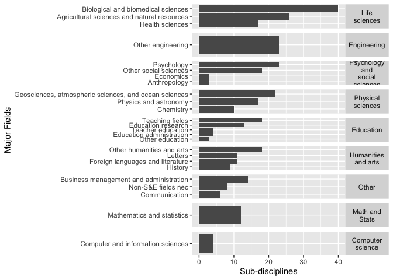
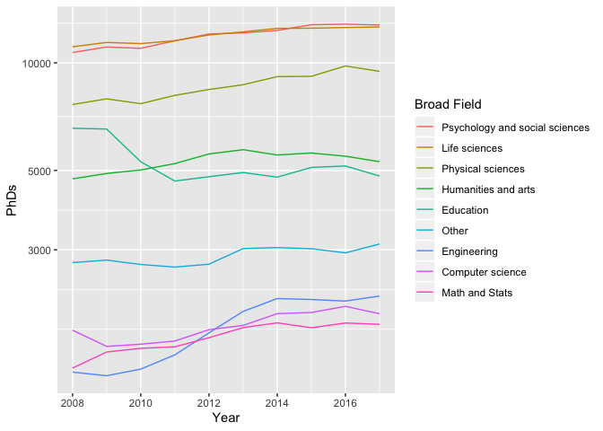
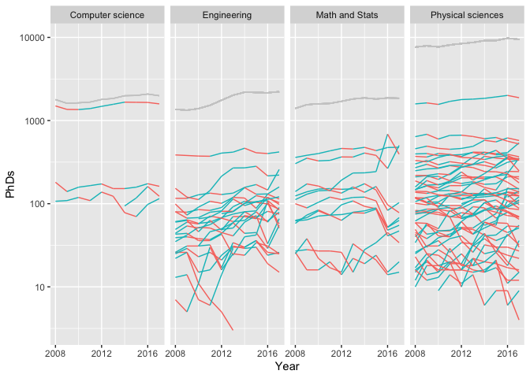
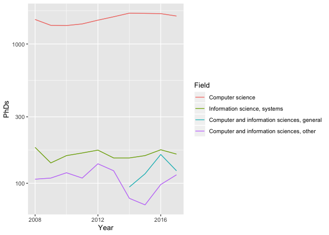
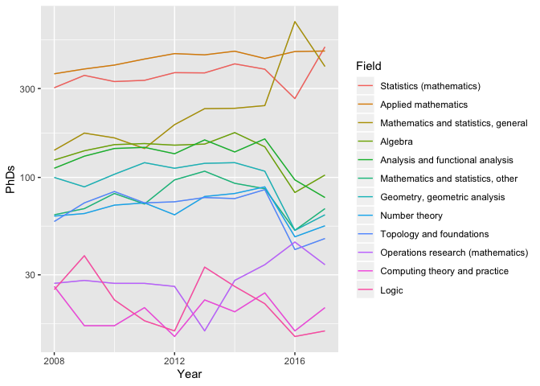
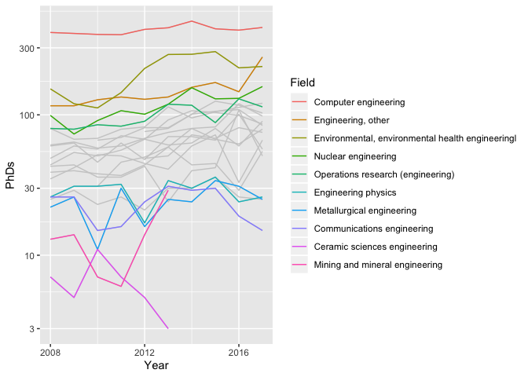
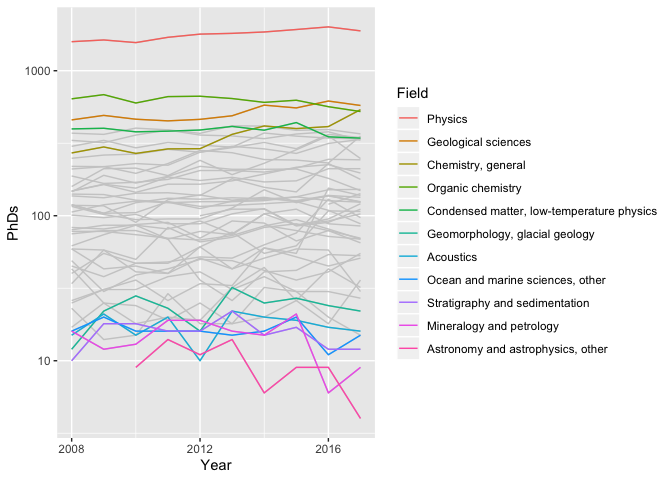

US PhD’s Awarded: EDA
================
Zachary del Rosario
2019-11-08

Exploration of “PhD’s awarded data” from the NSF. Inspired by
Tidytuesday.

Sources:

  - Original: [NSF](https://ncses.nsf.gov/pubs/nsf19301/data)
  - Via:
    [Tidytuesday](https://github.com/rfordatascience/tidytuesday/tree/master/data/2019/2019-02-19)

## Setup

<!-- -------------------------------------------------- -->

``` r
library(tidyverse)
```

    ## ── Attaching packages ────────────────────────────────── tidyverse 1.2.1 ──

    ## ✔ ggplot2 3.2.1     ✔ purrr   0.3.2
    ## ✔ tibble  2.1.3     ✔ dplyr   0.8.3
    ## ✔ tidyr   1.0.0     ✔ stringr 1.4.0
    ## ✔ readr   1.3.1     ✔ forcats 0.4.0

    ## ── Conflicts ───────────────────────────────────── tidyverse_conflicts() ──
    ## ✖ dplyr::filter() masks stats::filter()
    ## ✖ dplyr::lag()    masks stats::lag()

``` r
phd_field <- readr::read_csv("https://raw.githubusercontent.com/rfordatascience/tidytuesday/master/data/2019/2019-02-19/phd_by_field.csv")
```

    ## Parsed with column specification:
    ## cols(
    ##   broad_field = col_character(),
    ##   major_field = col_character(),
    ##   field = col_character(),
    ##   year = col_double(),
    ##   n_phds = col_double()
    ## )

Some overview checks.

``` r
phd_field %>% glimpse
```

    ## Observations: 3,370
    ## Variables: 5
    ## $ broad_field <chr> "Life sciences", "Life sciences", "Life sciences", "…
    ## $ major_field <chr> "Agricultural sciences and natural resources", "Agri…
    ## $ field       <chr> "Agricultural economics", "Agricultural and horticul…
    ## $ year        <dbl> 2008, 2008, 2008, 2008, 2008, 2008, 2008, 2008, 2008…
    ## $ n_phds      <dbl> 111, 28, 3, 68, 41, 18, 77, 182, 52, 96, 41, 32, 44,…

``` r
phd_field %>% summary
```

    ##  broad_field        major_field           field                year     
    ##  Length:3370        Length:3370        Length:3370        Min.   :2008  
    ##  Class :character   Class :character   Class :character   1st Qu.:2010  
    ##  Mode  :character   Mode  :character   Mode  :character   Median :2012  
    ##                                                           Mean   :2012  
    ##                                                           3rd Qu.:2015  
    ##                                                           Max.   :2017  
    ##                                                                         
    ##      n_phds      
    ##  Min.   :   0.0  
    ##  1st Qu.:  41.0  
    ##  Median :  85.0  
    ##  Mean   : 165.9  
    ##  3rd Qu.: 178.0  
    ##  Max.   :5302.0  
    ##  NA's   :278

What are the major fields coded as?

``` r
phd_field %>%
  select(broad_field, major_field) %>%
  unique %>%
  print(n = 25)
```

    ## # A tibble: 25 x 2
    ##    broad_field                  major_field                                
    ##    <chr>                        <chr>                                      
    ##  1 Life sciences                Agricultural sciences and natural resources
    ##  2 Life sciences                Biological and biomedical sciences         
    ##  3 Life sciences                Health sciences                            
    ##  4 Life sciences                Chemistry                                  
    ##  5 Life sciences                Geosciences, atmospheric sciences, and oce…
    ##  6 Life sciences                Physics and astronomy                      
    ##  7 Mathematics and computer sc… Computer and information sciences          
    ##  8 Mathematics and computer sc… Mathematics and statistics                 
    ##  9 Psychology and social scien… Psychology                                 
    ## 10 Psychology and social scien… Anthropology                               
    ## 11 Psychology and social scien… Economics                                  
    ## 12 Psychology and social scien… Other social sciences                      
    ## 13 Engineering                  Other engineering                          
    ## 14 Education                    Education administration                   
    ## 15 Education                    Education research                         
    ## 16 Education                    Teacher education                          
    ## 17 Education                    Teaching fields                            
    ## 18 Education                    Other education                            
    ## 19 Humanities and arts          Foreign languages and literature           
    ## 20 Humanities and arts          History                                    
    ## 21 Humanities and arts          Letters                                    
    ## 22 Humanities and arts          Other humanities and arts                  
    ## 23 Other                        Business management and administration     
    ## 24 Other                        Communication                              
    ## 25 Other                        Non-S&E fields nec

These are not the most informative broad fields. I will do some
re-coding, then down-select to some broad areas of interest.

``` r
df_recoded <-
  phd_field %>%
  mutate(
    broad_field = case_when(
      str_detect(major_field, "Physics") ~ "Physical sciences",
      str_detect(major_field, "Chemistry") ~ "Physical sciences",
      str_detect(major_field, "Geosciences") ~ "Physical sciences",

      str_detect(major_field, "Computer") ~ "Computer science",
      str_detect(major_field, "Mathematics") ~ "Math and Stats",
      TRUE ~ broad_field
    )
  )

broad_fields_selected <-
  c(
    "Physical sciences",
    "Computer science",
    "Math and Stats",
    "Engineering"
  )
```

## Visualizations

<!-- -------------------------------------------------- -->

How many sub-disciplines (levels of `field`) are in each major field?

``` r
df_recoded %>%
  select(broad_field, major_field, field) %>%
  unique %>%
  count(broad_field, major_field) %>%
  group_by(broad_field) %>%
  mutate(n_max = max(n)) %>%
  ungroup() %>%
  mutate(broad_field = fct_reorder(broad_field, -n_max)) %>%

  ggplot(aes(fct_reorder(major_field, n), n)) +
  geom_col() +
  facet_grid(
    broad_field~.,
    scales = "free_y",
    labeller = labeller(broad_field = label_wrap_gen(width = 10))
  ) +
  coord_flip() +
  theme(strip.text.y = element_text(angle = 0)) +
  labs(
    x = "Major Fields",
    y = "Sub-disciplines"
  )
```

<!-- -->

Observations:

  - The `Life Sciences`; particularly biosciences, have many, many
    sub-disciplines.
  - Disciplines like `Economics`, `Anthropology`, and `CS` have very few
    sub-disciplines.

## Timeseries

<!-- -------------------------------------------------- -->

By broad field, how many PhD’s are minted?

``` r
df_recoded %>%
  group_by(broad_field, year) %>%
  summarize(n_phds = sum(n_phds, na.rm = TRUE)) %>%
  ungroup() %>%

  ggplot(aes(year, n_phds, color = fct_reorder2(broad_field, year, n_phds))) +
  geom_line() +
  scale_x_continuous(breaks = seq(from = 2008, to = 2016, by = 2)) +
  scale_y_log10() +
  scale_color_discrete(name = "Broad Field") +
  labs(
    x = "Year",
    y = "PhDs"
  )
```

<!-- -->

Observations:

  - I had no idea there were so many PhD’s earned in the Social
    sciences\!
  - There was a fairly sharp decline in Education post-Great Recession
    (2008), which has not recovered.
  - CS, Math and Stats, and (especially) Engineering saw an increase
    from 2010 to 2014, but these seem to have leveled out.

Let’s disaggregate by sub-discipline and inspect the timeseries again.

``` r
df_recoded %>%
  filter(broad_field %in% broad_fields_selected) %>%
  group_by(field) %>%
  mutate(delta = lead(n_phds) - n_phds) %>%
  ungroup() %>%
  group_by(broad_field, year) %>%
  mutate(n_phds_total = sum(n_phds, na.rm = TRUE)) %>%
  ungroup() %>%

  ggplot(aes(year, n_phds, group = field)) +
  geom_line(aes(color = delta > 0), show.legend = FALSE) +
  geom_line(aes(y = n_phds_total), color = "grey80") +
  facet_grid(~broad_field) +
  scale_y_log10() +
  scale_x_continuous(breaks = c(2008, 2012, 2016)) +
  theme(legend.position = "bottom") +
  labs(
    x = "Year",
    y = "PhDs"
  )
```

    ## Warning: Removed 46 rows containing missing values (geom_path).

<!-- -->

Observations:

  - The number of PhD’s awarded in the Computer science(s), Math and
    Stats, and Engineering are roughly equal. There are many more PhD’s
    awared in the Physical sciences.
  - A certain Engineering sub-discipline seems to have declined and then
    disappeared in 2014.
  - There was a fairly sharp decline across various Math and Stats
    sub-disciplines between 2014-16.

Build a helper function to highlight the top and bottom sub-disciplines.

``` r
plot_timeseries <- function(df) {
  fields_minmax <-
    df %>%
    group_by(field) %>%
    summarize(
      n_min = min(n_phds, na.rm = TRUE),
      n_max = max(n_phds, na.rm = TRUE)
    ) %>%
    filter((dense_rank(n_min) <= 5) | (dense_rank(-n_max) <= 5)) %>%
    pull(field)

  df %>%
  ggplot(aes(year, n_phds)) +
  geom_line(aes(group = field), color = "grey80") +
  geom_line(
    data = . %>% filter(field %in% fields_minmax),
    aes(color = fct_reorder2(field, year, n_phds))
  ) +
  scale_y_log10() +
  scale_x_continuous(breaks = c(2008, 2012, 2016)) +
  scale_color_discrete(name = "Field") +
  guides(color = guide_legend(ncol = 1)) +
  theme(legend.position = "right") +
  labs(
    x = "Year",
    y = "PhDs"
  )
}
```

``` r
df_recoded %>%
  filter(broad_field == "Computer science") %>%
  plot_timeseries
```

    ## Warning: Removed 6 rows containing missing values (geom_path).
    
    ## Warning: Removed 6 rows containing missing values (geom_path).

<!-- -->

Pure CS degrees seem most common; I’m not sure what the distinction is
with other degrees.

``` r
df_recoded %>%
  filter(broad_field == "Math and Stats") %>%
  plot_timeseries
```

<!-- -->

Observations:

  - Statistics seems to be the most popular sub-discipline, especially
    if we consider the `Mathematics and statistics` flavors as the same.
    Applied math is quite high as well.
  - The “crash” we saw earlier seems to be confined to pure disciplines.
  - There are very few *Mathematics* OR PhD’s trained every year\!

<!-- end list -->

``` r
df_recoded %>%
  filter(broad_field == "Engineering") %>%
  plot_timeseries
```

    ## Warning: Removed 20 rows containing missing values (geom_path).

    ## Warning: Removed 8 rows containing missing values (geom_path).

<!-- -->

Observations:

  - There are far more OR PhD’s classified in Engineering (rather than
    Mathematics).

<!-- end list -->

``` r
df_recoded %>%
  filter(broad_field == "Physical sciences") %>%
  plot_timeseries
```

    ## Warning: Removed 20 rows containing missing values (geom_path).

    ## Warning: Removed 2 rows containing missing values (geom_path).

<!-- -->
