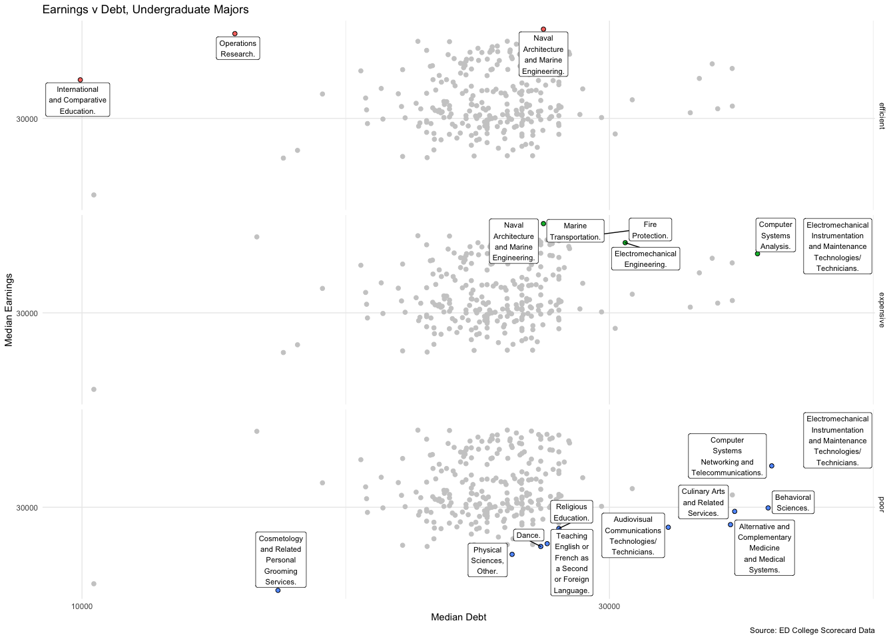
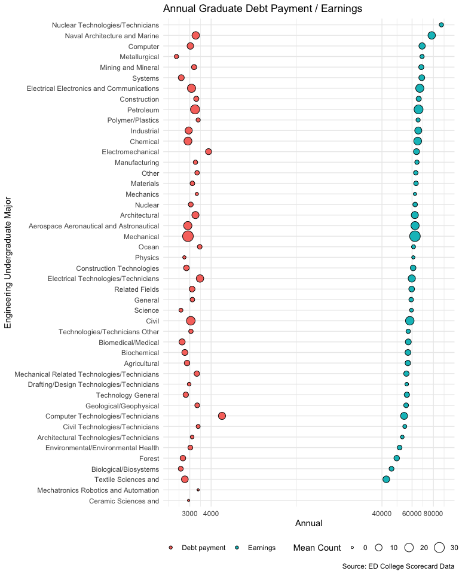
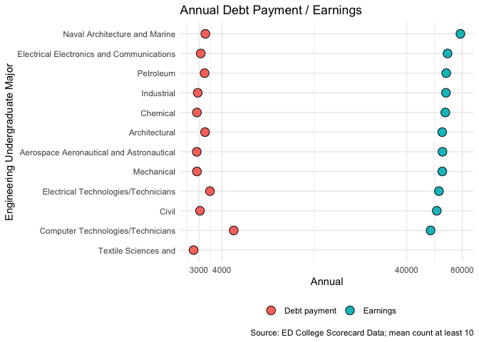

Analyze ED Outcomes Data
================
Zachary del Rosario
2019-11-24

On November 20th, the Department of Education released data on [college
student
outcomes](https://www.insidehighered.com/news/2019/11/21/federal-government-releases-earnings-data-thousands-college-programs),
for the first time disaggregated by degree program. Here I carry out an
exploratory analysis on the
    data.

``` r
library(tidyverse)
```

    ## ── Attaching packages ────────────────────────────────── tidyverse 1.2.1 ──

    ## ✔ ggplot2 3.2.1     ✔ purrr   0.3.2
    ## ✔ tibble  2.1.3     ✔ dplyr   0.8.3
    ## ✔ tidyr   1.0.0     ✔ stringr 1.4.0
    ## ✔ readr   1.3.1     ✔ forcats 0.4.0

    ## ── Conflicts ───────────────────────────────────── tidyverse_conflicts() ──
    ## ✖ dplyr::filter() masks stats::filter()
    ## ✖ dplyr::lag()    masks stats::lag()

``` r
library(ggrepel)
library(rpnd)
```

``` r
file_data <- "./FieldOfStudyData1516_1617_PP.csv"

df_raw <-
  file_data %>%
  read_csv(
    col_types = cols(
      UNITID          = col_double(),
      OPEID6          = col_character(),
      INSTNM          = col_character(),
      CONTROL         = col_character(),
      MAIN            = col_double(),
      CIPCODE         = col_character(),
      CIPDESC         = col_character(),
      CREDLEV         = col_double(),
      CREDDESC        = col_character(),

      COUNT           = col_double(),
      DEBTMEDIAN      = col_double(),
      DEBTPAYMENT10YR = col_double(),
      DEBTMEAN        = col_double(),
      TITLEIVCOUNT    = col_double(),
      EARNINGSCOUNT   = col_double(),
      MD_EARN_WNE     = col_double(),
      IPEDSCOUNT1     = col_character(),
      IPEDSCOUNT2     = col_character()
    )
  )
```

    ## Warning: 1150106 parsing failures.
    ## row             col expected            actual                                 file
    ##   1 COUNT           a double PrivacySuppressed './FieldOfStudyData1516_1617_PP.csv'
    ##   1 DEBTMEDIAN      a double PrivacySuppressed './FieldOfStudyData1516_1617_PP.csv'
    ##   1 DEBTPAYMENT10YR a double PrivacySuppressed './FieldOfStudyData1516_1617_PP.csv'
    ##   1 DEBTMEAN        a double PrivacySuppressed './FieldOfStudyData1516_1617_PP.csv'
    ##   1 TITLEIVCOUNT    a double PrivacySuppressed './FieldOfStudyData1516_1617_PP.csv'
    ## ... ............... ........ ................. ....................................
    ## See problems(...) for more details.

``` r
df_data <-
  df_raw %>%
  select(
    uid               = UNITID,
    institution       = INSTNM,
    control           = CONTROL,
    major             = CIPDESC,
    level             = CREDLEV,
    degree            = CREDDESC,
    count             = COUNT,
    debt_median       = DEBTMEDIAN,
    debt_payment_10yr = DEBTPAYMENT10YR,
    debt_mean         = DEBTMEAN,
    title_iv_count    = TITLEIVCOUNT,
    earnings_count    = EARNINGSCOUNT,
    earnings_median   = MD_EARN_WNE
  ) %>%
  mutate(
    debt_annual = 12 * debt_payment_10yr,
    count = if_else(is.na(count), 0, count),
    earnings_count = if_else(is.na(earnings_count), 0, earnings_count),
    title_iv_count = if_else(is.na(title_iv_count), 0, title_iv_count)
  )
```

## UG Engineering Colleges

<!-- -------------------------------------------------- -->

I have a particular interest in small undergraduate-focused engineering
colleges. How do they compare?

``` r
df_data %>%
  filter(
    str_detect(institution, "Olin") |
    str_detect(institution, "Harvey Mudd") |
    str_detect(institution, "Rose-Hulman")
  ) %>%
  select(
    institution,
    major,
    count,
    debt_median,
    title_iv_count,
    earnings_median,
    earnings_count
  ) %>%
  mutate(
    institution = case_when(
      str_detect(institution, "Olin") ~ "Olin",
      str_detect(institution, "Harvey Mudd") ~ "HMC",
      str_detect(institution, "Rose-Hulman") ~ "RHIT"
    )
  ) %>%
  filter((debt_median > 0) | (earnings_median > 0)) %>%
  arrange(desc(earnings_median)) %>%
  knitr::kable()
```

| institution | major                                                   | count | debt\_median | title\_iv\_count | earnings\_median | earnings\_count |
| :---------- | :------------------------------------------------------ | ----: | -----------: | ---------------: | ---------------: | --------------: |
| HMC         | Computer Science.                                       |    29 |        24089 |               43 |           124500 |              41 |
| RHIT        | Computer Science.                                       |    53 |        24979 |               58 |           107800 |              57 |
| RHIT        | Computer Engineering.                                   |    75 |        26500 |               82 |            84900 |              82 |
| Olin        | Engineering, General.                                   |    33 |        15691 |               22 |            77700 |              22 |
| HMC         | Engineering, General.                                   |    67 |        22034 |               45 |            77500 |              43 |
| RHIT        | Chemical Engineering.                                   |   100 |        27000 |               85 |            75900 |              85 |
| RHIT        | Electrical, Electronics and Communications Engineering. |    54 |        26932 |               46 |            73500 |              45 |
| Olin        | Mechanical Engineering.                                 |    13 |           NA |               23 |            72200 |              21 |
| RHIT        | Mechanical Engineering.                                 |   233 |        26000 |              180 |            68900 |             179 |
| RHIT        | Civil Engineering.                                      |    54 |        27000 |               44 |            64800 |              43 |
| RHIT        | Biomedical/Medical Engineering.                         |    49 |        27000 |               33 |            64300 |              32 |
| HMC         | Mathematics and Computer Science.                       |    22 |        25248 |                0 |               NA |               0 |
| HMC         | Physics.                                                |    22 |        20201 |                0 |               NA |               0 |
| Olin        | Electrical, Electronics and Communications Engineering. |    21 |        16675 |                0 |               NA |               0 |

I know that HMC tends to pride itself on high starting salaries for its
graduates; it appears that CS drives a lot of that outcome. Olin’s
general engineering degree includes both CS-focused and other
self-designed majors, which probably accounts for some of the difference
with Olin’s ME degree.

Given the small numbers at HMC and Olin, it appears the ED does not have
access to data across all majors offered. The ED is probably only able
to collect data from students that interact with federally-funded
programs—this is something to keep in mind when studying the rest of the
data.

## EDA

<!-- -------------------------------------------------- -->

What majors tend to receive Title IV funding in greater volume; that is,
number of Title IV counts (not dollar values)?

``` r
df_data %>%
  group_by(major) %>%
  summarize(
    total = sum(title_iv_count, na.rm = TRUE),
    mean = mean(title_iv_count, na.rm = TRUE)
  ) %>%
  arrange(desc(total)) %>%
  head(n = 20) %>%
  knitr::kable()
```

| major                                                                              |   total |      mean |
| :--------------------------------------------------------------------------------- | ------: | --------: |
| Business Administration, Management and Operations.                                | 1133314 | 170.44879 |
| Allied Health and Medical Assisting Services.                                      |  615117 | 190.32085 |
| Registered Nursing, Nursing Administration, Nursing Research and Clinical Nursing. |  461964 | 102.49922 |
| Health and Medical Administrative Services.                                        |  401528 |  93.59627 |
| Cosmetology and Related Personal Grooming Services.                                |  297222 | 128.05773 |
| Criminal Justice and Corrections.                                                  |  267877 |  66.06091 |
| Accounting and Related Services.                                                   |  205364 |  45.38431 |
| Psychology, General.                                                               |  138199 |  52.03276 |
| Liberal Arts and Sciences, General Studies and Humanities.                         |  124205 |  31.60433 |
| Vehicle Maintenance and Repair Technologies.                                       |  117854 |  70.91095 |
| Teacher Education and Professional Development, Specific Levels and Methods.       |  108982 |  29.39105 |
| Human Resources Management and Services.                                           |   94101 |  62.15390 |
| Dental Support Services and Allied Professions.                                    |   92139 |  65.16195 |
| Behavioral Sciences.                                                               |   76730 | 433.50282 |
| Allied Health Diagnostic, Intervention, and Treatment Professions.                 |   71592 |  22.13729 |
| Culinary Arts and Related Services.                                                |   69946 |  54.47508 |
| Human Services, General.                                                           |   68148 |  86.92347 |
| Business/Commerce, General.                                                        |   65924 |  36.12274 |
| Marketing.                                                                         |   65793 |  36.57198 |
| Communication and Media Studies.                                                   |   65664 |  32.00000 |

  - Top Title IV volume goes to Business admin and various health
    professions

What majors have the greatest debt?

``` r
df_data %>%
  group_by(major) %>%
  summarize(
    total = sum(debt_median, na.rm = TRUE),
    median = median(debt_median, na.rm = TRUE)
  ) %>%
  arrange(desc(median)) %>%
  head(n = 20) %>%
  knitr::kable()
```

| major                                                       |    total |   median |
| :---------------------------------------------------------- | -------: | -------: |
| Osteopathic Medicine/Osteopathy.                            |  7477130 | 261732.0 |
| Dentistry.                                                  | 16308535 | 232056.0 |
| Podiatric Medicine/Podiatry.                                |  1972751 | 225063.0 |
| Advanced/Graduate Dentistry and Oral Sciences.              |  4602985 | 183616.0 |
| Chiropractic.                                               |  2855536 | 176263.5 |
| Medicine.                                                   | 25683219 | 173352.0 |
| Optometry.                                                  |  3513853 | 163822.0 |
| Veterinary Medicine.                                        |  6211430 | 163215.5 |
| Dental Residency Programs.                                  |   259421 | 129710.5 |
| Pharmacy, Pharmaceutical Sciences, and Administration.      | 18788707 | 123016.0 |
| Law.                                                        | 24434393 | 108222.0 |
| Alternative and Complementary Medicine and Medical Systems. |  5102311 |  95581.0 |
| Medical Clinical Sciences/Graduate Medical Studies.         |   171009 |  85504.5 |
| Real Estate Development.                                    |   279035 |  71219.0 |
| Rehabilitation and Therapeutic Professions.                 | 32638483 |  61500.0 |
| Bioethics/Medical Ethics.                                   |   113824 |  56912.0 |
| Legal Research and Advanced Professional Studies.           |  2539765 |  54664.0 |
| Clinical, Counseling and Applied Psychology.                | 29380520 |  51125.0 |
| Archeology.                                                 |   120018 |  48080.0 |
| Alternative and Complementary Medical Support Services.     |    47334 |  47334.0 |

Perhaps unsurprisingly, medical doctoral programs result in the greatest
debt, at least within this dataset.

How does total debt compare against earnings for different majors?

``` r
df_major_summaries <-
  df_data %>%
  filter(level == 3) %>% # UG only
  group_by(major) %>%
  summarize(
    earnings_median = median(earnings_median, na.rm = TRUE),
    debt_median = median(debt_median, na.rm = TRUE)
  ) %>%
  ## Categorize earnings-debt space
  filter(!is.na(debt_median), !is.na(earnings_median)) %>%
  add_pareto(
    max(debt_median) | max(earnings_median),
    var = "expensive"
  ) %>%
  add_pareto(
    min(debt_median) | max(earnings_median),
    var = "efficient"
  ) %>%
  add_pareto(
    max(debt_median) | min(earnings_median),
    var = "poor"
  ) %>%
  mutate(plain = !expensive & !efficient & !poor) %>%
  gather(key = "type", value = "flag", expensive, efficient, poor, plain) %>%
  filter(flag) %>%
  select(-flag) %>%
  ## Aesthetics
  mutate(major = str_wrap(major, width = 15))

## Plot
df_major_summaries %>%
  filter(type != "plain") %>%
  ggplot(aes(debt_median, earnings_median)) +
  geom_point(
    data = df_major_summaries %>%
      filter(type == "plain") %>%
      select(-type),
    color = "grey80",
    size = 2
  ) +
  geom_point(
    mapping = aes(fill = type),
    color = "black",
    pch = 21,
    size = 2
  ) +
  geom_label_repel(
    mapping = aes(label = major),
    size = 3,
    force = 10
  ) +
  ## Tail
  facet_grid(type~.) +
  scale_x_log10(breaks = c(10000, 30000, 100000)) +
  scale_y_log10(breaks = c(10000, 30000, 100000)) +
  theme_minimal() +
  theme(legend.position = "none") +
  labs(
    x = "Median Debt",
    y = "Median Earnings",
    title = "Earnings v Debt, Undergraduate Majors",
    caption = "Source: ED College Scorecard Data"
  )
```

<!-- -->

I categorize undergraduate degrees based on their location in
Earning-Debt space: - Efficient majors have high Earnings and low Debt -
Expensive majors have both high Earnings and high Debt - Poor majors
have low Earnings but high Debt

Such information could potentially be helpful to students in major
decisions.

## Engineering Major Debt and Earnings

<!-- -------------------------------------------------- -->

I have a particular interest in Engineering degrees; how do these
compare?

``` r
df_dollars <-
  df_data %>%
  filter(
    str_detect(major, "Engineer"),
    level == 3
  ) %>%
  ## Dollars
  gather(key = "type", value = "val", earnings_median, debt_annual) %>%
  group_by(major, type) %>%
  summarize(val = median(val, na.rm = TRUE)) %>%
  ungroup() %>%
  ## Factor mutation
  mutate(
    major = str_remove(major, "Engineer[[:alpha:]]+\\s?"),
    major = str_remove_all(major, "[,|\\.|-]"),
    major = str_remove(major, "\\s?$"),
    type = case_when(
      type == "debt_annual" ~ "Debt payment",
      type == "earnings_median" ~ "Earnings"
    )
  )

df_counts <-
  df_data %>%
  filter(str_detect(major, "Engineer")) %>%
  ## Dollars
  gather(key = "type", value = "count", title_iv_count, earnings_count) %>%
  mutate(count = if_else(is.na(count), 0, count)) %>%
  group_by(major, type) %>%
  summarize(count = mean(count)) %>%
  ungroup() %>%
  ## Factor mutation
  mutate(
    major = str_remove(major, "Engineer[[:alpha:]]+\\s?"),
    major = str_remove_all(major, "[,|\\.|-]"),
    major = str_remove(major, "\\s?$"),
    type = case_when(
      type == "title_iv_count" ~ "Debt payment",
      type == "earnings_count" ~ "Earnings"
    )
  )

left_join(
  df_dollars,
  df_counts,
  by = c("major", "type")
) %>%
  filter(!is.na(val)) %>%

  ggplot(aes(fct_reorder(major, val), val)) +
  geom_point(
    aes(size = count, fill = type),
    color = "black",
    pch = 21
  ) +
  scale_y_log10(breaks = c(3000, 4000, 40000, 60000, 80000)) +
  scale_fill_discrete(name = "") +
  scale_size_continuous(name = "Mean Count") +
  coord_flip() +
  theme_minimal() +
  theme(legend.position = "bottom") +
  labs(
    x = "Engineering Undergraduate Major",
    y = "Annual",
    title = "Annual Graduate Debt Payment / Earnings",
    caption = "Source: ED College Scorecard Data"
  )
```

<!-- -->

Observations: - Computer Technicians and Electromechnical engineers have
outlier levels of high debt - There are two clear ‘winner’ degrees in
terms of Earnings, and a tail of lower-paying Engineering UG majors -
There is a wide bulk of ‘middle’-paying Engineering majors - Petroleum,
chemical, and metallurgical-related majors tend to be on the higher-paid
side - Majors with a ‘technician’ flavor tend to be less well-paid

A focused version of the same plot, but filtering for a minimum count.

``` r
left_join(
  df_dollars,
  df_counts,
  by = c("major", "type")
) %>%
  filter(
    !is.na(val),
    count >= 10
  ) %>%

  ggplot(aes(fct_reorder(major, val), val)) +
  geom_point(
    aes(fill = type),
    color = "black",
    pch = 21,
    size = 4
  ) +
  scale_y_log10(breaks = c(3000, 4000, 40000, 80000)) +
  scale_fill_discrete(name = "") +
  coord_flip() +
  theme_minimal() +
  theme(legend.position = "bottom") +
  labs(
    x = "Engineering Undergraduate Major",
    y = "Annual",
    caption = "Source: ED College Scorecard Data; mean count at least 10",
    title = "Annual Debt Payment / Earnings"
  )
```

<!-- -->
