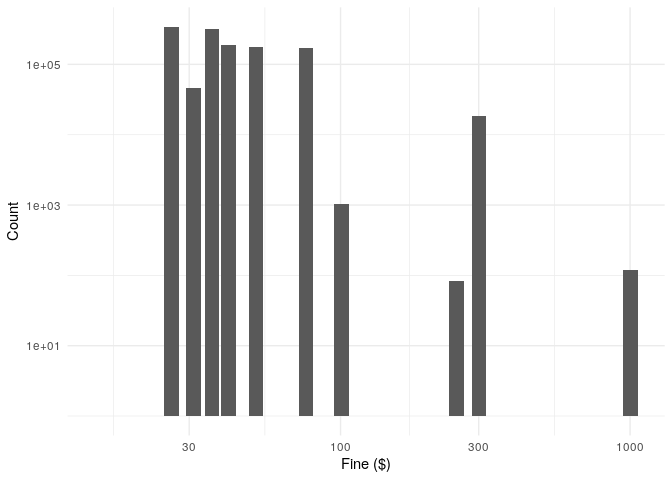
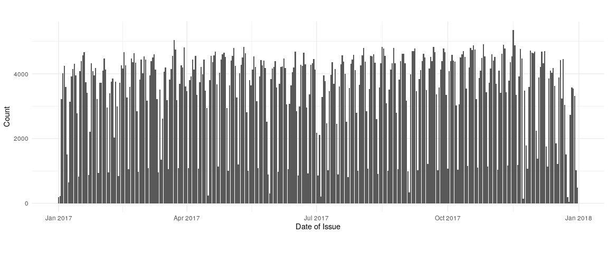
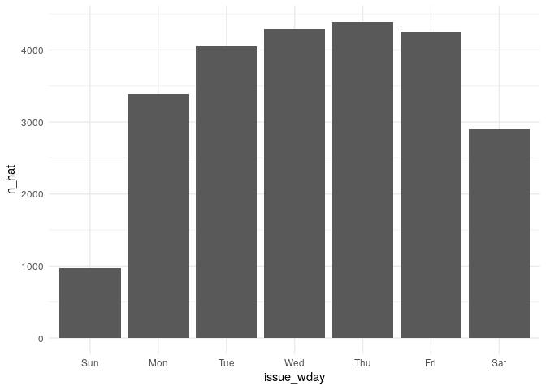
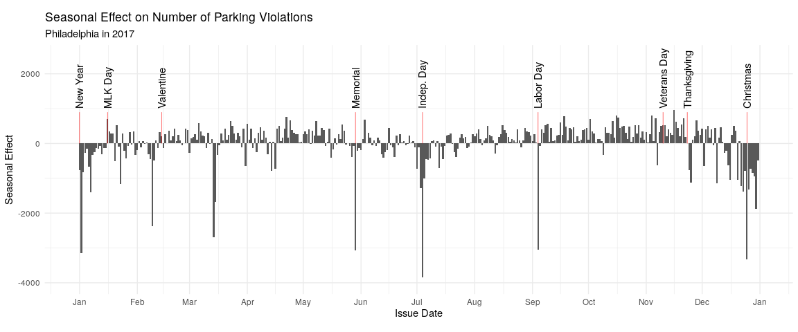

Philadelphia Parking Violations
================
Zach
2019-12-03

``` r
library(tidyverse)
```

    ## Registered S3 method overwritten by 'rvest':
    ##   method            from
    ##   read_xml.response xml2

    ## ── Attaching packages ────────────────────────────────── tidyverse 1.2.1 ──

    ## ✔ ggplot2 3.2.0       ✔ purrr   0.3.2  
    ## ✔ tibble  2.1.1       ✔ dplyr   0.8.0.1
    ## ✔ tidyr   0.8.3       ✔ stringr 1.4.0  
    ## ✔ readr   1.3.1       ✔ forcats 0.4.0

    ## ── Conflicts ───────────────────────────────────── tidyverse_conflicts() ──
    ## ✖ dplyr::filter() masks stats::filter()
    ## ✖ dplyr::lag()    masks stats::lag()

``` r
library(lubridate)
```

    ## 
    ## Attaching package: 'lubridate'

    ## The following object is masked from 'package:base':
    ## 
    ##     date

``` r
library(modelr)
```

``` r
df_tickets <-
  readr::read_csv(
"https://raw.githubusercontent.com/rfordatascience/tidytuesday/master/data/2019/2019-12-03/tickets.csv"
)
```

    ## Parsed with column specification:
    ## cols(
    ##   violation_desc = col_character(),
    ##   issue_datetime = col_datetime(format = ""),
    ##   fine = col_double(),
    ##   issuing_agency = col_character(),
    ##   lat = col_double(),
    ##   lon = col_double(),
    ##   zip_code = col_double()
    ## )

## \#\# Simple Checks

``` r
df_tickets %>% glimpse
```

    ## Observations: 1,260,891
    ## Variables: 7
    ## $ violation_desc <chr> "BUS ONLY ZONE", "STOPPING PROHIBITED", "OVER TIM…
    ## $ issue_datetime <dttm> 2017-12-06 12:29:00, 2017-10-16 18:03:00, 2017-1…
    ## $ fine           <dbl> 51, 51, 26, 26, 76, 51, 36, 36, 76, 26, 26, 301, …
    ## $ issuing_agency <chr> "PPA", "PPA", "PPA", "PPA", "PPA", "POLICE", "PPA…
    ## $ lat            <dbl> 40.03550, 40.02571, 40.02579, 40.02590, 39.95617,…
    ## $ lon            <dbl> -75.08111, -75.22249, -75.22256, -75.22271, -75.1…
    ## $ zip_code       <dbl> 19149, 19127, 19127, 19127, 19102, NA, NA, 19106,…

  - There are `1,260,891` tickets in this
    dataset.

<!-- end list -->

``` r
df_tickets %>% summary
```

    ##  violation_desc     issue_datetime                     fine        
    ##  Length:1260891     Min.   :2017-01-01 00:00:00   Min.   :  15.00  
    ##  Class :character   1st Qu.:2017-04-05 00:37:30   1st Qu.:  26.00  
    ##  Mode  :character   Median :2017-07-05 09:11:00   Median :  36.00  
    ##                     Mean   :2017-07-03 06:07:59   Mean   :  45.41  
    ##                     3rd Qu.:2017-10-01 13:20:30   3rd Qu.:  51.00  
    ##                     Max.   :2017-12-31 15:42:00   Max.   :1001.00  
    ##                                                                    
    ##  issuing_agency          lat             lon            zip_code     
    ##  Length:1260891     Min.   :39.57   Min.   :-75.99   Min.   :19102   
    ##  Class :character   1st Qu.:39.95   1st Qu.:-75.18   1st Qu.:19106   
    ##  Mode  :character   Median :39.95   Median :-75.16   Median :19123   
    ##                     Mean   :39.97   Mean   :-75.16   Mean   :19124   
    ##                     3rd Qu.:39.97   3rd Qu.:-75.15   3rd Qu.:19143   
    ##                     Max.   :40.37   Max.   :-74.96   Max.   :19154   
    ##                                                      NA's   :173588

  - The records are for 2017, spanning January 1st until December 31st
  - Fines are mostly for small amounts of cash, though the most
    expensive ticket is for over a thousand dollars\!
  - Zip codes are given for nearly all tickets, though a small minority
    (in the 100,000’s) are not available

<!-- end list -->

``` r
descriptions <-
  df_tickets %>%
  pull(violation_desc) %>%
  unique

length(descriptions)
```

    ## [1] 95

``` r
descriptions
```

    ##  [1] "BUS ONLY ZONE"        "STOPPING PROHIBITED"  "OVER TIME LIMIT"     
    ##  [4] "STOP PROHIBITED CC"   "DOUBLE PARKED"        "OVER TIME LIMIT CC"  
    ##  [7] "FIRE HYDRANT"         "METER EXPIRED"        "HP RESERVED SPACE"   
    ## [10] "METER EXPIRED CC"     "LOADING ZONE   CC"    "STREET CLEANING"     
    ## [13] "PASSENGR LOADNG ZONE" "EXPIRED INSPECTION"   "SIDEWALK"            
    ## [16] "CORNER CLEARANCE"     "PARKING PROHBITED CC" "PARKING PROHBITED"   
    ## [19] "HP RAMP BLOCKED"      "CROSSWALK"            "IMPROPER ON 2WAY HWY"
    ## [22] "TAXI STAND"           "BLOCKING DRIVEWAY"    "SIDEWALK   CC"       
    ## [25] "PRIVATE PROPERTY"     "SCHOOL ZONE"          "BUS ONLY ZONE   CC"  
    ## [28] "UNREG/ABANDONED VEH"  "EXPIRED TAG"          "DOUBLE PARKED  CC"   
    ## [31] "LOADING ZONE"         "CAR SHARE VEHS ONLY"  "VALET ZONE VIOLATION"
    ## [34] "IMPROPER ON 1WAY HWY" "SNOW EMERGENCY ROUTE" "STOP MEDIAL STRIP"   
    ## [37] "STOP/BLOCK HIGHWAY"   "SNOW RELOCATION TOW"  "CORNER CLEARANCE  CC"
    ## [40] "TAXI NOT AT STAND"    "BUS NOT IN BUS STAND" "STOP IN INTERSECTION"
    ## [43] "DISPLAY VEH FOR SALE" "STOP ON R/R TRACK 44" "WASH/REPAIR VEH"     
    ## [46] "PARKING PROHIBITED"   "BLOCKING DRIVEWAY CC" "BLOCKNG MASS TRANSIT"
    ## [49] "CROSSWALK    CC"      "COUNTERFEIT HP PERM"  "COMMRCL VEH RES AREA"
    ## [52] "ON LIMITD ACCESS HW"  "ILLEGAL PLACED TICKT" "PK NEAR FIRE STAT 51"
    ## [55] "UNMETERED SPACE"      "SUSPENDED LICENSE"    "VALET VIOLATION"     
    ## [58] "PKG W/LIC SUSPD 75"   "PARK MOBILE HOME 28"  "EXCESSIVE IDLING"    
    ## [61] "BUS-IMP PSNG DISCHRG" "DISOBEY SIGN-PRHB 21" "PARKED ON BRIDGE 14" 
    ## [64] "STOP/BLOCK HIWY  CC"  "PARK METER IMPROPER"  "EXCESSIVE NOISE"     
    ## [67] "UNATTENDED VEH    29" "PARENTAL LIABILITY"   "PARK PROHIBITED 04"  
    ## [70] "IMPROPER-2WAY HWY 74" "PARKED ON GRASS"      "STOPPED IN SAFE ZONE"
    ## [73] "OBSTRUCT TROLLEY 52"  "UNLAWFUL ALARM"       "FRAUD PARK HP SPACE" 
    ## [76] "PARK PROHIB PLACE"    "INVALID CONT PERMIT"  "INVALID KIOSK RECPT" 
    ## [79] "DAMAGE TO METER"      "PK NEAR TRAFF SIGNAL" "INVALID RPP PERMIT"  
    ## [82] "DISOBEY SN-STANDING"  "BUS-IMPROPER LOADING" "ILLEGAL PLACD TKT 73"
    ## [85] "HIWAY CONSTRCTION 43" "PARK-TROLLEY STOP 23" "STOP PROHIBITED  CC" 
    ## [88] "OWNER ID ON COM VEH"  "STOP/BLOCK HWY  33"   "IMPROPER MOTORCYCLE" 
    ## [91] "PK OVER TIME LIM 17"  "+4HR IN LOADING ZONE" "PRK MTR IMPROPER 11" 
    ## [94] "INTERSECTION   CC"    "STOPPED SAFE ZONE CC"

  - There are `95` ticket descriptions

<!-- end list -->

``` r
df_tickets %>%
  pull(issuing_agency) %>%
  unique
```

    ##  [1] "PPA"      "POLICE"   "SEPTA"    "PENN"     "HOUSING"  "CENTER C"
    ##  [7] "TEMPLE"   "FAIRMNT"  "PRISONS"  "POST OFF" NA

I hadn’t thought about it before, but it stands to reason that multiple
agencies have the authority to issue tickets. The `POLICE` are of course
here, but `PENN` presumably refers to Pennsylvania University.

## 1 Dimensional EDA

<!-- -------------------------------------------------- -->

I tried a histogram of the `fine` values, but the fingers were
ridiculous. Checking a count table shows us why:

``` r
df_tickets %>%
  count(fine)
```

    ## # A tibble: 11 x 2
    ##     fine      n
    ##    <dbl>  <int>
    ##  1    15      1
    ##  2    26 342740
    ##  3    31  46793
    ##  4    36 314632
    ##  5    41 187886
    ##  6    51 178640
    ##  7    76 170509
    ##  8   101   1048
    ##  9   251     84
    ## 10   301  18438
    ## 11  1001    120

  - Fines seem to come in standard values

<!-- end list -->

``` r
df_tickets %>%
  count(fine) %>%

  ggplot(aes(fine, n)) +
  geom_bar(stat = "identity") +
  ## Tail
  scale_x_log10() +
  scale_y_log10() +
  theme_minimal() +
  labs(
    x = "Fine ($)",
    y = "Count"
  )
```

<!-- -->

Observations:

  - The bulk of tickets are in the \< $100 range
  - A minority of tickets are in the $100-$300 range
  - A small fraction of tickets are around $1000
      - What violation *is* this?\!

## Timeseries

<!-- -------------------------------------------------- -->

Let’s try

``` r
df_tickets %>%
  mutate(issue_date = date(issue_datetime)) %>%
  count(issue_date) %>%

  ggplot(aes(issue_date, n)) +
  geom_bar(stat = "identity") +
  ## Tail
  theme_minimal() +
  theme(aspect.ratio = 1 / 3) +
  labs(
    x = "Date of Issue",
    y = "Count"
  )
```

<!-- -->

Observations:

  - There seems to be some cyclical pattern in the data; this is
    probably the effect of a work-week
  - It’s rather challenging to see much from this visualization; let’s
    try modeling the week effect and subtracting it.

Here I model the weekday effect on the counts.

``` r
df_dates <-
  df_tickets %>%
  mutate(issue_date = date(issue_datetime)) %>%
  count(issue_date) %>%
  mutate(issue_wday = wday(issue_date, label = TRUE))

fit_wday <-
  lm(
    formula = n ~ issue_wday,
    data = df_dates
  )

df_dates <-
  df_dates %>%
  add_predictions(fit_wday, var = "n_hat") %>%
  mutate(n_resid = n - n_hat)
```

Let’s visualize the weekday-effect model:

``` r
tibble(
  issue_wday = df_dates %>%
    pull(issue_wday) %>%
    unique
) %>%
  add_predictions(fit_wday, var = "n_hat") %>%

  ggplot(aes(issue_wday, n_hat)) +
  geom_bar(stat = "identity") +
  theme_minimal()
```

<!-- -->

The peak issue-date seems to be Thursday, with Sunday having the fewest
tickets issued. The low weekend counts can explain the cyclical pattern
we saw above.

``` r
df_holidays <-
  tribble(
           ~date, ~holiday,
    "2017-01-01", "New Year",
    "2017-01-16", "MLK Day",
    "2017-02-14", "Valentine",
    "2017-05-29", "Memorial",
    "2017-07-04", "Indep. Day",
    "2017-09-04", "Labor Day",
    "2017-11-10", "Veterans Day",
    "2017-11-23", "Thanksgiving",
    "2017-12-25", "Christmas"
  ) %>%
  mutate(date = ymd(date))

df_dates %>%
  ggplot(aes(issue_date, n_resid)) +
  geom_bar(stat = "identity") +
  geom_segment(
    data = df_holidays,
    mapping = aes(x = date, y = 0, xend = date, yend = 900),
    color = "red",
    size = 0.2
  ) +
  geom_text(
    data = df_holidays,
    mapping = aes(x = date, y = 1000, label = holiday),
    angle = 90,
    hjust = 0
  ) +
  ## Tail
  scale_x_date(date_breaks = "1 month", date_labels = "%b") +
  scale_y_continuous(limits = c(-4000, 2500)) +
  theme_minimal() +
  theme(aspect.ratio = 1 / 3) +
  labs(
    x = "Issue Date",
    y = "Seasonal Effect",
    title = "Seasonal Effect on Number of Parking Violations",
    subtitle = "Philadelphia in 2017"
  )
```

    ## Warning: Removed 1 rows containing missing values (position_stack).

<!-- -->

Negative spikes correspond to fewer tickets than weekday effects would
predict

There do seem to be **strong** seasonal effects:

  - Many of the strong negative spikes are associated with national
    holidays.
  - The time around Christmas day seems to be a period of prolonged
    low-ticket behavior; sensibly, people are probably staying home
    during this time.
  - March 14th is an oddity; the best I can tell is there was a [heavy
    snowstorm](https://www.inquirer.com/philly/blogs/real-time/Snow-sleet-freezing-rain-Stella-blizzard-Philadelphia-March-14-2017.html)
    that week.
  - February 9th may also be explained by a
    [snowstorm](https://www.phillyvoice.com/latest-forecast-goes-deep-6-10-inches-of-snow-across-region/).
