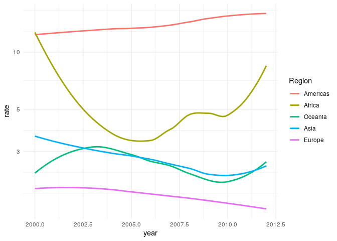
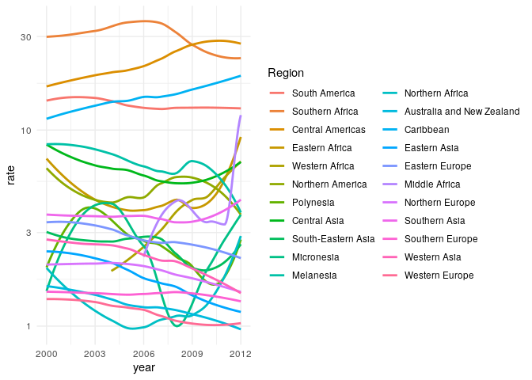
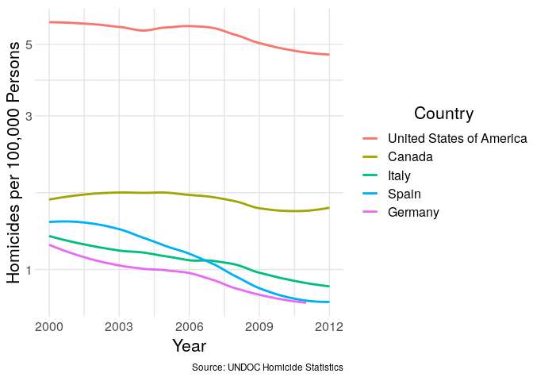
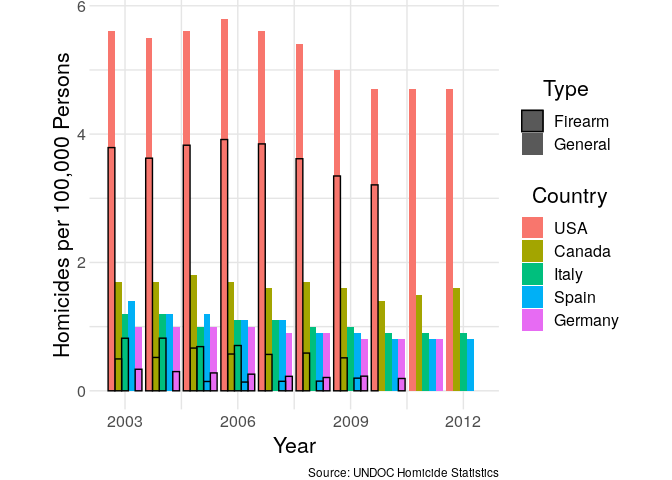

UNDOC Homicide Data
================
Zach
2019-12-10

This week's [tidytuesday](https://github.com/rfordatascience/tidytuesday/tree/master/data/2019/2019-12-10) is focused on re-creating plots from the news. However, I was more interested in apparent discrepancies between the datasets, and decided to return to the original UNDOC data.

``` r
library(tidyverse)
library(readxl)

murders <- readr::read_csv("https://raw.githubusercontent.com/rfordatascience/tidytuesday/master/data/2019/2019-12-10/international_murders.csv")
```

    ## Parsed with column specification:
    ## cols(
    ##   country = col_character(),
    ##   count = col_double(),
    ##   label = col_character(),
    ##   code = col_character()
    ## )

``` r
gun_murders <- readr::read_csv("https://raw.githubusercontent.com/rfordatascience/tidytuesday/master/data/2019/2019-12-10/gun_murders.csv")
```

    ## Parsed with column specification:
    ## cols(
    ##   country = col_character(),
    ##   count = col_double()
    ## )

``` r
diseases <- readr::read_csv("https://raw.githubusercontent.com/rfordatascience/tidytuesday/master/data/2019/2019-12-10/diseases.csv")
```

    ## Parsed with column specification:
    ## cols(
    ##   disease = col_character(),
    ##   state = col_character(),
    ##   year = col_double(),
    ##   weeks_reporting = col_double(),
    ##   count = col_double(),
    ##   population = col_double()
    ## )

``` r
nyc_regents <- readr::read_csv("https://raw.githubusercontent.com/rfordatascience/tidytuesday/master/data/2019/2019-12-10/nyc_regents.csv")
```

    ## Parsed with column specification:
    ## cols(
    ##   score = col_double(),
    ##   integrated_algebra = col_double(),
    ##   global_history = col_double(),
    ##   living_environment = col_double(),
    ##   english = col_double(),
    ##   us_history = col_double()
    ## )

``` r
theme_common <- function() {
  theme_minimal() %+replace%
  theme(
    axis.text.x = element_text(size = 12),
    axis.text.y = element_text(size = 12),
    axis.title.x = element_text(margin = margin(4, 4, 4, 4), size = 16),
    axis.title.y = element_text(margin = margin(4, 4, 4, 4), size = 16, angle = 90),

    legend.title = element_text(size = 16),
    legend.text = element_text(size = 12),

    strip.text.x = element_text(size = 12),
    strip.text.y = element_text(size = 12),

    panel.grid.major = element_line(color = "grey90"),
    panel.grid.minor = element_line(color = "grey90"),

    aspect.ratio = 4 / 4,
    plot.margin   = unit(c(t = +0, b = +0, r = +0, l = +0), "cm")
  )
}
```

Let's look at the two death-related datasets:

``` r
murders %>% arrange(desc(count)) %>% head()
```

    ## # A tibble: 6 x 4
    ##   country count label code 
    ##   <chr>   <dbl> <chr> <chr>
    ## 1 US       3.2  3.2   us   
    ## 2 ITALY    0.71 0.71  it   
    ## 3 CANADA   0.5  0.5   ca   
    ## 4 GERMANY  0.2  0.2   de   
    ## 5 UK       0.1  0.1   gb   
    ## 6 FRANCE   0.1  0.1   fr

``` r
gun_murders %>% arrange(desc(count)) %>% head()
```

    ## # A tibble: 6 x 2
    ##   country       count
    ##   <chr>         <dbl>
    ## 1 UNITED STATES  3.61
    ## 2 CANADA         0.5 
    ## 3 PORTUGAL       0.48
    ## 4 IRELAND        0.35
    ## 5 ITALY          0.35
    ## 6 BELGIUM        0.33

Both datasets are given as counts per 100,000 persons. The values are inconsistent---they're probably from different years. I'm curious about the trends over time, and the relation of these firearm homicide rates with the general homicide rates. To study that, I'll need to go back to the original data.

Comparison: UNDOC Homicide Data
-------------------------------

<!-- -------------------------------------------------- -->
Data from [UNDOC Global Study on Homicide](https://www.unodc.org/gsh/en/data.html).

``` r
df_raw <- read_excel(
  "GSH2013_Homicide_count_and_rate.xlsx",
  sheet = 1,
  skip = 6,
  col_names = c(
    "region",
    "sub_region",
    "territory",
    "source",
    "org",
    "indicator",
    "2000",
    "2001",
    "2002",
    "2003",
    "2004",
    "2005",
    "2006",
    "2007",
    "2008",
    "2009",
    "2010",
    "2011",
    "2012"
  )
)
```

``` r
## Trim head and notes
df_tmp <-
  df_raw %>%
  slice(-1) %>%
  slice(-(n()-5):-n())

## Detect notes and fill with NA
df_tmp %>%
  mutate(region = if_else(str_detect(region, "estimate|data"), NA_character_, region))
```

    ## # A tibble: 438 x 19
    ##    region sub_region territory source org   indicator `2000` `2001` `2002`
    ##    <chr>  <chr>      <chr>     <chr>  <chr> <chr>      <dbl>  <dbl>  <dbl>
    ##  1 Africa Eastern A… Burundi   PH     WHO   Rate          NA     NA     NA
    ##  2 <NA>   <NA>       <NA>      <NA>   <NA>  Count         NA     NA     NA
    ##  3 <NA>   <NA>       Comoros   PH     WHO   Rate          NA     NA     NA
    ##  4 <NA>   <NA>       <NA>      <NA>   <NA>  Count         NA     NA     NA
    ##  5 <NA>   <NA>       Djibouti  PH     WHO   Rate          NA     NA     NA
    ##  6 <NA>   <NA>       <NA>      <NA>   <NA>  Count         NA     NA     NA
    ##  7 <NA>   <NA>       Eritrea   PH     WHO   Rate          NA     NA     NA
    ##  8 <NA>   <NA>       <NA>      <NA>   <NA>  Count         NA     NA     NA
    ##  9 <NA>   <NA>       Ethiopia  PH     WHO   Rate          NA     NA     NA
    ## 10 <NA>   <NA>       <NA>      <NA>   <NA>  Count         NA     NA     NA
    ## # … with 428 more rows, and 10 more variables: `2003` <dbl>, `2004` <dbl>,
    ## #   `2005` <dbl>, `2006` <dbl>, `2007` <dbl>, `2008` <dbl>, `2009` <chr>,
    ## #   `2010` <chr>, `2011` <chr>, `2012` <chr>

``` r
## Repeatedly lag-fill until NA's are gone
countna <- function(df) {
  df %>%
    filter_at(vars(region, sub_region, territory, source, org), any_vars(is.na(.))) %>%
    dim %>%
    .[[1]]
}

while (countna(df_tmp) > 0) {
  df_tmp <-
    df_tmp %>%
    mutate_at(vars(region, sub_region, territory, source, org), ~if_else(is.na(.), lag(.), .))
}

## Cast all the estimates
df_tmp <-
  df_tmp %>%
  mutate_at(
    vars(`2000`:`2012`),
    as.numeric
  )
```

    ## Warning: NAs introduced by coercion

    ## Warning: NAs introduced by coercion

    ## Warning: NAs introduced by coercion

    ## Warning: NAs introduced by coercion

``` r
## Reshape
df_tmp <-
  df_tmp %>%
  pivot_longer(
    `2000`:`2012`,
    names_to = "year",
    values_to = "value",
    names_ptypes = list(year = integer())
  ) %>%
  pivot_wider(
    names_from = indicator,
    values_from = "value"
  ) %>%
  glimpse
```

    ## Observations: 2,847
    ## Variables: 8
    ## $ region     <chr> "Africa", "Africa", "Africa", "Africa", "Africa", "Af…
    ## $ sub_region <chr> "Eastern Africa", "Eastern Africa", "Eastern Africa",…
    ## $ territory  <chr> "Burundi", "Burundi", "Burundi", "Burundi", "Burundi"…
    ## $ source     <chr> "PH", "PH", "PH", "PH", "PH", "PH", "PH", "PH", "PH",…
    ## $ org        <chr> "WHO", "WHO", "WHO", "WHO", "WHO", "WHO", "WHO", "WHO…
    ## $ year       <int> 2000, 2001, 2002, 2003, 2004, 2005, 2006, 2007, 2008,…
    ## $ Rate       <dbl> NA, NA, NA, NA, NA, NA, NA, NA, NA, NA, NA, NA, 8, NA…
    ## $ Count      <dbl> NA, NA, NA, NA, NA, NA, NA, NA, NA, NA, NA, NA, 790, …

``` r
## Final cleaning
df_undoc <-
  df_tmp %>%
  rename_all(str_to_lower)

df_undoc %>%
  glimpse
```

    ## Observations: 2,847
    ## Variables: 8
    ## $ region     <chr> "Africa", "Africa", "Africa", "Africa", "Africa", "Af…
    ## $ sub_region <chr> "Eastern Africa", "Eastern Africa", "Eastern Africa",…
    ## $ territory  <chr> "Burundi", "Burundi", "Burundi", "Burundi", "Burundi"…
    ## $ source     <chr> "PH", "PH", "PH", "PH", "PH", "PH", "PH", "PH", "PH",…
    ## $ org        <chr> "WHO", "WHO", "WHO", "WHO", "WHO", "WHO", "WHO", "WHO…
    ## $ year       <int> 2000, 2001, 2002, 2003, 2004, 2005, 2006, 2007, 2008,…
    ## $ rate       <dbl> NA, NA, NA, NA, NA, NA, NA, NA, NA, NA, NA, NA, 8, NA…
    ## $ count      <dbl> NA, NA, NA, NA, NA, NA, NA, NA, NA, NA, NA, NA, 790, …

Let's check some summaries:

``` r
df_undoc %>% pull(region) %>% unique
```

    ## [1] "Africa"   "Americas" "Asia"     "Europe"   "Oceania"

``` r
df_undoc %>% summary
```

    ##     region           sub_region         territory        
    ##  Length:2847        Length:2847        Length:2847       
    ##  Class :character   Class :character   Class :character  
    ##  Mode  :character   Mode  :character   Mode  :character  
    ##                                                          
    ##                                                          
    ##                                                          
    ##                                                          
    ##     source              org                 year           rate       
    ##  Length:2847        Length:2847        Min.   :2000   Min.   : 0.000  
    ##  Class :character   Class :character   1st Qu.:2003   1st Qu.: 1.500  
    ##  Mode  :character   Mode  :character   Median :2006   Median : 3.800  
    ##                                        Mean   :2006   Mean   : 8.941  
    ##                                        3rd Qu.:2009   3rd Qu.:10.200  
    ##                                        Max.   :2012   Max.   :91.400  
    ##                                                       NA's   :1242    
    ##      count        
    ##  Min.   :    0.0  
    ##  1st Qu.:   37.0  
    ##  Median :  201.5  
    ##  Mean   : 2070.6  
    ##  3rd Qu.:  873.2  
    ##  Max.   :50108.0  
    ##  NA's   :1251

Sadly, this spreadsheet seems to be about half empty.

Before joining with the firearm homicide data, let's do some quick EDA on the general homicide data.

``` r
df_undoc %>%
  ggplot(aes(year, rate)) +
  geom_smooth(aes(color = fct_reorder2(region, year, rate)), se = FALSE) +
  ## Tail
  scale_y_log10() +
  scale_color_discrete(name = "Region") +
  theme_minimal()
```

    ## Warning: Transformation introduced infinite values in continuous y-axis

    ## `geom_smooth()` using method = 'loess' and formula 'y ~ x'

    ## Warning: Removed 1276 rows containing non-finite values (stat_smooth).



Observations:

-   I'm surprised to see the Americas have the highest homicide rates! I wonder which specific regions are affected?
-   Africa has a fairly unstable homicide rate; it has fluctuated quite a bit in the early part of the millennium.

``` r
df_undoc %>%
  ggplot(aes(year, rate)) +
  geom_smooth(aes(color = fct_reorder2(sub_region, year, rate)), se = FALSE) +
  ## Tail
  scale_y_log10() +
  scale_x_continuous(breaks = c(2000, 2003, 2006, 2009, 2012)) +
  scale_color_discrete(name = "Region") +
  theme_minimal()
```

    ## Warning: Transformation introduced infinite values in continuous y-axis

    ## `geom_smooth()` using method = 'loess' and formula 'y ~ x'

    ## Warning: Removed 1276 rows containing non-finite values (stat_smooth).

    ## Warning in simpleLoess(y, x, w, span, degree = degree, parametric =
    ## parametric, : pseudoinverse used at 2012

    ## Warning in simpleLoess(y, x, w, span, degree = degree, parametric =
    ## parametric, : neighborhood radius 2.03

    ## Warning in simpleLoess(y, x, w, span, degree = degree, parametric =
    ## parametric, : reciprocal condition number 0

    ## Warning in simpleLoess(y, x, w, span, degree = degree, parametric =
    ## parametric, : There are other near singularities as well. 1



Observations:

-   South and Central America account for the high average homicide rate we saw above.
-   Alarmingly Middle Africa has a sharp uptick in homicidate rate starting around 2010.

``` r
df_undoc %>%
  filter(sub_region == "Northern America") %>%
  group_by(territory) %>%
  summarize(rate = mean(rate, na.rm = TRUE))
```

    ## # A tibble: 5 x 2
    ##   territory                  rate
    ##   <chr>                     <dbl>
    ## 1 Bermuda                    5.49
    ## 2 Canada                     1.65
    ## 3 Greenland                 17.1 
    ## 4 Saint Pierre and Miquelon  8.25
    ## 5 United States of America   5.41

Observations:

-   Greenland has an enormous homicide rate, but keep in mind their population is about 56,000 total (so the statistic itself can fluctuate widely).
-   The USA has a homicide rate over three times that of neighboring Canada.

``` r
territories <-
  c(
    "United States of America",
    "Canada",
    "Germany",
    "Italy",
    "Spain"
  ) %>%
  paste(., collapse = "|")

df_undoc %>%
  filter(str_detect(territory, territories)) %>%

  ggplot(aes(year, rate)) +
  geom_smooth(aes(color = fct_reorder2(territory, year, rate)), se = FALSE) +
  ## Tail
  scale_y_log10() +
  scale_x_continuous(breaks = c(2000, 2003, 2006, 2009, 2012)) +
  scale_color_discrete(name = "Country") +
  theme_common() +
  labs(
    x = "Year",
    y = "Homicides per 100,000 Persons",
    caption = "Source: UNDOC Homicide Statistics"
  )
```

    ## `geom_smooth()` using method = 'loess' and formula 'y ~ x'

    ## Warning: Removed 1 rows containing non-finite values (stat_smooth).



This gives us a sense of all homicides, but we'll need firearm data to understand questions about gun violence.

Join: UNDOC Firearm data
------------------------

<!-- -------------------------------------------------- -->
I can't find a direct link on the UNDOC website; I found the following spreadsheet via Google search.

``` r
df_gun_raw <-
  read_excel(
    "Homicides_by_firearms.xls",
    sheet = 1,
    skip = 6,
    col_names = c(
      "region",
      "sub_region",
      "territory",
      "source",
      "org",
      "variable",
      "1995",
      "1996",
      "1997",
      "1998",
      "1999",
      "2000",
      "2001",
      "2002",
      "2003",
      "2004",
      "2005",
      "2006",
      "2007",
      "2008",
      "2009",
      "2010"
    )
  ) %>%
  slice(-(n()-14):-n())

## Repeatedly lag-fill until NA's are gone
countna <- function(df, v_vars) {
  df %>%
    filter_at(vars(!!!v_vars), any_vars(is.na(.))) %>%
    dim %>%
    .[[1]]
}

v_vars <- c("region", "sub_region", "territory", "source", "org")
while (countna(df_gun_raw, v_vars) > 0) {
  df_gun_raw <-
    df_gun_raw %>%
    mutate_at(vars(!!!v_vars), ~if_else(is.na(.), lag(.), .))
}

## Cast all the estimates
df_gun_raw <-
  df_gun_raw %>%
  mutate_at(
    vars(`1995`:`2010`),
    as.numeric
  )

## Reshape
df_gun_raw <-
  df_gun_raw %>%
  pivot_longer(
    `1995`:`2010`,
    names_to = "year",
    values_to = "value",
    names_ptypes = list(year = integer())
  ) %>%
  mutate(
    variable = case_when(
      str_detect(variable, "percentage") ~ "percent",
      str_detect(variable, "number") ~ "count",
      str_detect(variable, "rate") ~ "gun_rate",
      TRUE ~ variable
    )
  ) %>%
  pivot_wider(
    names_from = variable,
    values_from = "value"
  )

## Final cleaning
df_undoc_gun <-
  df_gun_raw %>%
  rename_all(str_to_lower)

df_undoc_gun %>%
  glimpse
```

    ## Observations: 1,856
    ## Variables: 9
    ## $ region                               <chr> "Africa", "Africa", "Africa…
    ## $ sub_region                           <chr> "Eastern Africa", "Eastern …
    ## $ territory                            <chr> "Mauritius", "Mauritius", "…
    ## $ source                               <chr> "CJ", "CJ", "CJ", "CJ", "CJ…
    ## $ org                                  <chr> "CTS", "CTS", "CTS", "CTS",…
    ## $ year                                 <int> 1995, 1996, 1997, 1998, 199…
    ## $ `percentage of homicides by firearm` <dbl> NA, NA, NA, NA, NA, NA, NA,…
    ## $ `number of homicides by firearm`     <dbl> NA, NA, NA, NA, NA, NA, NA,…
    ## $ gun_rate                             <dbl> NA, NA, NA, NA, NA, NA, NA,…

Now we join with the general homicide data to visualize.

``` r
territories <-
  c(
    "United States of America",
    "Canada",
    "Germany",
    "Italy",
    "Spain"
  ) %>%
  paste(., collapse = "|")

full_join(
  df_undoc %>% select(territory, year, rate),
  df_undoc_gun %>% select(territory, year, gun_rate),
  by = c("territory", "year")
) %>%
  filter(
    str_detect(territory, territories),
    2003 <= year,
    year <= 2012
  ) %>%
  mutate(
    territory = if_else(str_detect(territory, "America"), "USA", territory)
  ) %>%

  ggplot(aes(year, fill = fct_reorder2(territory, year, rate))) +
  geom_bar(
    aes(y = rate, color = "General"),
    stat = "identity",
    position = position_dodge()
  ) +
  geom_bar(
    aes(y = gun_rate, color = "Firearm"),
    stat = "identity",
    position = position_dodge()
  ) +
  ## Tail
  scale_x_continuous(breaks = c(2000, 2003, 2006, 2009, 2012)) +
  scale_fill_discrete(name = "Country") +
  scale_color_manual(name = "Type", values = c("General" = NA, "Firearm" = "black")) +
  scale_linetype_manual(
    name = "Type",
    values = c("General" = 1, "Firearm" = 2)
  ) +
  theme_common() +
  labs(
    x = "Year",
    y = "Homicides per 100,000 Persons",
    caption = "Source: UNDOC Homicide Statistics"
  )
```

    ## Warning: Removed 1 rows containing missing values (geom_bar).

    ## Warning: Removed 18 rows containing missing values (geom_bar).



Observations:

-   Firearm homicides account for a majority of US homicides; Italy has a similar trend.
-   US *firearm* homicides occur at a greater rate than *general* homicides in similar nations.
-   Data availability on firearm homicides is less than general homicide data.
