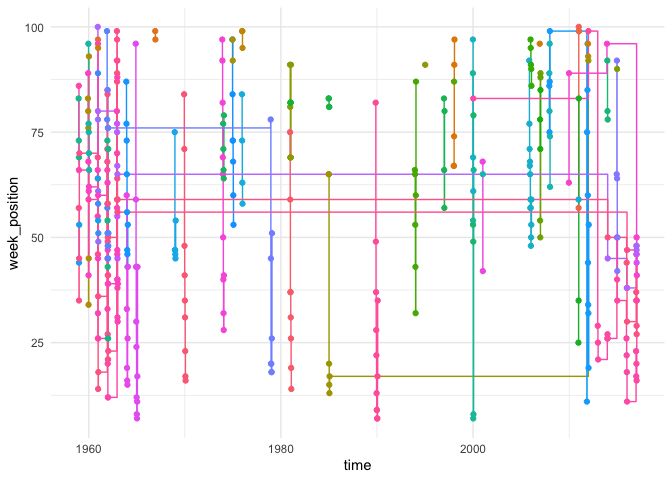
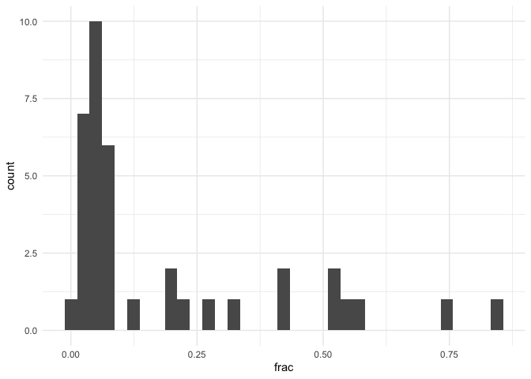
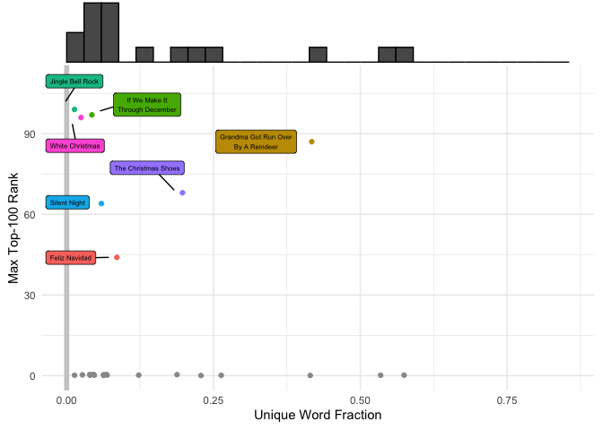
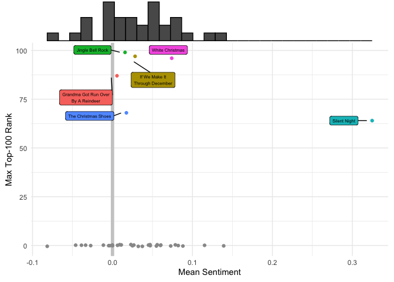
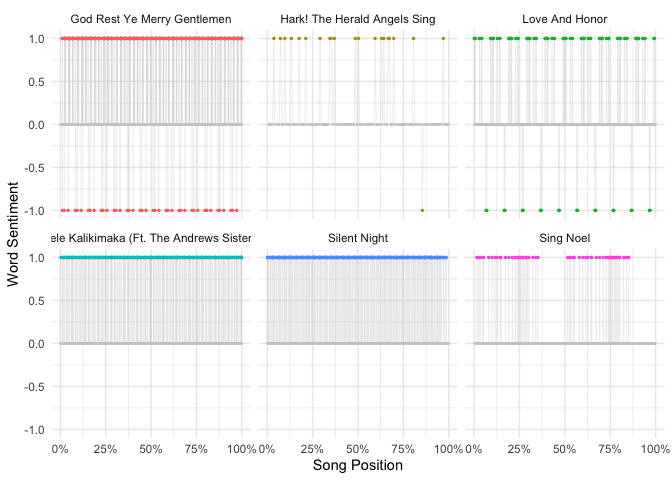
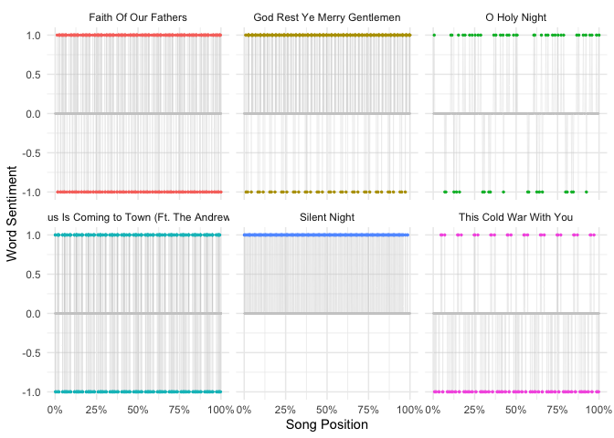
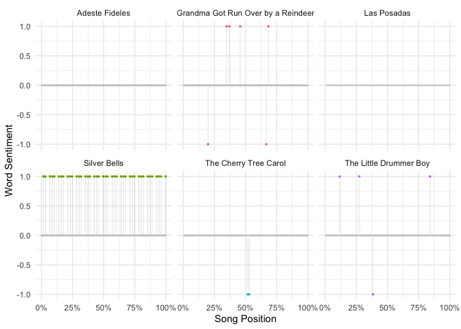

Christmas Songs on the Hot-100
================
Zach
2019-12-25

Tidy Tuesday 2019-12-24 dataset: Christmas songs on the Top-100 list.

``` r
library(tidyverse)
library(tidytext)
library(lubridate)

df_songs <- readr::read_csv("https://raw.githubusercontent.com/rfordatascience/tidytuesday/master/data/2019/2019-12-24/christmas_songs.csv") %>%
  mutate(time = mdy(weekid))
```

    ## Parsed with column specification:
    ## cols(
    ##   url = col_character(),
    ##   weekid = col_character(),
    ##   week_position = col_double(),
    ##   song = col_character(),
    ##   performer = col_character(),
    ##   songid = col_character(),
    ##   instance = col_double(),
    ##   previous_week_position = col_double(),
    ##   peak_position = col_double(),
    ##   weeks_on_chart = col_double(),
    ##   year = col_double(),
    ##   month = col_double(),
    ##   day = col_double()
    ## )

``` r
df_lyrics <- readr::read_tsv("https://raw.githubusercontent.com/rfordatascience/tidytuesday/master/data/2019/2019-12-24/christmas_lyrics.tsv")
```

    ## Parsed with column specification:
    ## cols(
    ##   title = col_character(),
    ##   artist = col_character(),
    ##   songid = col_character(),
    ##   weekid = col_character(),
    ##   track_title = col_character(),
    ##   track_n = col_double(),
    ##   line = col_double(),
    ##   lyric = col_character()
    ## )

## Glimpses

<!-- -------------------------------------------------- -->

A quick look at the data:

``` r
df_songs %>% glimpse
```

    ## Observations: 387
    ## Variables: 14
    ## $ url                    <chr> "http://www.billboard.com/charts/hot-100/…
    ## $ weekid                 <chr> "12/13/1958", "12/20/1958", "12/20/1958",…
    ## $ week_position          <dbl> 83, 57, 73, 86, 44, 66, 69, 35, 45, 53, 7…
    ## $ song                   <chr> "RUN RUDOLPH RUN", "JINGLE BELL ROCK", "R…
    ## $ performer              <chr> "Chuck Berry", "Bobby Helms", "Chuck Berr…
    ## $ songid                 <chr> "Run Rudolph RunChuck Berry", "Jingle Bel…
    ## $ instance               <dbl> 1, 1, 1, 1, 1, 1, 1, 1, 1, 1, 1, 1, 1, 1,…
    ## $ previous_week_position <dbl> NA, NA, 83, NA, NA, 86, 73, 57, 35, 44, 4…
    ## $ peak_position          <dbl> 69, 29, 69, 12, 44, 12, 69, 29, 29, 44, 2…
    ## $ weeks_on_chart         <dbl> 3, 19, 3, 13, 2, 13, 3, 19, 19, 2, 19, 6,…
    ## $ year                   <dbl> 1958, 1958, 1958, 1958, 1958, 1958, 1958,…
    ## $ month                  <dbl> 12, 12, 12, 12, 12, 12, 12, 12, 1, 1, 1, …
    ## $ day                    <dbl> 13, 20, 20, 20, 27, 27, 27, 27, 3, 3, 10,…
    ## $ time                   <date> 1958-12-13, 1958-12-20, 1958-12-20, 1958…

``` r
df_lyrics %>% glimpse
```

    ## Observations: 7,525
    ## Variables: 8
    ## $ title       <chr> "JINGLE BELL ROCK", "JINGLE BELL ROCK", "JINGLE BELL…
    ## $ artist      <chr> "Bobby Helms", "Bobby Helms", "Bobby Helms", "Bobby …
    ## $ songid      <chr> "Jingle Bell RockBobby Helms", "Jingle Bell RockBobb…
    ## $ weekid      <chr> "12/20/1958", "12/20/1958", "12/20/1958", "12/20/195…
    ## $ track_title <chr> "Jingle Bell Rock", "Jingle Bell Rock", "Jingle Bell…
    ## $ track_n     <dbl> 1, 1, 1, 1, 1, 1, 1, 1, 1, 1, 1, 1, 1, 1, 1, 1, 1, 1…
    ## $ line        <dbl> 1, 2, 3, 4, 5, 6, 7, 8, 9, 10, 11, 12, 13, 14, 15, 1…
    ## $ lyric       <chr> "Jingle bell, jingle bell, jingle bell rock", "Jingl…

I’m not sure why there are both `title` and `track_title` variables…

``` r
df_lyrics %>% pull(title) %>% unique
```

    ## [1] "JINGLE BELL ROCK"                  
    ## [2] "WHITE CHRISTMAS"                   
    ## [3] "IF WE MAKE IT THROUGH DECEMBER"    
    ## [4] "GRANDMA GOT RUN OVER BY A REINDEER"
    ## [5] "THE CHRISTMAS SHOES"               
    ## [6] "FELIZ NAVIDAD"

There are only `6` unique `title`
    values.

``` r
df_lyrics %>% pull(track_title) %>% unique
```

    ##  [1] "Jingle Bell Rock"                                                               
    ##  [2] "Silent Night"                                                                   
    ##  [3] "Adeste Fideles"                                                                 
    ##  [4] "White Christmas"                                                                
    ##  [5] "God Rest Ye Merry Gentlemen"                                                    
    ##  [6] "Faith Of Our Fathers"                                                           
    ##  [7] "I'll Be Home For Christmas (If Only In My Dreams)"                              
    ##  [8] "Jingle Bells"                                                                   
    ##  [9] "Santa Claus Is Coming to Town (Ft. The Andrews Sisters)"                        
    ## [10] "Silver Bells"                                                                   
    ## [11] "Its beginning to look a lot like christmas by Bing Crosby & The Andrews Sisters"
    ## [12] "Christmas in Killarney"                                                         
    ## [13] "Mele Kalikimaka (Ft. The Andrews Sisters)"                                      
    ## [14] "If We Make It Through December"                                                 
    ## [15] "Love And Honor"                                                                 
    ## [16] "To Each His Own"                                                                
    ## [17] "You're The Only Girl In The Game"                                               
    ## [18] "I'm An Old Old Man Tryin' To Live While I Can"                                  
    ## [19] "Come On Into My Arms"                                                           
    ## [20] "Better Off When I Was Hungry"                                                   
    ## [21] "I'll Break Out Again Tonight"                                                   
    ## [22] "This Cold War With You"                                                         
    ## [23] "Uncle Lem"                                                                      
    ## [24] "Grandma Got Run Over by a Reindeer"                                             
    ## [25] "Rudolph, The Red-Nosed Reindeer"                                                
    ## [26] "Percy, The Puny Poinsettia"                                                     
    ## [27] "Here's to the Lonely"                                                           
    ## [28] "Senor Santa Claus"                                                              
    ## [29] "Joy to the World"                                                               
    ## [30] "Christmas"                                                                      
    ## [31] "Medley 1"                                                                       
    ## [32] "Sing Noel"                                                                      
    ## [33] "The Christmas Shoes"                                                            
    ## [34] "Rockin' Around the Christmas Tree"                                              
    ## [35] "You're A Mean One, Mr. Grinch"                                                  
    ## [36] "Light Your World"                                                               
    ## [37] "Medley 2"                                                                       
    ## [38] "What Child Is This?"                                                            
    ## [39] "As the World Slept"                                                             
    ## [40] "The First Noel"                                                                 
    ## [41] "Christmas Carol"                                                                
    ## [42] "O Holy Night"                                                                   
    ## [43] "Feliz Navidad"                                                                  
    ## [44] "The Christmas Song"                                                             
    ## [45] "The Cherry Tree Carol"                                                          
    ## [46] "The Little Drummer Boy"                                                         
    ## [47] "Mary's Little Boy Child"                                                        
    ## [48] "Hark! The Herald Angels Sing"                                                   
    ## [49] "Las Posadas"

There are `49` unique `track_title` values; this is what I’ll use to
group the song lyrics.

``` r
df_lyrics %>%
  group_by(track_title) %>%
  summarize(length = max(line)) %>%
  select(track_title, length)
```

    ## # A tibble: 49 x 2
    ##    track_title                  length
    ##    <chr>                         <dbl>
    ##  1 Adeste Fideles                   18
    ##  2 As the World Slept               NA
    ##  3 Better Off When I Was Hungry     12
    ##  4 Christmas                        NA
    ##  5 Christmas Carol                  NA
    ##  6 Christmas in Killarney           18
    ##  7 Come On Into My Arms             14
    ##  8 Faith Of Our Fathers             20
    ##  9 Feliz Navidad                    52
    ## 10 God Rest Ye Merry Gentlemen      30
    ## # … with 39 more rows

We don’t have lyric data on every song; let’s see how many have this
info.

``` r
df_lyrics %>%
  group_by(track_title) %>%
  summarize(length = max(line)) %>%
  select(track_title, length) %>%
  filter(!is.na(length)) %>%
  arrange(desc(length))
```

    ## # A tibble: 35 x 2
    ##    track_title                                                       length
    ##    <chr>                                                              <dbl>
    ##  1 Sing Noel                                                             71
    ##  2 Grandma Got Run Over by a Reindeer                                    53
    ##  3 Feliz Navidad                                                         52
    ##  4 The Cherry Tree Carol                                                 52
    ##  5 Santa Claus Is Coming to Town (Ft. The Andrews Sisters)               47
    ##  6 The Christmas Shoes                                                   46
    ##  7 The Little Drummer Boy                                                41
    ##  8 Silver Bells                                                          40
    ##  9 Its beginning to look a lot like christmas by Bing Crosby & The …     37
    ## 10 Light Your World                                                      37
    ## # … with 25 more rows

There are `35` tracks (out of `49`) with lyric data in this set. I’ll
filter down to just those songs for which we have lyrics.

## Timeseries

<!-- -------------------------------------------------- -->

First, let’s try a basic visualization of all the Top-100 Christmas
songs:

``` r
df_songs %>%
  mutate(title = str_to_title(song)) %>%

  ggplot(
    aes(time, week_position, color = fct_reorder2(title, time, week_position))
  ) +
  geom_step(
    aes(),
    direction = "hv"
  ) +
  geom_point() +
  ## Tail
  guides(color = FALSE) +
  theme_minimal()
```

<!-- -->

From this vis we can tell a few things:

  - Christmas songs on the Top-100 are fairly rare; there was a large
    collection of hits in the 1960’s, a short run in the 1970’s, and a
    resurgance only in the past decade.
  - A few songs have enjoyed a “revival”, as evidenced by the long
    horizontal lines connecting the same song charting decades across.

What are these “revived” Christmas songs?

``` r
df_songs %>%
  group_by(song) %>%
  mutate(time_delta = max(time) - min(time)) %>%
  mutate(
    case = case_when(
      percent_rank(time) == 0 ~ "Earliest",
      percent_rank(time) == 1 ~ "Latest",
      TRUE ~ NA_character_
    ),
    time_perf = str_c(time, " ", performer)
  ) %>%
  ungroup() %>%
  arrange(desc(time_delta)) %>%
  filter(!is.na(case), time_delta > years(5)) %>%
  select(song, time_perf, case) %>%
  pivot_wider(names_from = case, values_from = time_perf)
```

    ## # A tibble: 7 x 3
    ##   song                              Earliest            Latest             
    ##   <chr>                             <chr>               <chr>              
    ## 1 JINGLE BELL ROCK                  1958-12-20 Bobby H… 2017-01-07 Bobby H…
    ## 2 THE CHRISTMAS SONG (MERRY CHRIST… 1960-12-10 Nat Kin… 2017-01-07 Nat Kin…
    ## 3 ROCKIN' AROUND THE CHRISTMAS TREE 1960-12-10 Brenda … 2017-01-07 Brenda …
    ## 4 DO THEY KNOW IT'S CHRISTMAS?      1984-12-22 Band-Aid 2011-12-31 Glee Ca…
    ## 5 PLEASE COME HOME FOR CHRISTMAS    1961-12-23 Charles… 1979-01-27 Eagles  
    ## 6 ALL I WANT FOR CHRISTMAS IS YOU   2000-01-08 Mariah … 2017-01-14 Mariah …
    ## 7 LAST CHRISTMAS                    2009-12-19 Glee Ca… 2017-01-14 Wham!

There are been `7` “revived” Christmas songs, where the earliest to
latest charting was over 5 years apart. Most of these are attributed to
the same artist, though a few have been re-interpreted by a different
performer. The longest span is (shudder) “Jingle Bell Rock”, which
charted as recently as 2017.

## Process Lyrics

<!-- -------------------------------------------------- -->

Let’s tokenize the lyrics for each song (split into words) and join
sentiment data for each entry. Since I’m using the `afinn` numeric
scale, I zero-fill those words without sentiment.

``` r
df_lyrics_tokens <-
  df_lyrics %>%
  select(track_title, line, lyric) %>%
  filter(!is.na(line)) %>%
  unnest_tokens(word, lyric) %>%
  left_join(
    .,
    get_sentiments("bing"),
    by = "word"
  ) %>%
  group_by(track_title) %>%
  mutate(
    song_n = row_number(),
    song_p = song_n / max(song_n),
    sentiment = if_else(is.na(sentiment), "neutral", sentiment),
    sentiment = fct_relevel(sentiment, "negative", "neutral", "positive"),
    value = case_when(
      sentiment == "negative" ~ -1,
      sentiment == "neutral" ~ 0,
      sentiment == "positive" ~ +1,
      TRUE ~ NA_real_
    )
  ) %>%
  ungroup()

df_lyrics_tokens %>% glimpse
```

    ## Observations: 49,022
    ## Variables: 7
    ## $ track_title <chr> "Jingle Bell Rock", "Jingle Bell Rock", "Jingle Bell…
    ## $ line        <dbl> 1, 1, 1, 1, 1, 1, 1, 2, 2, 2, 2, 2, 2, 2, 3, 3, 3, 3…
    ## $ word        <chr> "jingle", "bell", "jingle", "bell", "jingle", "bell"…
    ## $ sentiment   <chr> "neutral", "neutral", "neutral", "neutral", "neutral…
    ## $ song_n      <int> 1, 2, 3, 4, 5, 6, 7, 8, 9, 10, 11, 12, 13, 14, 15, 1…
    ## $ song_p      <dbl> 0.0002617801, 0.0005235602, 0.0007853403, 0.00104712…
    ## $ value       <dbl> 0, 0, 0, 0, 0, 0, 0, 0, 0, 0, 0, 0, 0, 0, 0, 0, 0, 0…

How many unique words show up in each song?

``` r
df_unique_words <-
  df_lyrics_tokens %>%
  select(track_title, word) %>%
  unique() %>%
  count(track_title) %>%
  arrange(desc(n))

df_unique_words %>% head
```

    ## # A tibble: 6 x 2
    ##   track_title                                                 n
    ##   <chr>                                                   <int>
    ## 1 The Christmas Shoes                                       159
    ## 2 Grandma Got Run Over by a Reindeer                        149
    ## 3 Uncle Lem                                                 147
    ## 4 Light Your World                                          112
    ## 5 Percy, The Puny Poinsettia                                107
    ## 6 Santa Claus Is Coming to Town (Ft. The Andrews Sisters)    95

``` r
df_unique_words %>% tail
```

    ## # A tibble: 6 x 2
    ##   track_title                                           n
    ##   <chr>                                             <int>
    ## 1 Mele Kalikimaka (Ft. The Andrews Sisters)            43
    ## 2 Jingle Bells                                         40
    ## 3 White Christmas                                      37
    ## 4 I'll Be Home For Christmas (If Only In My Dreams)    30
    ## 5 Adeste Fideles                                       22
    ## 6 Feliz Navidad                                        20

The songs The Christmas Shoes, Grandma Got Run Over by a Reindeer, Uncle
Lem, Light Your World, Percy, The Puny Poinsettia, Santa Claus Is Coming
to Town (Ft. The Andrews Sisters) have the most words, while Mele
Kalikimaka (Ft. The Andrews Sisters), Jingle Bells, White Christmas,
I’ll Be Home For Christmas (If Only In My Dreams), Adeste Fideles,
Feliz Navidad have the fewest words.

Let’s count the fraction of unique words in each song. The lower the
fraction, the more repetitive the lyrics.

``` r
df_unique_frac <-
  df_lyrics_tokens %>%
  select(track_title, word) %>%
  group_by(track_title) %>%
  mutate(n_tot = n()) %>%
  unique() %>%
  mutate(
    n_words = n(),
    frac = n_words / n_tot
  ) %>%
  ungroup() %>%
  select(track_title, frac) %>%
  unique() %>%
  arrange(desc(frac))

df_unique_frac %>% head
```

    ## # A tibble: 6 x 2
    ##   track_title                      frac
    ##   <chr>                           <dbl>
    ## 1 The Christmas Song              0.856
    ## 2 Las Posadas                     0.753
    ## 3 Rudolph, The Red-Nosed Reindeer 0.575
    ## 4 Mary's Little Boy Child         0.535
    ## 5 Hark! The Herald Angels Sing    0.533
    ## 6 Percy, The Puny Poinsettia      0.510

``` r
df_unique_frac %>% tail
```

    ## # A tibble: 6 x 2
    ##   track_title                                               frac
    ##   <chr>                                                    <dbl>
    ## 1 Santa Claus Is Coming to Town (Ft. The Andrews Sisters) 0.0259
    ## 2 Silver Bells                                            0.0250
    ## 3 White Christmas                                         0.0245
    ## 4 Mele Kalikimaka (Ft. The Andrews Sisters)               0.0134
    ## 5 Jingle Bell Rock                                        0.0134
    ## 6 Jingle Bells                                            0.0115

Observations:

  - “The Christmas Song” is the least repetitive song
  - “Jingle Bells” is the most repetitive, followed closely by “Jingle
    Bell Rock”

<!-- end list -->

``` r
df_unique_frac %>%
  ggplot(aes(frac)) +
  geom_histogram(bins = 35) +
  theme_minimal()
```

<!-- -->

Observations:

  - It’s not just a feeling: Christmas songs tend to be very
    repetitive….

<!-- end list -->

``` r
df_unique_frac %>%
  summarize(frac_mean = mean(frac))
```

    ## # A tibble: 1 x 1
    ##   frac_mean
    ##       <dbl>
    ## 1     0.184

In the songs for which we have data, the lyrics tend to be very
repetitive. On average, if the lyrics have 100 words, the song itself
will tend to repeat the same 18 words over and over.

Is there any relation between max Top-100 rank and repetitiveness?

``` r
p <-

  left_join(
    df_unique_frac %>% mutate(title = str_to_lower(track_title)),
    df_songs %>% mutate(title = str_to_lower(song)),
    by = "title"
  ) %>%
  select(title, frac, week_position) %>%
  mutate(week_position = if_else(is.na(week_position), 0, week_position)) %>%
  group_by(title) %>%
  filter(min_rank(-week_position) == 1) %>%
  ungroup() %>%
  mutate(title = str_to_title(title)) %>%

  ggplot(aes(frac, week_position)) +
  geom_vline(xintercept = 0, size = 2, color = "grey80") +
  ggrepel::geom_label_repel(
    data = . %>% filter(week_position >= 1),
    aes(label = str_wrap(title, width = 20), fill = title),
    point.padding = 1,
    size = 2,
    hjust = 0,
    seed = 102
  ) +
  geom_point(
    data = . %>% filter(week_position < 1),
    color = "grey60",
    position = position_jitter(width = 0, height = 0.5, seed = 101)
  ) +
  geom_point(
    data = . %>% filter(week_position >= 1),
    aes(color = title)
  ) +
  ## Tail
  scale_y_continuous(limits = c(0, 110)) +
  guides(color = FALSE, fill = FALSE) +
  theme_minimal() +
  theme(legend.position = "bottom") +
  labs(
    x = "Unique Word Fraction",
    y = "Max Top-100 Rank"
  )

ggExtra::ggMarginal(p, type = "histogram", margins = "x")
```

    ## Warning: Removed 14 rows containing missing values (geom_point).

<!-- -->

There are not many observations where we have both Top-100 rankings and
lyrics data, so we probably can’t draw many conclusions from this. It’s
interesting to note that not many of the high-fraction songs made it
into the Top-100, but we can’t support that conclusion entirely due to
the missing data.

## Word Sentiment Analysis

<!-- -------------------------------------------------- -->

I decided to use this as an excuse to learn how to do simple [sentiment
analysis](https://www.tidytextmining.com/sentiment.html). For each song,
how many unique words with non-zero sentiment are there?

``` r
df_unique_value_words <-
  df_lyrics_tokens %>%
  select(track_title, word, value) %>%
  unique() %>%
  filter(value != 0) %>%
  count(track_title) %>%
  arrange(desc(n))

df_unique_value_words %>% head
```

    ## # A tibble: 6 x 2
    ##   track_title                      n
    ##   <chr>                        <int>
    ## 1 Faith Of Our Fathers            17
    ## 2 O Holy Night                    16
    ## 3 Hark! The Herald Angels Sing    13
    ## 4 Silent Night                    13
    ## 5 Sing Noel                       13
    ## 6 The Christmas Shoes             13

``` r
df_unique_value_words %>% tail
```

    ## # A tibble: 6 x 2
    ##   track_title                                           n
    ##   <chr>                                             <int>
    ## 1 Jingle Bells                                          3
    ## 2 Mele Kalikimaka (Ft. The Andrews Sisters)             3
    ## 3 Silver Bells                                          2
    ## 4 Feliz Navidad                                         1
    ## 5 I'll Be Home For Christmas (If Only In My Dreams)     1
    ## 6 The Cherry Tree Carol                                 1

A couple issues with this analysis:

  - The sentiment database I use is English only; this won’t work well
    for some of the Spanish songs, e.g.

<!-- end list -->

``` r
df_lyrics_tokens %>% filter(track_title == "Las Posadas")
```

    ## # A tibble: 85 x 7
    ##    track_title  line word   sentiment song_n song_p value
    ##    <chr>       <dbl> <chr>  <chr>      <int>  <dbl> <dbl>
    ##  1 Las Posadas     1 en     neutral        1 0.0118     0
    ##  2 Las Posadas     1 nombre neutral        2 0.0235     0
    ##  3 Las Posadas     1 del    neutral        3 0.0353     0
    ##  4 Las Posadas     1 cielo  neutral        4 0.0471     0
    ##  5 Las Posadas     2 os     neutral        5 0.0588     0
    ##  6 Las Posadas     2 pido   neutral        6 0.0706     0
    ##  7 Las Posadas     2 posada neutral        7 0.0824     0
    ##  8 Las Posadas     3 pues   neutral        8 0.0941     0
    ##  9 Las Posadas     3 no     neutral        9 0.106      0
    ## 10 Las Posadas     3 puede  neutral       10 0.118      0
    ## # … with 75 more rows

  - This may be a misleading way to judge “degree sentimentality”; this
    isn’t normalizing by the total count of unique words.

Let’s instead compute the fraction of unique words which have non-zero
sentiment:

``` r
df_lyrics_frac <-
  df_lyrics_tokens %>%
  select(track_title, word, value) %>%
  unique() %>%
  group_by(track_title) %>%
  mutate(
    nz = (value != 0)
  ) %>%
  summarize(
    n_nz = sum(nz),
    n_tot = n()
  ) %>%
  mutate(frac = n_nz / n_tot) %>%
  arrange(desc(frac))

df_lyrics_frac %>% head
```

    ## # A tibble: 6 x 4
    ##   track_title                    n_nz n_tot  frac
    ##   <chr>                         <int> <int> <dbl>
    ## 1 Silent Night                     13    55 0.236
    ## 2 O Holy Night                     16    75 0.213
    ## 3 Faith Of Our Fathers             17    90 0.189
    ## 4 Sing Noel                        13    78 0.167
    ## 5 You're A Mean One, Mr. Grinch    12    80 0.15 
    ## 6 Hark! The Herald Angels Sing     13    88 0.148

``` r
df_lyrics_frac %>% tail
```

    ## # A tibble: 6 x 4
    ##   track_title                                        n_nz n_tot   frac
    ##   <chr>                                             <int> <int>  <dbl>
    ## 1 Better Off When I Was Hungry                          3    78 0.0385
    ## 2 I'll Be Home For Christmas (If Only In My Dreams)     1    30 0.0333
    ## 3 Silver Bells                                          2    76 0.0263
    ## 4 The Cherry Tree Carol                                 1    73 0.0137
    ## 5 Adeste Fideles                                        0    22 0     
    ## 6 Las Posadas                                           0    64 0

Observations:

  - We’re seeing similar songs at the bottom: `Las Posadas` shows up
    again, likely due to the language issue.
  - Some classic Christmas songs show up in the high-fraction range.

Let’s compute the mean sentiment for each song:

``` r
df_stat_sentiment <-
  df_lyrics_tokens %>%
  group_by(track_title) %>%
  summarize(
    mean_value = mean(value),
    sd_value = sd(value)
  )

df_stat_sentiment %>% arrange(desc(mean_value)) %>% head
```

    ## # A tibble: 6 x 3
    ##   track_title                               mean_value sd_value
    ##   <chr>                                          <dbl>    <dbl>
    ## 1 Silent Night                                  0.325     0.469
    ## 2 God Rest Ye Merry Gentlemen                   0.139     0.399
    ## 3 Hark! The Herald Angels Sing                  0.115     0.339
    ## 4 Sing Noel                                     0.0881    0.284
    ## 5 Love And Honor                                0.0822    0.361
    ## 6 Mele Kalikimaka (Ft. The Andrews Sisters)     0.0786    0.269

``` r
df_stat_sentiment %>% arrange(desc(mean_value)) %>% tail
```

    ## # A tibble: 6 x 3
    ##   track_title                      mean_value sd_value
    ##   <chr>                                 <dbl>    <dbl>
    ## 1 The Cherry Tree Carol               -0.0114    0.106
    ## 2 You're The Only Girl In The Game    -0.0273    0.251
    ## 3 Come On Into My Arms                -0.0336    0.288
    ## 4 I'll Break Out Again Tonight        -0.0388    0.193
    ## 5 You're A Mean One, Mr. Grinch       -0.0461    0.289
    ## 6 This Cold War With You              -0.0816    0.369

Unsurprisingly, Christmas songs tend to use positive-sentiment words.
Even the lowest-sentiment Christmas songs (in this dataset) are only
marginally negative.

Which songs have the greatest variability in the sentiment of their
words?

``` r
df_stat_sentiment %>% arrange(desc(sd_value)) %>% head
```

    ## # A tibble: 6 x 3
    ##   track_title                                           mean_value sd_value
    ##   <chr>                                                      <dbl>    <dbl>
    ## 1 Silent Night                                              0.325     0.469
    ## 2 Faith Of Our Fathers                                      0.0728    0.432
    ## 3 O Holy Night                                              0.0549    0.418
    ## 4 God Rest Ye Merry Gentlemen                               0.139     0.399
    ## 5 This Cold War With You                                   -0.0816    0.369
    ## 6 Santa Claus Is Coming to Town (Ft. The Andrews Siste…     0.0267    0.365

``` r
df_stat_sentiment %>% arrange(desc(sd_value)) %>% tail
```

    ## # A tibble: 6 x 3
    ##   track_title                        mean_value sd_value
    ##   <chr>                                   <dbl>    <dbl>
    ## 1 Silver Bells                          0.0230     0.150
    ## 2 The Little Drummer Boy                0.0109     0.148
    ## 3 Grandma Got Run Over by a Reindeer    0.00560    0.130
    ## 4 The Cherry Tree Carol                -0.0114     0.106
    ## 5 Adeste Fideles                        0          0    
    ## 6 Las Posadas                           0          0

## Sentiment Visualizations

<!-- -------------------------------------------------- -->

Is there any relation with Hot-100 max-position?

``` r
p <-

  left_join(
    df_stat_sentiment %>% mutate(title = str_to_lower(track_title)),
    df_songs %>% mutate(title = str_to_lower(song)),
    by = "title"
  ) %>%
  select(title, mean_value, sd_value, weekid, week_position) %>%
  filter(!str_detect(title, "feliz navidad")) %>%
  mutate(week_position = if_else(is.na(week_position), 0, week_position)) %>%
  group_by(title) %>%
  filter(min_rank(-week_position) == 1) %>%
  ungroup() %>%
  mutate(title = str_to_title(title)) %>%

  ggplot(aes(mean_value, week_position)) +
  geom_vline(xintercept = 0, size = 2, color = "grey80") +
  ggrepel::geom_label_repel(
    data = . %>% filter(week_position >= 1),
    aes(label = str_wrap(title, width = 20), fill = title),
    point.padding = 1,
    size = 2,
    hjust = 0,
    seed = 102
  ) +
  geom_point(
    data = . %>% filter(week_position < 1),
    color = "grey60",
    position = position_jitter(width = 0, height = 0.5, seed = 101)
  ) +
  geom_point(
    data = . %>% filter(week_position >= 1),
    aes(color = title)
  ) +
  ## Tail
  guides(color = FALSE, fill = FALSE) +
  theme_minimal() +
  theme(legend.position = "bottom") +
  labs(
    x = "Mean Sentiment",
    y = "Max Top-100 Rank"
  )

ggExtra::ggMarginal(p, type = "histogram", margins = "x")
```

<!-- -->

There’s no obvious relation between mean sentiment and max Top-100 rank.
If anything, this shows that the ranking songs tend to be in the middle
of the distribution of Christmas songs, in terms of mean sentiment. Note
however that this only considers those songs for which we have lyrics;
some of the Top-100 ranked songs lie outside our lyrics database.

Visualize the timeseries of word sentiments.

``` r
vis_value_timeseries <- function(df) {
  df %>%
    ggplot(aes(song_p, value)) +
    geom_line(size = 0.1, color = "grey80") +
    geom_point(
      data = . %>% filter(value != 0),
      aes(color = track_title),
      size = 0.5
    ) +
    geom_point(
      data = . %>% filter(value == 0),
      color = "grey80",
      size = 0.1
    ) +
    ## Tail
    scale_color_discrete(name = "") +
    scale_x_continuous(labels = scales::label_percent()) +
    facet_wrap(~track_title) +
    guides(color = FALSE) +
    theme_minimal() +
    theme(legend.position = "bottom") +
    labs(
      x = "Song Position",
      y = "Word Sentiment"
    )
}
```

High-mean lyrics

``` r
sel_track_title <-
  df_stat_sentiment %>%
  arrange(desc(mean_value)) %>%
  head %>%
  pull(track_title)

df_lyrics_tokens %>%
  filter(track_title %in% sel_track_title) %>%
  vis_value_timeseries()
```

<!-- -->

High-variability lyrics

``` r
sel_track_title <-
  df_stat_sentiment %>%
  arrange(desc(sd_value)) %>%
  head %>%
  pull(track_title)

df_lyrics_tokens %>%
  filter(track_title %in% sel_track_title) %>%
  vis_value_timeseries()
```

<!-- -->

Observations:

  - The high-variability lyrics are due to liberal use of positive- and
    negative-sentiment words.

Low-variability lyrics

``` r
track_title_tail <-
  df_stat_sentiment %>%
  arrange(desc(sd_value)) %>%
  tail %>%
  pull(track_title)

df_lyrics_tokens %>%
  filter(track_title %in% track_title_tail) %>%
  vis_value_timeseries()
```

<!-- -->

Observations:

  - The low-variability lyrics are due mostly to songs with neutral
    charged words.
