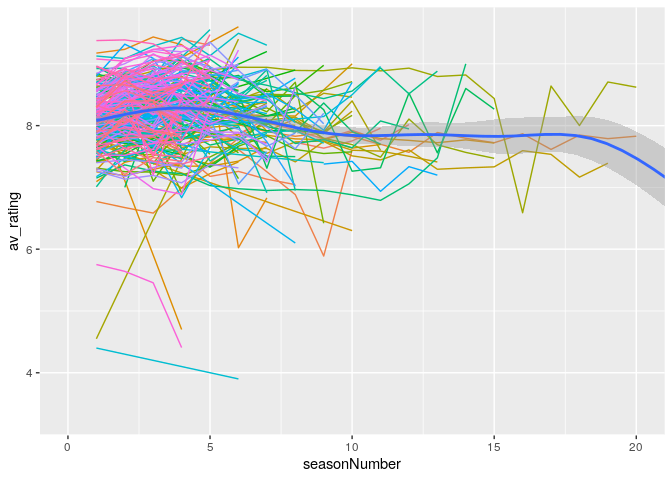
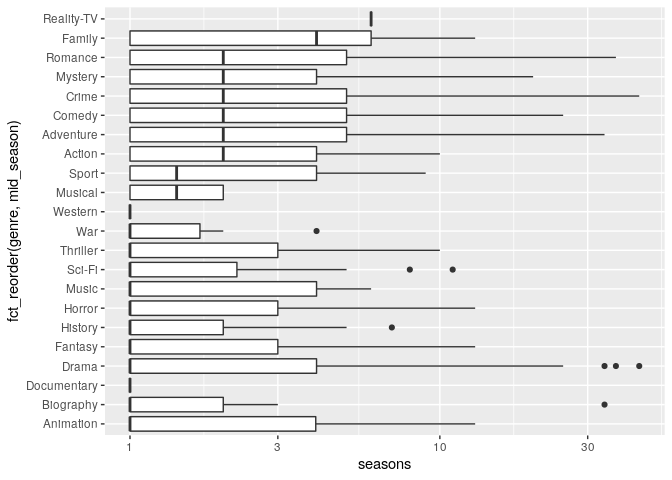

IMDB Ratings
================
Zach
2019-12-31

Since there’s no tidytuesday this week, I went back to the archives and
decided to try the [IMDB
dataset](https://github.com/rfordatascience/tidytuesday/tree/master/data/2019/2019-01-08)
posted earlier this year.

Some setup:

``` r
library(tidyverse)
library(lubridate)

df_imdb <- readr::read_csv("https://raw.githubusercontent.com/rfordatascience/tidytuesday/master/data/2019/2019-01-08/IMDb_Economist_tv_ratings.csv")
```

    ## Parsed with column specification:
    ## cols(
    ##   titleId = col_character(),
    ##   seasonNumber = col_double(),
    ##   title = col_character(),
    ##   date = col_date(format = ""),
    ##   av_rating = col_double(),
    ##   share = col_double(),
    ##   genres = col_character()
    ## )

## Simple EDA

<!-- -------------------------------------------------- -->

``` r
df_imdb %>% glimpse
```

    ## Observations: 2,266
    ## Variables: 7
    ## $ titleId      <chr> "tt2879552", "tt3148266", "tt3148266", "tt3148266", "tt3…
    ## $ seasonNumber <dbl> 1, 1, 2, 3, 4, 1, 2, 1, 2, 3, 4, 5, 6, 7, 8, 1, 1, 1, 1,…
    ## $ title        <chr> "11.22.63", "12 Monkeys", "12 Monkeys", "12 Monkeys", "1…
    ## $ date         <date> 2016-03-10, 2015-02-27, 2016-05-30, 2017-05-19, 2018-06…
    ## $ av_rating    <dbl> 8.4890, 8.3407, 8.8196, 9.0369, 9.1363, 8.4370, 7.5089, …
    ## $ share        <dbl> 0.51, 0.46, 0.25, 0.19, 0.38, 2.38, 2.19, 6.67, 7.13, 5.…
    ## $ genres       <chr> "Drama,Mystery,Sci-Fi", "Adventure,Drama,Mystery", "Adve…

``` r
df_imdb %>%
  arrange(desc(av_rating)) %>%
  select(av_rating, title, everything()) %>%
  head
```

    ## # A tibble: 6 x 7
    ##   av_rating title            titleId seasonNumber date       share genres       
    ##       <dbl> <chr>            <chr>          <dbl> <date>     <dbl> <chr>        
    ## 1      9.68 Parenthood       tt0098…            1 1990-11-13  1.68 Comedy,Drama 
    ## 2      9.6  Homicide: Life … tt0106…            6 1997-12-05  0.13 Crime,Drama,…
    ## 3      9.6  Touched by an A… tt0108…            5 1998-11-15  0.08 Drama,Family…
    ## 4      9.55 Breaking Bad     tt0903…            5 2013-02-20 19.0  Crime,Drama,…
    ## 5      9.49 Game of Thrones  tt0944…            6 2016-05-25 15.2  Action,Adven…
    ## 6      9.47 BoJack Horseman  tt3398…            5 2018-09-14  0.45 Animation,Co…

Are shows rated on a per-season basis?

``` r
df_imdb %>%
  filter(title == "Breaking Bad")
```

    ## # A tibble: 5 x 7
    ##   titleId   seasonNumber title       date       av_rating share genres          
    ##   <chr>            <dbl> <chr>       <date>         <dbl> <dbl> <chr>           
    ## 1 tt0903747            1 Breaking B… 2008-02-15      8.71  11.6 Crime,Drama,Thr…
    ## 2 tt0903747            2 Breaking B… 2009-04-19      8.77  15.4 Crime,Drama,Thr…
    ## 3 tt0903747            3 Breaking B… 2010-05-02      8.75  12.3 Crime,Drama,Thr…
    ## 4 tt0903747            4 Breaking B… 2011-08-28      9.11  10.8 Crime,Drama,Thr…
    ## 5 tt0903747            5 Breaking B… 2013-02-20      9.55  19.0 Crime,Drama,Thr…

Yes, it appears each show is listed with all of its seasons. I’m not
sure how to read these dates; “Breaking Bad” Season 5
[half-premiered](https://en.wikipedia.org/wiki/Breaking_Bad#Season_5_\(2012%E2%80%9313\))
on 2013-08-11, not 2013-02-20. Given the “Polizeiruf 110” data below,
these dates must be connected to ratings, and not the airing dates
themselves.

Which shows have the most seasons?

``` r
df_imdb %>%
  group_by(titleId) %>%
  mutate(seasons = max(seasonNumber)) %>%
  ungroup() %>%
  filter(seasons == seasonNumber) %>%
  arrange(desc(seasons)) %>%
  select(title, seasons, av_rating, date) %>%
  head(10)
```

    ## # A tibble: 10 x 4
    ##    title                                  seasons av_rating date      
    ##    <chr>                                    <dbl>     <dbl> <date>    
    ##  1 Polizeiruf 110                              44      7    2015-06-28
    ##  2 Masterpiece Classic                         37      6.6  2007-02-04
    ##  3 Walt Disney's Wonderful World of Color      34      7.74 1990-01-30
    ##  4 ABC Afterschool Specials                    25      3.3  1996-09-12
    ##  5 Law & Order                                 20      7.83 2010-01-28
    ##  6 Law & Order: Special Victims Unit           20      8.62 2018-09-29
    ##  7 Midsomer Murders                            19      7.39 2017-01-18
    ##  8 CSI: Crime Scene Investigation              15      7.47 2014-12-09
    ##  9 ER                                          15      7.72 2009-01-01
    ## 10 Grey's Anatomy                              15      8.27 2018-09-29

Note that since this is a *ratings* databse, we won’t catch shows that
haven’t been rated. That being said [Polizeiruf
110](https://en.wikipedia.org/wiki/Polizeiruf_110) has been running
since 1971, first in the German Democratic Republic (East Germany).

Why isn’t “The Simpsons” in this database? That’s weird.

What’s the distribution of seasons among shows?

``` r
df_imdb %>%
  group_by(titleId) %>%
  summarize(seasons = max(seasonNumber)) %>%
  count(seasons)
```

    ## # A tibble: 21 x 2
    ##    seasons     n
    ##      <dbl> <int>
    ##  1       1   447
    ##  2       2   118
    ##  3       3    71
    ##  4       4    60
    ##  5       5    60
    ##  6       6    34
    ##  7       7    31
    ##  8       8    17
    ##  9       9     7
    ## 10      10     9
    ## # … with 11 more rows

A very large fraction of shows have just one season; fewer are renewed
for a second season, and a modest number continue for three or more.

The genres are given as lists; let’s split those to make the genre data
parsable.

``` r
df_genres <-
  df_imdb %>%
  mutate(genre = str_split(genres, ",")) %>%
  unnest(genre)

df_genres %>%
  count(genre) %>%
  arrange(desc(n)) %>%
  knitr::kable()
```

| genre       |    n |
| :---------- | ---: |
| Drama       | 2266 |
| Crime       |  822 |
| Mystery     |  558 |
| Comedy      |  516 |
| Action      |  387 |
| Romance     |  235 |
| Fantasy     |  223 |
| Adventure   |  204 |
| Thriller    |  160 |
| Sci-Fi      |  154 |
| Horror      |  124 |
| Family      |   76 |
| History     |   62 |
| Animation   |   36 |
| Music       |   32 |
| Biography   |   29 |
| Sport       |   29 |
| War         |   10 |
| Western     |    9 |
| Musical     |    6 |
| Documentary |    4 |
| Reality-TV  |    2 |

I have a hunch this distribution is more a data artifact than anything
else; I feel like I can name more than two Reality-TV shows\!

## Visualize

<!-- -------------------------------------------------- -->

Let’s take a rough look at all the data over time:

``` r
df_imdb %>%

  ggplot(aes(date, av_rating)) +
  geom_point(aes(color = titleId), show.legend = FALSE) +
  geom_line(aes(color = titleId), show.legend = FALSE) +
  geom_smooth()
```

    ## `geom_smooth()` using method = 'gam' and formula 'y ~ s(x, bs = "cs")'

<!-- -->

I connect shows across seasons, and color by show ID.

Observations:

  - There are a lot more shows later in time than earlier. This is
    probably in large part a data artifact (IMDB was
    [launched](https://en.wikipedia.org/wiki/IMDb) in 1990), though
    there very well may be more TV shows today given the rise of
    streaming platforms.
  - I don’t see an especially large trend in average ratings, aside from
    a bit of a dip in the late 90’s.

Do shows tend to trend up, down, or stay the same across seasons?

``` r
df_imdb %>%

  ggplot(aes(seasonNumber, av_rating)) +
  geom_line(aes(color = titleId), show.legend = FALSE) +
  geom_smooth() +
  ## Tail
  coord_cartesian(xlim = c(0, 20))
```

    ## `geom_smooth()` using method = 'gam' and formula 'y ~ s(x, bs = "cs")'

<!-- -->

Observations:

  - Edge-effects on regression mean the downward trend near 20 is
    unreliable.
  - There seems to be a “bump” in ratings around season 4-6, but…
  - The large number of shows unrenewed for a 2nd season probably skew
    the trend; let’s try again with longer-running shows.

<!-- end list -->

``` r
df_imdb %>%
  group_by(titleId) %>%
  filter(max(seasonNumber) > 3) %>%
  ungroup() %>%

  ggplot(aes(seasonNumber, av_rating)) +
  geom_line(aes(color = titleId), show.legend = FALSE) +
  geom_smooth() +
  ## Tail
  coord_cartesian(xlim = c(0, 20))
```

    ## `geom_smooth()` using method = 'gam' and formula 'y ~ s(x, bs = "cs")'

<!-- -->

Observations:

  - The bump persists even in the filtered data, but I’m worried about
    edge effects pulling down the early-season part of the trend.

Let’s try a boxplot series, which will not make structural assumptions
on the data.

``` r
df_imdb %>%
  group_by(titleId) %>%
  filter(max(seasonNumber) > 3) %>%
  ungroup() %>%
  mutate(season = as.factor(seasonNumber)) %>%

  ggplot(aes(season, av_rating)) +
  geom_boxplot()
```

<!-- -->

The bump does seem to be real\!

I’ve felt for awhile that TV shows “take awhile” to get good; it seems
that trend is (weakly) reflected in the data\!

Is there a difference in first-season ratings between shows that are and
are not renewed?

``` r
df_imdb %>%
  group_by(titleId) %>%
  mutate(renewed = (max(seasonNumber) > 1)) %>%
  ungroup() %>%
  filter(seasonNumber == 1) %>%

  ggplot(aes(renewed, av_rating)) +
  geom_boxplot()
```

<!-- -->

There is a difference in ratings, but it’s not huge and there’s a fair
bit of overlap between the two categories.

Are there rating differences across genres?

``` r
df_genres %>%
  group_by(genre) %>%
  ## filter(n() > 100) %>%
  mutate(mid_rating = median(av_rating, na.rm = TRUE)) %>%
  ungroup() %>%

  ggplot(aes(fct_reorder(genre, mid_rating), av_rating)) +
  geom_boxplot() +
  coord_flip()
```

<!-- -->

The low sample size for Documentary and Reality shows means we can’t
draw strong conclusions for those genres. Otherwise there’s not an
especially strong trend across genres, though Western, Animation, and
Sci-Fi tend to be lowest-rated and War, Sport, and History
highest-rated.

Are there differences in number of seasons across genres?

``` r
df_genres %>%
  group_by(titleId) %>%
  mutate(seasons = max(seasonNumber)) %>%
  ungroup() %>%
  filter(seasons == seasonNumber) %>%
  group_by(genre) %>%
  mutate(mid_season = median(seasons, na.rm = TRUE)) %>%
  ungroup() %>%

  ggplot(aes(fct_reorder(genre, mid_season), seasons)) +
  geom_boxplot() +
  scale_y_log10() +
  coord_flip()
```

<!-- -->

Observations:

  - We’ve already seen that there are very few Musical, Documentary, and
    Reality shows in the dataset, so those statistics are not
    generalizable.
  - Certain genres seem to get renewed at a higher rate\! Action,
    Adventure, Comedy, Crime, Mystery, Romance, and Family seem to be
    more reliably renewed than other genres.
