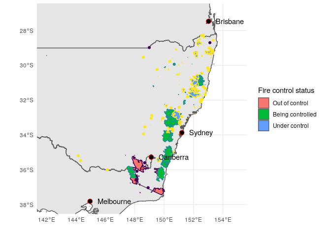
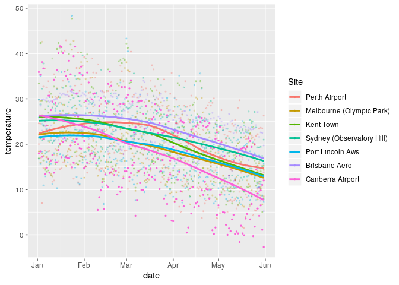
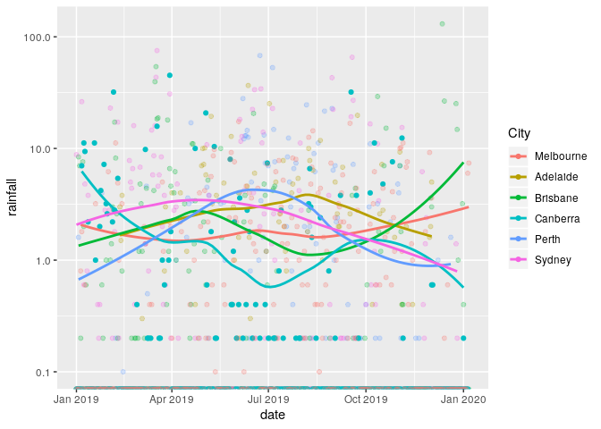

Australia Fires
================
Zach
2019-01-11

Tuesday’s exercise is investigating the Australia fires. The code below
pulls the most recent fire reports, so the data are up-to-date as of
knitting
    (2019-01-11).

``` r
library(tidyverse)
```

    ## ── Attaching packages ───────────────────────────────────────────────────────────────────────────────────── tidyverse 1.3.0 ──

    ## ✓ ggplot2 3.2.1     ✓ purrr   0.3.3
    ## ✓ tibble  2.1.3     ✓ dplyr   0.8.3
    ## ✓ tidyr   1.0.0     ✓ stringr 1.4.0
    ## ✓ readr   1.3.1     ✓ forcats 0.4.0

    ## ── Conflicts ──────────────────────────────────────────────────────────────────────────────────────── tidyverse_conflicts() ──
    ## x dplyr::filter() masks stats::filter()
    ## x dplyr::lag()    masks stats::lag()

``` r
library(sf)
```

    ## Linking to GEOS 3.7.1, GDAL 2.4.0, PROJ 5.2.0

``` r
library(lubridate)
```

    ## 
    ## Attaching package: 'lubridate'

    ## The following object is masked from 'package:base':
    ## 
    ##     date

``` r
# Get the Data

df_rainfall <- readr::read_csv('https://raw.githubusercontent.com/rfordatascience/tidytuesday/master/data/2020/2020-01-07/rainfall.csv')
```

    ## Parsed with column specification:
    ## cols(
    ##   station_code = col_character(),
    ##   city_name = col_character(),
    ##   year = col_double(),
    ##   month = col_character(),
    ##   day = col_character(),
    ##   rainfall = col_double(),
    ##   period = col_double(),
    ##   quality = col_character(),
    ##   lat = col_double(),
    ##   long = col_double(),
    ##   station_name = col_character()
    ## )

``` r
df_temperature <- readr::read_csv('https://raw.githubusercontent.com/rfordatascience/tidytuesday/master/data/2020/2020-01-07/temperature.csv')
```

    ## Parsed with column specification:
    ## cols(
    ##   city_name = col_character(),
    ##   date = col_date(format = ""),
    ##   temperature = col_double(),
    ##   temp_type = col_character(),
    ##   site_name = col_character()
    ## )

``` r
# IF YOU USE THIS DATA PLEASE BE CAUTIOUS WITH INTERPRETATION
df_nasa_fire <- readr::read_csv('https://raw.githubusercontent.com/rfordatascience/tidytuesday/master/data/2020/2020-01-07/MODIS_C6_Australia_and_New_Zealand_7d.csv')
```

    ## Parsed with column specification:
    ## cols(
    ##   latitude = col_double(),
    ##   longitude = col_double(),
    ##   brightness = col_double(),
    ##   scan = col_double(),
    ##   track = col_double(),
    ##   acq_date = col_date(format = ""),
    ##   acq_time = col_character(),
    ##   satellite = col_character(),
    ##   confidence = col_double(),
    ##   version = col_character(),
    ##   bright_t31 = col_double(),
    ##   frp = col_double(),
    ##   daynight = col_character()
    ## )

``` r
# For JSON File of fires
url <- "http://www.rfs.nsw.gov.au/feeds/majorIncidents.json"

df_aus_fires <- sf::st_read(url)
```

    ## Reading layer `majorIncidents' from data source `http://www.rfs.nsw.gov.au/feeds/majorIncidents.json' using driver `GeoJSON'
    ## Simple feature collection with 135 features and 7 fields
    ## geometry type:  GEOMETRY
    ## dimension:      XY
    ## bbox:           xmin: 144.1628 ymin: -37.81881 xmax: 153.3965 ymax: -28.19746
    ## epsg (SRID):    4326
    ## proj4string:    +proj=longlat +datum=WGS84 +no_defs

Download and unpack Australia boundary
data.

``` r
url_aus_geo <- "http://data.daff.gov.au/data/warehouse/nsaasr9nnd_022/nsaasr9nnd_02211a04es_geo___.zip"
curl::curl_download(url_aus_geo, destfile = "../data/aus.shp.zip")
unzip("../data/aus.shp.zip", exdir = "../data")
```

Load boundary data.

``` r
df_boundaries <- sf::read_sf("../data", "aust_cd66states")
```

Process the descriptions for `control` information.

``` r
df_aus_control <- 
  df_aus_fires %>% 
  mutate(
    control = str_extract(description, "STATUS: [\\w|\\s]+") %>% 
      str_remove(., "STATUS: ") %>% 
      str_trim(.) %>% 
      ordered(., c("Out of control", "Being controlled", "Under control")),
    pubDate = dmy_hms(pubDate)
  )

df_aus_control %>% glimpse
```

    ## Observations: 135
    ## Variables: 9
    ## $ title            <fct> "Aberdeen Stanborough", "Adaminaby Complex ", "Ander…
    ## $ link             <fct> http://www.rfs.nsw.gov.au/fire-information/fires-nea…
    ## $ category         <fct> Advice, Advice, Advice, Advice, Advice, Advice, Advi…
    ## $ guid             <fct> https://incidents.rfs.nsw.gov.au/api/v1/incidents/37…
    ## $ guid_isPermaLink <fct> true, true, true, true, true, true, true, true, true…
    ## $ pubDate          <dttm> 2020-01-11 05:26:00, 2020-01-11 12:56:00, 2020-01-1…
    ## $ description      <fct> "ALERT LEVEL: Advice <br />LOCATION: 257 Aston Rd, S…
    ## $ geometry         <GEOMETRY [°]> GEOMETRYCOLLECTION (POINT (..., GEOMETRYCOL…
    ## $ control          <ord> Under control, Out of control, Under control, Under …

``` r
df_aus_control %>% pull(control) %>% unique
```

    ## [1] Under control    Out of control   Being controlled
    ## Levels: Out of control < Being controlled < Under control

## Visualize

<!-- ----------------------------------------------------------------- -->

### GIS

<!-- --------------------------- -->

Geographic distribution of fires. This will give us valuable context to
understand the other data.

``` r
fires_crs <- st_crs(df_aus_control)

# Lat-lon data for Australian cities
df_cities_latlon <- tribble(
       ~lat,     ~lon, ~city,
  +115.8605, -31.9505, "Perth",
  +138.6007, -34.9285, "Adelaide",
  +153.0251, -27.4698, "Brisbane",
  +151.2093, -33.8688, "Sydney",
  +149.1300, -35.2809, "Canberra",
  +144.9631, -37.8136, "Melbourne"
)
sf_cities_latlon <- 
  st_as_sf(
    df_cities_latlon,
    coords = c("lat", "lon"),
    crs = 4326,
    agr = "constant"
  )

ggplot() +
  geom_sf(data = df_boundaries %>% st_set_crs(fires_crs)) +
  geom_sf(
    data = df_aus_control,
    mapping = aes(fill = control, color = control)
  ) +
  geom_sf(
    data = sf_cities_latlon,
    shape = 21,
    size = 3,
    color = "red",
    fill = "black"
  ) +
  geom_text(
    data = df_cities_latlon,
    aes(lat, lon, label = city),
    hjust = 0,
    nudge_x = +0.5
  ) +
  ## Tail
  scale_fill_discrete(name = "Fire control status") +
  coord_sf(
    xlim = c(+142, +155),
    ylim = c(-38, -27)
  ) +
  guides(color = FALSE) +
  theme(legend.position = "right") +
  theme_minimal() +
  labs(x = "", y = "")
```

<!-- -->

The fires are concentrated around Canberra and Sydney. Of course, smoke
is probably affecting nearby cities as well. The presence of “Out of
control” fires near Canberra is cause for major alarm.

### Temperature

<!-- --------------------------- -->

What is the temperature history for Australia?

``` r
df_temperature %>% glimpse
```

    ## Observations: 528,278
    ## Variables: 5
    ## $ city_name   <chr> "PERTH", "PERTH", "PERTH", "PERTH", "PERTH", "PERTH", "PE…
    ## $ date        <date> 1910-01-01, 1910-01-02, 1910-01-03, 1910-01-04, 1910-01-…
    ## $ temperature <dbl> 26.7, 27.0, 27.5, 24.0, 24.8, 24.4, 25.3, 28.0, 32.6, 35.…
    ## $ temp_type   <chr> "max", "max", "max", "max", "max", "max", "max", "max", "…
    ## $ site_name   <chr> "PERTH AIRPORT", "PERTH AIRPORT", "PERTH AIRPORT", "PERTH…

``` r
df_temperature %>% 
  mutate(
    date = ymd(date),
    site_name = str_to_title(site_name)
  ) %>% 
  filter(date > ymd("2019-01-01")) %>%

  ggplot(aes(date, temperature, color = fct_reorder2(site_name, date, temperature))) +
  geom_point(
    data = . %>% mutate(flag = str_detect(site_name, "Canberra")),
    aes(alpha = flag),
    size = 0.5
  ) +
  geom_smooth(se = FALSE, size = 1) +
  
  scale_color_discrete(name = "Site") +
  scale_alpha_manual(values = c(`TRUE` = 1, `FALSE` = 1 / 4)) +
  guides(alpha = FALSE)
```

    ## `geom_smooth()` using method = 'loess' and formula 'y ~ x'

<!-- -->

The temperature near Canberra doesn’t seem especially high; if anything,
it’s been colder than other parts of Australia.

### Rainfall

<!-- --------------------------- -->

``` r
df_rainfall %>% glimpse
```

    ## Observations: 179,273
    ## Variables: 11
    ## $ station_code <chr> "009151", "009151", "009151", "009151", "009151", "00915…
    ## $ city_name    <chr> "Perth", "Perth", "Perth", "Perth", "Perth", "Perth", "P…
    ## $ year         <dbl> 1967, 1967, 1967, 1967, 1967, 1967, 1967, 1967, 1967, 19…
    ## $ month        <chr> "01", "01", "01", "01", "01", "01", "01", "01", "01", "0…
    ## $ day          <chr> "01", "02", "03", "04", "05", "06", "07", "08", "09", "1…
    ## $ rainfall     <dbl> NA, NA, NA, NA, NA, NA, NA, NA, NA, NA, NA, NA, NA, NA, …
    ## $ period       <dbl> NA, NA, NA, NA, NA, NA, NA, NA, NA, NA, NA, NA, NA, NA, …
    ## $ quality      <chr> NA, NA, NA, NA, NA, NA, NA, NA, NA, NA, NA, NA, NA, NA, …
    ## $ lat          <dbl> -31.96, -31.96, -31.96, -31.96, -31.96, -31.96, -31.96, …
    ## $ long         <dbl> 115.79, 115.79, 115.79, 115.79, 115.79, 115.79, 115.79, …
    ## $ station_name <chr> "Subiaco Wastewater Treatment Plant", "Subiaco Wastewate…

``` r
df_rainfall %>% 
  mutate(
    date = ymd(str_c(year, month, day))
  ) %>% 
  filter(date >= ymd("2019-01-01")) %>% 
  
  ggplot(aes(date, rainfall, color = fct_reorder2(city_name, date, rainfall))) +
  geom_point(
    data = . %>% mutate(flag = city_name == "Canberra"),
    aes(alpha = flag)
  ) +
  geom_smooth(se = FALSE) +
  
  scale_y_log10() +
  scale_color_discrete(name = "City") + 
  scale_alpha_manual(values = c(`TRUE` = 1, `FALSE` = 1 / 4)) +
  guides(alpha = FALSE)
```

    ## Warning: Transformation introduced infinite values in continuous y-axis
    
    ## Warning: Transformation introduced infinite values in continuous y-axis

    ## `geom_smooth()` using method = 'loess' and formula 'y ~ x'

    ## Warning: Removed 1605 rows containing non-finite values (stat_smooth).

    ## Warning: Removed 48 rows containing missing values (geom_point).

<!-- -->

It seems July was dryer in Canberra than other parts of Australia.
Perhaps this helped cause the fires?

The last few rainfall measurements in Canberra were also fairly low.
