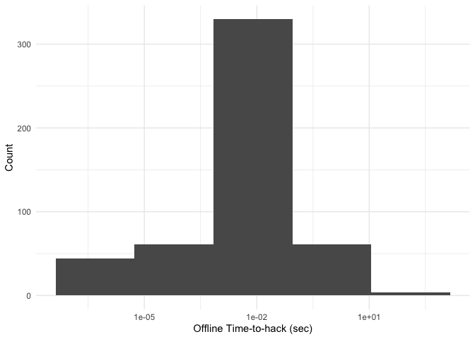

Password Data
================
Zach
2020-01-19

This week’s data are [terrible
passwords](https://github.com/rfordatascience/tidytuesday/tree/master/data/2020/2020-01-14),
which are all terrible for different reasons. These will be
    fun\!

``` r
library(tidyverse)
```

    ## ── Attaching packages ────────────────────────────────── tidyverse 1.2.1 ──

    ## ✔ ggplot2 3.2.1     ✔ purrr   0.3.3
    ## ✔ tibble  2.1.3     ✔ dplyr   0.8.3
    ## ✔ tidyr   1.0.0     ✔ stringr 1.4.0
    ## ✔ readr   1.3.1     ✔ forcats 0.4.0

    ## ── Conflicts ───────────────────────────────────── tidyverse_conflicts() ──
    ## ✖ dplyr::filter() masks stats::filter()
    ## ✖ dplyr::lag()    masks stats::lag()

``` r
library(lubridate)
```

    ## 
    ## Attaching package: 'lubridate'

    ## The following object is masked from 'package:base':
    ## 
    ##     date

``` r
# Get the Data

df_pass <- readr::read_csv('https://raw.githubusercontent.com/rfordatascience/tidytuesday/master/data/2020/2020-01-14/passwords.csv') %>%
  filter(!is.na(password))
```

    ## Parsed with column specification:
    ## cols(
    ##   rank = col_double(),
    ##   password = col_character(),
    ##   category = col_character(),
    ##   value = col_double(),
    ##   time_unit = col_character(),
    ##   offline_crack_sec = col_double(),
    ##   rank_alt = col_double(),
    ##   strength = col_double(),
    ##   font_size = col_double()
    ## )

## EDA

<!-- -------------------------------------------------- -->

What are the Top-10 most popular
passwords?

``` r
df_pass %>% head(10) %>% knitr::kable()
```

| rank | password | category            | value | time\_unit | offline\_crack\_sec | rank\_alt | strength | font\_size |
| ---: | :------- | :------------------ | ----: | :--------- | ------------------: | --------: | -------: | ---------: |
|    1 | password | password-related    |  6.91 | years      |            2.17e+00 |         1 |        8 |         11 |
|    2 | 123456   | simple-alphanumeric | 18.52 | minutes    |            1.11e-05 |         2 |        4 |          8 |
|    3 | 12345678 | simple-alphanumeric |  1.29 | days       |            1.11e-03 |         3 |        4 |          8 |
|    4 | 1234     | simple-alphanumeric | 11.11 | seconds    |            1.00e-07 |         4 |        4 |          8 |
|    5 | qwerty   | simple-alphanumeric |  3.72 | days       |            3.21e-03 |         5 |        8 |         11 |
|    6 | 12345    | simple-alphanumeric |  1.85 | minutes    |            1.10e-06 |         6 |        4 |          8 |
|    7 | dragon   | animal              |  3.72 | days       |            3.21e-03 |         7 |        8 |         11 |
|    8 | baseball | sport               |  6.91 | years      |            2.17e+00 |         8 |        4 |          8 |
|    9 | football | sport               |  6.91 | years      |            2.17e+00 |         9 |        7 |         11 |
|   10 | letmein  | password-related    |  3.19 | months     |            8.35e-02 |        10 |        8 |         11 |

A lot of these are (sadly) unsurprising, but I’m surprised to see
`dragon` on here.

Which are the ‘best of the worst’ passwords?

``` r
df_pass %>%
  arrange(desc(offline_crack_sec)) %>%
  head(10) %>%
  knitr::kable()
```

| rank | password | category            | value | time\_unit | offline\_crack\_sec | rank\_alt | strength | font\_size |
| ---: | :------- | :------------------ | ----: | :--------- | ------------------: | --------: | -------: | ---------: |
|  406 | jordan23 | sport               | 92.27 | years      |               29.27 |       407 |       34 |         23 |
|   26 | trustno1 | simple-alphanumeric | 92.27 | years      |               29.02 |        26 |       25 |         20 |
|  336 | rush2112 | nerdy-pop           | 92.27 | years      |               29.02 |       337 |       48 |         28 |
|  500 | passw0rd | password-related    | 92.27 | years      |               29.02 |       502 |       28 |         21 |
|    1 | password | password-related    |  6.91 | years      |                2.17 |         1 |        8 |         11 |
|    8 | baseball | sport               |  6.91 | years      |                2.17 |         8 |        4 |          8 |
|    9 | football | sport               |  6.91 | years      |                2.17 |         9 |        7 |         11 |
|   18 | jennifer | name                |  6.91 | years      |                2.17 |        18 |        9 |         12 |
|   22 | superman | name                |  6.91 | years      |                2.17 |        22 |       10 |         13 |
|   41 | michelle | name                |  6.91 | years      |                2.17 |        41 |        8 |         11 |

These are really funny. :D

How are passwords distributed among the categories?

``` r
df_pass %>%
  count(category) %>%
  arrange(desc(n))
```

    ## # A tibble: 10 x 2
    ##    category                n
    ##    <chr>               <int>
    ##  1 name                  183
    ##  2 cool-macho             79
    ##  3 simple-alphanumeric    61
    ##  4 fluffy                 44
    ##  5 sport                  37
    ##  6 nerdy-pop              30
    ##  7 animal                 29
    ##  8 password-related       15
    ##  9 food                   11
    ## 10 rebellious-rude        11

Some of these categories are a bit quizzical; what are “fluffy”
passwords?

``` r
df_pass %>%
  filter(category == "fluffy")
```

    ## # A tibble: 44 x 9
    ##     rank password category value time_unit offline_crack_s… rank_alt
    ##    <dbl> <chr>    <chr>    <dbl> <chr>                <dbl>    <dbl>
    ##  1    42 love     fluffy    7.92 minutes         0.00000475       42
    ##  2    43 sunshine fluffy    6.91 years           2.17             43
    ##  3    54 silver   fluffy    3.72 days            0.00321          54
    ##  4    63 orange   fluffy    3.72 days            0.00321          63
    ##  5    70 ginger   fluffy    3.72 days            0.00321          70
    ##  6    73 summer   fluffy    3.72 days            0.00321          73
    ##  7    83 princess fluffy    6.91 years           2.17             83
    ##  8    88 diamond  fluffy    3.19 months          0.0835           88
    ##  9    89 yellow   fluffy    3.72 days            0.00321          89
    ## 10    99 iloveyou fluffy    6.91 years           2.17             99
    ## # … with 34 more rows, and 2 more variables: strength <dbl>,
    ## #   font_size <dbl>

Ah, I see.

What’s the distribution of crack-times?

``` r
df_pass %>%
  ggplot(aes(offline_crack_sec)) +
  geom_histogram(bins = 5) +

  scale_x_log10(labels = scales::label_number_auto()) +
  theme_minimal() +
  labs(
    x = "Offline Time-to-hack (sec)",
    y = "Count"
  )
```

<!-- -->

This seems odd; I wonder what’s in that “spike” near 10 milliseconds?

``` r
df_pass %>%
  filter(
    1e-2 / 5 <= offline_crack_sec,
    offline_crack_sec <= 1e-2
  )
```

    ## # A tibble: 233 x 9
    ##     rank password category value time_unit offline_crack_s… rank_alt
    ##    <dbl> <chr>    <chr>    <dbl> <chr>                <dbl>    <dbl>
    ##  1     5 qwerty   simple-…  3.72 days               0.00321        5
    ##  2     7 dragon   animal    3.72 days               0.00321        7
    ##  3    11 monkey   animal    3.72 days               0.00321       11
    ##  4    16 shadow   cool-ma…  3.72 days               0.00321       16
    ##  5    17 master   cool-ma…  3.72 days               0.00321       17
    ##  6    21 jordan   name      3.72 days               0.00321       21
    ##  7    23 harley   cool-ma…  3.72 days               0.00321       23
    ##  8    25 hunter   cool-ma…  3.72 days               0.00321       25
    ##  9    27 ranger   cool-ma…  3.72 days               0.00321       27
    ## 10    28 buster   cool-ma…  3.72 days               0.00321       28
    ## # … with 223 more rows, and 2 more variables: strength <dbl>,
    ## #   font_size <dbl>

These passwords seem to be alphabetic and of similar length; let’s check
the distribution of lengths against the distribution of hack-times.

``` r
df_pass %>%
  mutate(len = str_length(password)) %>%

  ggplot(aes(len, offline_crack_sec)) +
  geom_count() +

  scale_y_log10() +
  theme_minimal()
```

<!-- -->

Yup\! We’re seeing a lot of passwords of length 6 with similar offline
hack-times. The bands are very interesting structures; there seem to be
some features of passwords (of the same length) that raise or lower
their crack-time by orders of magnitude.

Can we see the aforementioned difference from the given `category`
variable?

``` r
df_pass %>%
  mutate(len = str_length(password)) %>%

  ggplot(aes()) +
  geom_count(
    aes(len, offline_crack_sec, color = category),
    position = position_dodge(width = 0.4)
  ) +
  geom_line(
    data = tibble(len = seq(4, 9)) %>%
      mutate(offline_crack_sec = 1e-10 * 10 ^ len),
    aes(len, offline_crack_sec),
    linetype = 2
  ) +

  scale_y_log10() +
  scale_color_discrete(name = "Category") +
  scale_size_continuous(name = "Count") +
  theme_minimal() +
  labs(
    x = "Password Length",
    y = "Offline Crack-Time (Sec)"
  )
```

<!-- -->

Observations:

  - Generally, password crack-times grow exponentially with password
    length. This is why general password advice is “longer is better.”
  - We can see that the `length==6` spike of `offline_crack_sec ~ 1e-2`
    can be sub-divided into animal, cool-macho, name, and sport
    passwords
  - The rate of growth of crack-time seems to be greater for the upper
    band. I suspect the lower band are ordered sequences, which have
    much more structure.

Let’s test that hypothesis\! The manual line I drew above separates the
bands, so we can use that to filter.

``` r
df_pass %>%
  mutate(len = str_length(password)) %>%
  filter(offline_crack_sec <= 1e-10 * 10 ^ len) %>%
  select(rank, password, category, offline_crack_sec) %>%
  knitr::kable()
```

| rank | password  | category            | offline\_crack\_sec |
| ---: | :-------- | :------------------ | ------------------: |
|    2 | 123456    | simple-alphanumeric |            1.11e-05 |
|    3 | 12345678  | simple-alphanumeric |            1.11e-03 |
|    4 | 1234      | simple-alphanumeric |            1.00e-07 |
|    6 | 12345     | simple-alphanumeric |            1.10e-06 |
|   12 | 696969    | simple-alphanumeric |            1.11e-05 |
|   19 | 111111    | simple-alphanumeric |            1.11e-05 |
|   20 | 2000      | simple-alphanumeric |            1.00e-07 |
|   24 | 1234567   | simple-alphanumeric |            1.11e-04 |
|   45 | 6969      | simple-alphanumeric |            1.00e-07 |
|   49 | 123456789 | simple-alphanumeric |            1.11e-02 |
|   50 | 654321    | simple-alphanumeric |            1.11e-05 |
|   58 | 123123    | simple-alphanumeric |            1.11e-05 |
|   60 | 666666    | simple-alphanumeric |            1.11e-05 |
|   77 | 1111      | simple-alphanumeric |            1.00e-07 |
|   80 | 121212    | simple-alphanumeric |            1.11e-05 |
|  116 | 131313    | simple-alphanumeric |            1.11e-05 |
|  193 | 11111111  | simple-alphanumeric |            1.11e-03 |
|  207 | 7777777   | simple-alphanumeric |            1.11e-04 |
|  262 | 112233    | simple-alphanumeric |            1.11e-05 |
|  274 | 8675309   | nerdy-pop           |            1.11e-04 |
|  277 | 5150      | simple-alphanumeric |            1.00e-07 |
|  278 | 222222    | simple-alphanumeric |            1.11e-05 |
|  287 | 777777    | simple-alphanumeric |            1.11e-05 |
|  292 | 88888888  | simple-alphanumeric |            1.11e-03 |
|  311 | 987654    | simple-alphanumeric |            1.11e-05 |
|  315 | 2112      | simple-alphanumeric |            1.00e-07 |
|  316 | 1212      | simple-alphanumeric |            1.00e-07 |
|  325 | 7777      | simple-alphanumeric |            1.00e-07 |
|  352 | 232323    | simple-alphanumeric |            1.11e-05 |
|  365 | 555555    | simple-alphanumeric |            1.11e-05 |
|  372 | 2222      | simple-alphanumeric |            1.00e-07 |
|  374 | 4444      | simple-alphanumeric |            1.00e-07 |
|  403 | 69696969  | simple-alphanumeric |            1.11e-03 |
|  410 | 11111     | simple-alphanumeric |            1.10e-06 |
|  414 | 123321    | simple-alphanumeric |            1.11e-05 |
|  421 | 999999    | simple-alphanumeric |            1.11e-05 |
|  430 | 1313      | simple-alphanumeric |            1.00e-07 |
|  454 | 87654321  | simple-alphanumeric |            1.11e-03 |
|  459 | 333333    | simple-alphanumeric |            1.11e-05 |
|  490 | 888888    | simple-alphanumeric |            1.11e-05 |

Ah yes, this pattern makes sense. There is one digit string that’s not a
“simple” pattern, but it’s definitely in the Zeitgeist.
