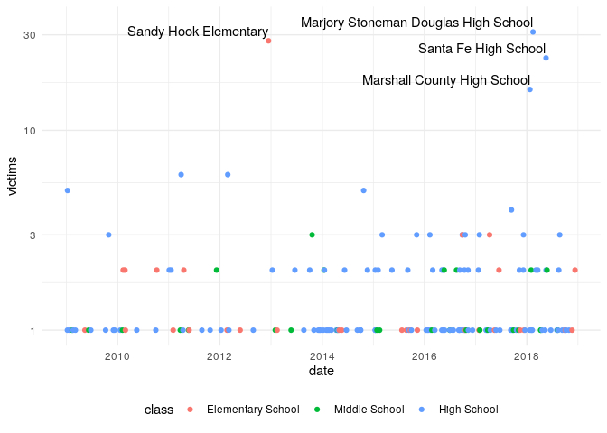
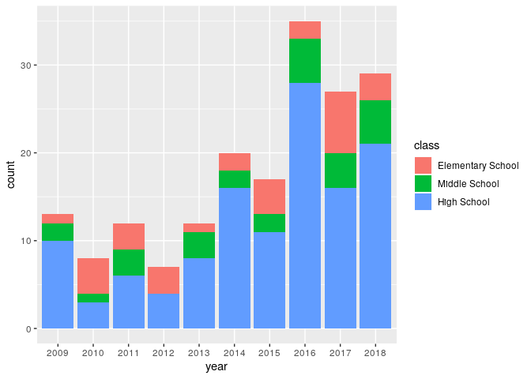
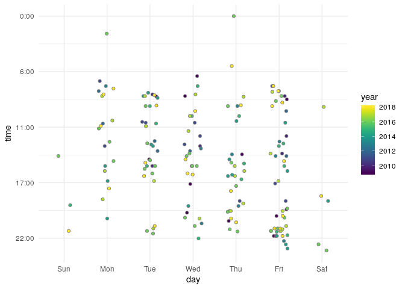
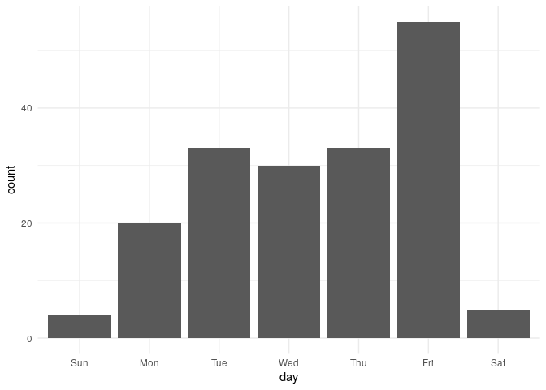
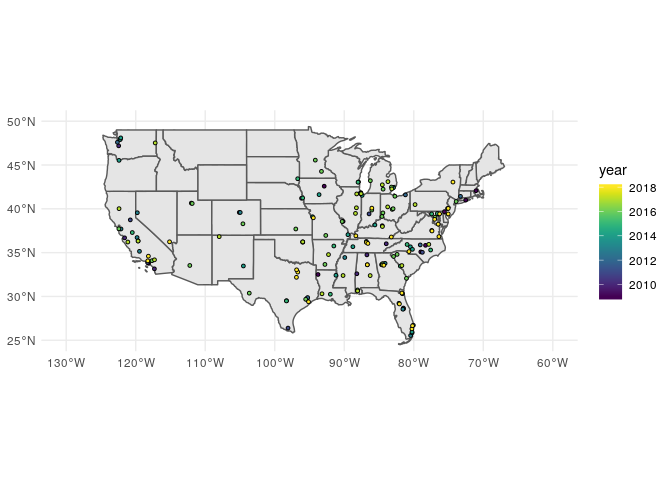

School Shootings
================
Zach
2020-01-20

I found these data by reading Andrew Gelman’s
[blog](https://statmodeling.stat.columbia.edu/2020/01/18/graphs-of-school-shootings-in-the-u-s/),
but the source is [CNN
Labs](https://github.com/cnnlabs/cnn-school-shooting-data/).

``` r
library(tidyverse)
```

    ## ── Attaching packages ──────────────────────────────────────────────────────────────── tidyverse 1.3.0 ──

    ## ✓ ggplot2 3.2.1     ✓ purrr   0.3.3
    ## ✓ tibble  2.1.3     ✓ dplyr   0.8.3
    ## ✓ tidyr   1.0.0     ✓ stringr 1.4.0
    ## ✓ readr   1.3.1     ✓ forcats 0.4.0

    ## ── Conflicts ─────────────────────────────────────────────────────────────────── tidyverse_conflicts() ──
    ## x dplyr::filter() masks stats::filter()
    ## x dplyr::lag()    masks stats::lag()

``` r
library(lubridate)
```

    ## 
    ## Attaching package: 'lubridate'

    ## The following object is masked from 'package:base':
    ## 
    ##     date

``` r
library(sf)
```

    ## Linking to GEOS 3.7.1, GDAL 2.4.0, PROJ 5.2.0

``` r
df_data <- readr::read_csv('https://raw.githubusercontent.com/cnnlabs/cnn-school-shooting-data/master/dataset.csv') %>%
  mutate(date = dmy(date))
```

    ## Parsed with column specification:
    ## cols(
    ##   LONCOD = col_double(),
    ##   LATCOD = col_double(),
    ##   CDCODE = col_double(),
    ##   year = col_double(),
    ##   school = col_character(),
    ##   city = col_character(),
    ##   state = col_character(),
    ##   address = col_character(),
    ##   urbanrural = col_character(),
    ##   race = col_character(),
    ##   killed = col_double(),
    ##   injured = col_double(),
    ##   victims = col_double(),
    ##   date = col_character(),
    ##   type = col_character(),
    ##   NCESSCH = col_double(),
    ##   time = col_time(format = "")
    ## )

## GIS Download

<!-- -------------------------------------------------- -->

``` r
url_boundaries <- "https://www2.census.gov/geo/tiger/GENZ2018/shp/cb_2018_us_state_20m.zip"
file_boundaries = "../data/usa_states.zip"

curl::curl_download(url_boundaries, destfile = file_boundaries)
unzip(file_boundaries, exdir = "../data")

sf_boundaries <- sf::read_sf("../data", "cb_2018_us_state_20m")
```

## EDA

<!-- -------------------------------------------------- -->

What are the types of shootings?

``` r
df_data %>%
  count(type) %>%
  arrange(desc(n)) %>% 
  knitr::kable()
```

| type              |   n |
| :---------------- | --: |
| High School       | 118 |
| Elementary School |  30 |
| Middle School     |  24 |
| Grades 7-12       |   2 |
| K-12              |   2 |
| Grades 7-8        |   1 |
| K-8               |   1 |
| PreK-12           |   1 |
| PreK-8            |   1 |

High school at the top conforms to my expectations, but Elementary
school is alarming. These are almost surely external perpretrators,
while High school probably involves more student actors.

Having all these types is accurate, but distracting. Let’s aggregate
some of the types. I choose to aggregate to the highest grade (e.g. K-12
-\> High School).

``` r
df_agg <- 
  df_data %>% 
  mutate(
    class = case_when(
      type == "High School" ~ "High School",
      type == "Elementary School" ~ "Elementary School",
      type == "Middle School" ~ "Middle School",
      
      type == "Grades 7-12" ~ "High School",
      type == "K-12" ~ "High School",
      type == "Grades 7-8" ~ "Middle School",
      type == "K-8" ~ "Middle School",
      type == "PreK-12" ~ "High School",
      type == "PreK-8" ~ "Middle School"
    ),
    class = fct_relevel(class, "Elementary School", "Middle School", "High School")
  )
df_agg %>% glimpse
```

    ## Observations: 180
    ## Variables: 18
    ## $ LONCOD     <dbl> -75.58490, -87.61750, -90.16510, -78.31180, -83.11398, -78…
    ## $ LATCOD     <dbl> 39.66810, 41.83990, 38.56570, 35.83150, 42.38359, 35.08430…
    ## $ CDCODE     <dbl> 1000, 1701, 1712, 3713, NA, 3702, 5103, 2106, 1901, 3601, …
    ## $ year       <dbl> 2009, 2009, 2009, 2009, 2009, 2009, 2009, 2009, 2009, 2009…
    ## $ school     <chr> "William Penn High School", "Dunbar Vocational Career Acad…
    ## $ city       <chr> "New Castle", "Chicago", "Cahokia", "Zebulon", "Detroit", …
    ## $ state      <chr> "Delaware", "Illinois", "Illinois", "North Carolina", "Mic…
    ## $ address    <chr> "713 E Basin Rd", "3000 S King Dr", "800 Range Ln", "Halif…
    ## $ urbanrural <chr> "suburbtown", "urban", "suburbtown", "suburbtown", "urban"…
    ## $ race       <chr> "BLACK", "BLACK", "BLACK", "BLACK", NA, "BLACK", "BLACK", …
    ## $ killed     <dbl> 0, 0, 1, 0, 0, 0, 1, 1, 1, 0, 1, 0, 0, 1, 1, 0, 0, 1, 0, 1…
    ## $ injured    <dbl> 1, 5, 0, 1, 1, 1, 0, 0, 0, 1, 2, 1, 1, 0, 0, 2, 2, 0, 1, 0…
    ## $ victims    <dbl> 1, 5, 1, 1, 1, 1, 1, 1, 1, 1, 3, 1, 1, 1, 1, 2, 2, 1, 1, 1…
    ## $ date       <date> 2009-01-08, 2009-01-09, 2009-01-23, 2009-02-11, 2009-02-1…
    ## $ type       <chr> "High School", "High School", "High School", "Middle Schoo…
    ## $ NCESSCH    <dbl> 100023000209, 170993000588, 170804000409, 370472001913, 26…
    ## $ time       <time> 20:30:00, 20:00:00, 19:20:00, 06:00:00, 14:20:00, 22:00:0…
    ## $ class      <fct> High School, High School, High School, Middle School, High…

``` r
df_agg %>%
  count(victims) %>%
  arrange(desc(n)) %>%
  knitr::kable()
```

| victims |   n |
| ------: | --: |
|       1 | 122 |
|       2 |  37 |
|       3 |  12 |
|       5 |   2 |
|       6 |   2 |
|       4 |   1 |
|      16 |   1 |
|      23 |   1 |
|      28 |   1 |
|      31 |   1 |

It’s cold comfort, but at least the majority of shootings seem to have
just one victim.

## Timeseries

<!-- -------------------------------------------------- -->

``` r
df_agg %>%

  ggplot(aes(date, victims)) +
  geom_point(aes(color = class)) +
  geom_text(
    data = . %>% filter(victims > 10),
    aes(label = school),
    hjust = 1,
    nudge_y = 0.05
  ) +

  scale_y_log10() +
  theme_minimal() +
  theme(legend.position = "bottom")
```

<!-- -->

Observations:

  - Many of the “mass” school shootings have occurred in recent times
  - It’s hard to see from this vis, but the number of single-victim
    shootings seems to have increased in recent times as well.

CNN produced a bargraph that illustrates the count of shootings fairly
well; let’s reproduce that:

``` r
df_agg %>% 
  mutate(year = as.factor(year)) %>% 
  
  ggplot(aes(year, fill = class)) +
  geom_histogram(stat = "count")
```

    ## Warning: Ignoring unknown parameters: binwidth, bins, pad

<!-- -->

This does illustrate the upward trend in shootings. With the previous
figure, we can see that in recent times there have been more frequent
and more deadly shootings.

## Times of day

<!-- -------------------------------------------------- -->

One of the figures Gelman discusses is meant to illustrate that more
school shootings occur on Friday afternoons. The original figure is hard
to interpret. Can we do better?

``` r
df_data %>%
  mutate(day = wday(date, label = TRUE)) %>%

  ggplot(aes(day, time)) +
  geom_point(
    aes(fill = year),
    pch = 21, 
    color = "grey50", 
    position = position_jitter(width = 0.2, height = 0)
  ) +

  viridis::scale_fill_viridis() +
  scale_y_reverse(labels = function(time) {
    str_c(round(time / 3600), ":00")
  }) +
  theme_minimal()
```

    ## Warning: Removed 6 rows containing missing values (geom_point).

<!-- -->

Observations:

  - There does not seem to be a pattern in year and time; the shootings
    seem to take place in roughly the same times & days over the years
  - As CNN notes, there seem to be more shootings on Friday afternoons.
    But there are also a fair number on Friday mornings.

Friday in general seems to be more common:

``` r
df_data %>%
  mutate(day = wday(date, label = TRUE)) %>%

  ggplot(aes(day)) +
  geom_histogram(stat = "count") +

  theme_minimal()
```

    ## Warning: Ignoring unknown parameters: binwidth, bins, pad

<!-- -->

Of schooldays, Monday is least common and Friday most common.

## Geospatial

<!-- -------------------------------------------------- -->

Let’s process the geospatial data into simple feature format for
plotting.

``` r
sf_data <- 
  st_as_sf(
    df_agg %>% filter(!is.na(LONCOD), !is.na(LATCOD)), 
    coords = c("LONCOD", "LATCOD"),
    crs = 4326, 
    agr = "constant"
  )

sf_data %>% glimpse
```

    ## Observations: 177
    ## Variables: 17
    ## $ CDCODE     <dbl> 1000, 1701, 1712, 3713, NA, 3702, 5103, 2106, 1901, 3601, …
    ## $ year       <dbl> 2009, 2009, 2009, 2009, 2009, 2009, 2009, 2009, 2009, 2009…
    ## $ school     <chr> "William Penn High School", "Dunbar Vocational Career Acad…
    ## $ city       <chr> "New Castle", "Chicago", "Cahokia", "Zebulon", "Detroit", …
    ## $ state      <chr> "Delaware", "Illinois", "Illinois", "North Carolina", "Mic…
    ## $ address    <chr> "713 E Basin Rd", "3000 S King Dr", "800 Range Ln", "Halif…
    ## $ urbanrural <chr> "suburbtown", "urban", "suburbtown", "suburbtown", "urban"…
    ## $ race       <chr> "BLACK", "BLACK", "BLACK", "BLACK", NA, "BLACK", "BLACK", …
    ## $ killed     <dbl> 0, 0, 1, 0, 0, 0, 1, 1, 1, 0, 1, 0, 0, 1, 1, 0, 0, 1, 0, 1…
    ## $ injured    <dbl> 1, 5, 0, 1, 1, 1, 0, 0, 0, 1, 2, 1, 1, 0, 0, 2, 2, 0, 1, 0…
    ## $ victims    <dbl> 1, 5, 1, 1, 1, 1, 1, 1, 1, 1, 3, 1, 1, 1, 1, 2, 2, 1, 1, 1…
    ## $ date       <date> 2009-01-08, 2009-01-09, 2009-01-23, 2009-02-11, 2009-02-1…
    ## $ type       <chr> "High School", "High School", "High School", "Middle Schoo…
    ## $ NCESSCH    <dbl> 100023000209, 170993000588, 170804000409, 370472001913, 26…
    ## $ time       <time> 20:30:00, 20:00:00, 19:20:00, 06:00:00, 14:20:00, 22:00:0…
    ## $ class      <fct> High School, High School, High School, Middle School, High…
    ## $ geometry   <POINT [°]> POINT (-75.5849 39.6681), POINT (-87.6175 41.8399), …

Now let’s visualize.

``` r
sf_data %>% 
  ggplot() +
  geom_sf(
    data = sf_boundaries
  ) +
  geom_sf(
    aes(fill = year),
    pch = 21,
    size = 1,
    color = "black"
  ) +
  
  viridis::scale_fill_viridis() +
  coord_sf(
    xlim = c(-130, -60),
    ylim = c(+25, +50)
  ) +
  theme_minimal()
```

<!-- -->

Observations:

  - I don’t see any clear pattern, other than the intuitive observation
    that shootings seem to take place in locations of fairly high
    population density (fewer in the upper-west)
