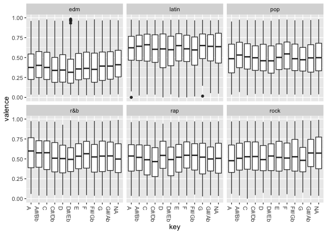
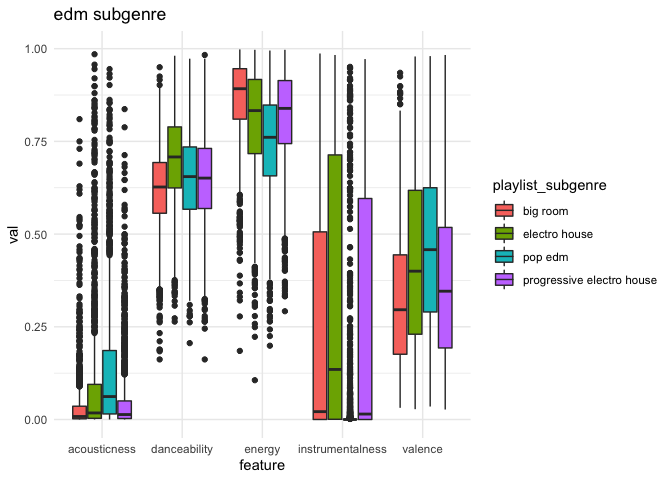

Spotify Data
================
Zach
2020-01-21

This week’s Tidy Tuesday is [Spotify song
data](https://github.com/rfordatascience/tidytuesday/tree/master/data/2020/2020-01-21).
It turns out there was a lot to see in these data\!

``` r
library(tidyverse)
library(ggrepel)
library(rpnd)
library(GGally)
```

    ## Registered S3 method overwritten by 'GGally':
    ##   method from   
    ##   +.gg   ggplot2

    ## 
    ## Attaching package: 'GGally'

    ## The following object is masked from 'package:dplyr':
    ## 
    ##     nasa

``` r
df_spotify_songs <- readr::read_csv('https://raw.githubusercontent.com/rfordatascience/tidytuesday/master/data/2020/2020-01-21/spotify_songs.csv')
```

    ## Parsed with column specification:
    ## cols(
    ##   .default = col_double(),
    ##   track_id = col_character(),
    ##   track_name = col_character(),
    ##   track_artist = col_character(),
    ##   track_album_id = col_character(),
    ##   track_album_name = col_character(),
    ##   track_album_release_date = col_character(),
    ##   playlist_name = col_character(),
    ##   playlist_id = col_character(),
    ##   playlist_genre = col_character(),
    ##   playlist_subgenre = col_character()
    ## )

    ## See spec(...) for full column specifications.

## EDA

<!-- -------------------------------------------------- -->

``` r
df_spotify_songs %>% summary
```

    ##    track_id          track_name        track_artist       track_popularity
    ##  Length:32833       Length:32833       Length:32833       Min.   :  0.00  
    ##  Class :character   Class :character   Class :character   1st Qu.: 24.00  
    ##  Mode  :character   Mode  :character   Mode  :character   Median : 45.00  
    ##                                                           Mean   : 42.48  
    ##                                                           3rd Qu.: 62.00  
    ##                                                           Max.   :100.00  
    ##  track_album_id     track_album_name   track_album_release_date
    ##  Length:32833       Length:32833       Length:32833            
    ##  Class :character   Class :character   Class :character        
    ##  Mode  :character   Mode  :character   Mode  :character        
    ##                                                                
    ##                                                                
    ##                                                                
    ##  playlist_name      playlist_id        playlist_genre    
    ##  Length:32833       Length:32833       Length:32833      
    ##  Class :character   Class :character   Class :character  
    ##  Mode  :character   Mode  :character   Mode  :character  
    ##                                                          
    ##                                                          
    ##                                                          
    ##  playlist_subgenre   danceability        energy              key        
    ##  Length:32833       Min.   :0.0000   Min.   :0.000175   Min.   : 0.000  
    ##  Class :character   1st Qu.:0.5630   1st Qu.:0.581000   1st Qu.: 2.000  
    ##  Mode  :character   Median :0.6720   Median :0.721000   Median : 6.000  
    ##                     Mean   :0.6548   Mean   :0.698619   Mean   : 5.374  
    ##                     3rd Qu.:0.7610   3rd Qu.:0.840000   3rd Qu.: 9.000  
    ##                     Max.   :0.9830   Max.   :1.000000   Max.   :11.000  
    ##     loudness            mode         speechiness      acousticness   
    ##  Min.   :-46.448   Min.   :0.0000   Min.   :0.0000   Min.   :0.0000  
    ##  1st Qu.: -8.171   1st Qu.:0.0000   1st Qu.:0.0410   1st Qu.:0.0151  
    ##  Median : -6.166   Median :1.0000   Median :0.0625   Median :0.0804  
    ##  Mean   : -6.720   Mean   :0.5657   Mean   :0.1071   Mean   :0.1753  
    ##  3rd Qu.: -4.645   3rd Qu.:1.0000   3rd Qu.:0.1320   3rd Qu.:0.2550  
    ##  Max.   :  1.275   Max.   :1.0000   Max.   :0.9180   Max.   :0.9940  
    ##  instrumentalness       liveness         valence           tempo       
    ##  Min.   :0.0000000   Min.   :0.0000   Min.   :0.0000   Min.   :  0.00  
    ##  1st Qu.:0.0000000   1st Qu.:0.0927   1st Qu.:0.3310   1st Qu.: 99.96  
    ##  Median :0.0000161   Median :0.1270   Median :0.5120   Median :121.98  
    ##  Mean   :0.0847472   Mean   :0.1902   Mean   :0.5106   Mean   :120.88  
    ##  3rd Qu.:0.0048300   3rd Qu.:0.2480   3rd Qu.:0.6930   3rd Qu.:133.92  
    ##  Max.   :0.9940000   Max.   :0.9960   Max.   :0.9910   Max.   :239.44  
    ##   duration_ms    
    ##  Min.   :  4000  
    ##  1st Qu.:187819  
    ##  Median :216000  
    ##  Mean   :225800  
    ##  3rd Qu.:253585  
    ##  Max.   :517810

Observations:

  - `danceability`, `energy`, `speechiness`, `acousticness`,
    `instrumentalness`, `liveness`, and `valence` all seem to be indices
    in `[0, 1]`
      - `speechiness` == presence of spoken words
      - `instrumentalness` == increased probability of instrumental
        track (0.5 is split; higher is greater confidence)
      - `liveness` == increased probability of track being live (0.8
        highly likely)
      - `valence` == positive emotion (1 most positive)
  - `loudness` is probably in Decibels
  - `tempo` is usually in BPM
  - `duration_ms` has its units in the name
  - `mode` (from the documentation) is coded as `major == 1, minor == 0`
  - `key` (from the documentation) codes the Key along 12 tones from `C`

<!-- end list -->

``` r
df_spotify_songs %>%
  pull(playlist_genre) %>%
  unique
```

    ## [1] "pop"   "rap"   "rock"  "latin" "r&b"   "edm"

There are only six genres represented here; stuff like “country” is not
present. There are also subgenres:

``` r
df_spotify_songs %>%
  pull(playlist_subgenre) %>%
  unique
```

    ##  [1] "dance pop"                 "post-teen pop"            
    ##  [3] "electropop"                "indie poptimism"          
    ##  [5] "hip hop"                   "southern hip hop"         
    ##  [7] "gangster rap"              "trap"                     
    ##  [9] "album rock"                "classic rock"             
    ## [11] "permanent wave"            "hard rock"                
    ## [13] "tropical"                  "latin pop"                
    ## [15] "reggaeton"                 "latin hip hop"            
    ## [17] "urban contemporary"        "hip pop"                  
    ## [19] "new jack swing"            "neo soul"                 
    ## [21] "electro house"             "big room"                 
    ## [23] "pop edm"                   "progressive electro house"

### Re-code

Given this info, we can re-code for convenience:

``` r
df_data <-
  df_spotify_songs %>%
  mutate(
    mode = case_when(
      mode == 1 ~ "Major",
      mode == 0 ~ "Minor",
      TRUE ~ NA_character_
    ),
    key = recode(
      key,
      `1`  = "C",
      `2`  = "C#/Db",
      `3`  = "D",
      `4`  = "D#/Eb",
      `5`  = "E",
      `6`  = "F",
      `7`  = "F#/Gb",
      `8`  = "G",
      `9`  = "G#/Ab",
      `10` = "A",
      `11` = "A#/Bb",
      `12` = "B",
      `NA` = NA_character_
    )
  )
```

    ## Warning in recode.numeric(key, `1` = "C", `2` = "C#/Db", `3` = "D", `4` =
    ## "D#/Eb", : NAs introduced by coercion

    ## Warning: Unreplaced values treated as NA as .x is not compatible. Please
    ## specify replacements exhaustively or supply .default

## Vis

<!-- -------------------------------------------------- -->

### Keys and Genres

<!-- ------------------------- -->

``` r
df_data %>%

  ggplot(aes(playlist_genre)) +
  geom_bar(stat = "count") +

  facet_wrap(~key) +
  theme(
    axis.text.x = element_text(angle = 270, hjust = 0)
  )
```

<!-- -->

Observations:

  - The key of `D` is least common, while `C` is most common
      - Except `C` is less common for Rock music
  - I would have expected `E` to be much more common for Rock, given the
    prevalence of guitars and standard tuning

### Valence

<!-- ------------------------- -->

``` r
df_data %>%

  ggplot(aes(key, valence)) +
  geom_boxplot() +

  facet_wrap(~playlist_genre) +
  theme(
    axis.text.x = element_text(angle = 270, hjust = 0)
  )
```

<!-- -->

Observations:

  - I’m rather surprised to see essentially no difference in valence
    across keys. I’d always heard that keys have different “feels” to
    them, but now I expect Major/Minor better accounts for valence

<!-- end list -->

``` r
df_data %>%

  ggplot(aes(mode, valence)) +
  geom_boxplot() +

  facet_wrap(~playlist_genre) +
  theme(
    axis.text.x = element_text(angle = 270, hjust = 0)
  )
```

<!-- -->

Observations:

  - Huh, there’s also little trend across mode\! That doesn’t seem
    right….

### Genre Fingerprints

<!-- ------------------------- -->

Let’s construct “fingerprints” by looking at the distribution of song
characteristics. We’ll do this first for genres and subgenres.

``` r
var_select <-
  c("danceability", "energy", "acousticness", "instrumentalness", "valence")

df_data %>%
  select(!!var_select, track_name, playlist_genre) %>%
  pivot_longer(names_to = "feature", values_to = "val", !!var_select) %>%

  ggplot(aes(feature, val, fill = playlist_genre)) +
  geom_boxplot() +

  theme_minimal()
```

<!-- -->

Observations:

  - All genres have a great deal of spread across all these
    features—there seems to be a lot of variety within a genre when
    considering a large sample of the music out there
  - `rock` is largely undanceable
  - The remaining genres tend to be similarly danceable
  - `edm` tends to be the highest-energy, followed closely by `rock`.
    But there’s more variation in `rock`
  - `r&b` tends to be lower-energy
  - `edm` tends to be the most instrumental, though the other genres
    have pleny of “outlier” instrumental tracks
  - Strangely, `edm` tends to be low in valence (positive sentiment); I
    suspect this is a case of the ML-generated characteristics going
    haywire—`edm` tends to be instrumental, so the lack of lyrics might
    affect this
  - `latin` tends to be a bit higher valence than the other genres

Can we see any differences across the subgenres? First, let’s build a
helper function:

``` r
genre_fingerprint <- function(genre) {
  df_data %>%
    filter(playlist_genre == genre) %>%
    select(!!var_select, track_name, playlist_genre, playlist_subgenre) %>%
    pivot_longer(names_to = "feature", values_to = "val", !!var_select) %>%

    ggplot(aes(feature, val, fill = playlist_subgenre)) +
    geom_boxplot() +

  theme_minimal() +
  labs(title = str_c(genre, " subgenre"))
}
```

Let’s zoom in to check out individual genres:

### Pop

``` r
genre_fingerprint("pop")
```

<!-- -->

Observations:

  - `indie poptimism` has a bit larger variability in acousticness
  - These look very similar to me

### Rap

``` r
genre_fingerprint("rap")
```

<!-- -->

Observations:

  - `hip hop` tends to be more acoustic and more instrumental, with a
    wider variation in energy

### Rock

``` r
genre_fingerprint("rock")
```

<!-- -->

Observations:

  - Acousticness is more common in the `album` and `classic` subgenres
  - `Hard` rock tends to be higher-energy

### Latin

``` r
genre_fingerprint("latin")
```

<!-- -->

Observations:

  - `tropical` latin tends to be lower-valence

### R\&B

``` r
genre_fingerprint("r&b")
```

<!-- -->

Observations:

  - `new jack swing` tends to be less acoustic, more danceable, and
    higher-valence

### EDM

``` r
genre_fingerprint("edm")
```

<!-- -->

Observations:

  - `pop` EDM is dramatically different from other subgenres, in that it
    tends to **not** be instrumental

### Artists Fingerprints

<!-- ------------------------- -->

I’m interested in particular artists; let’s see how they compare to
their respective genres:

``` r
artist_fingerprint <- function(artist) {
  genres_artist <-
    df_data %>%
    filter(track_artist == artist) %>%
    pull(playlist_genre) %>%
    unique

  df_data %>%
    filter(playlist_genre %in% genres_artist) %>%
    mutate(
      playlist_subgenre = if_else(
        track_artist == artist,
        artist,
        playlist_subgenre
      ) %>%
        fct_relevel(., artist),
      playlist_genre = if_else(
        track_artist == artist,
        artist,
        playlist_genre
      ) %>%
        fct_relevel(., artist)
    ) %>%

    select(!!var_select, track_name, playlist_genre, playlist_subgenre) %>%
    pivot_longer(names_to = "feature", values_to = "val", !!var_select) %>%

    ggplot(aes(feature, val, fill = playlist_genre)) +
    geom_boxplot() +

  theme_minimal() +
  labs(title = str_c(artist, " fingerprint"))
}
```

#### Radiohead

``` r
artist_fingerprint("Radiohead")
```

<!-- -->

Observations; relative to their genre, Radiohead songs tend to be:

  - Less danceable
  - Wider-spread in energy
  - More instrumental
  - Lower-valence

<!-- end list -->

``` r
df_data %>%
  filter(track_artist == "Radiohead") %>%
  select(track_name, !!var_select) %>%
  unique() %>%

  ggplot(aes(valence, energy)) +
  geom_point() +
  geom_text_repel(
    aes(label = track_name)
  ) +

  theme_minimal()
```

<!-- -->

Observations:

  - `valence` must be some ML-derived quantity, because no sane human
    would rate “Burn the Witch”, “My Iron Lung”, or “Jigsaw Falling Into
    Place” as high-positivity\!
  - For Radiohead, there is positive correlation between energy and
    “valence”

#### Rush

``` r
artist_fingerprint("Rush")
```

<!-- -->

Observations: Rush songs tended to be

  - *Very* undanceable
  - *Very* high-energy
  - Fairly high-valence, at least compared to other rock artists

RIP Neal Peart

#### Pink Floyd

``` r
artist_fingerprint("Pink Floyd")
```

<!-- -->

Observations: Pink Floyd songs tend to be

  - Highly acoustic
  - Tightly “mid-danceable”
  - Low-energy
  - Fairly instrumental
  - Widely-variable in valence

<!-- end list -->

``` r
df_data %>%
  filter(track_artist == "Pink Floyd") %>%
  select(track_name, !!var_select) %>%
  unique() %>%

  ggplot(aes(valence, acousticness)) +
  geom_point() +
  geom_text_repel(
    aes(label = track_name)
  ) +

  theme_minimal()
```

<!-- -->

Observations:

  - There’s little correlation between `valence` and `acousticness` for
    Pink Floyd

#### The Beatles

``` r
artist_fingerprint("The Beatles")
```

<!-- -->

Observations:

  - The Beatles tended to be more variable in energy than their peers

#### The Who

``` r
artist_fingerprint("The Who")
```

<!-- -->

Observations: The Who were

  - Fairly similar to the “bulk” of other rock bands
  - A little more acoustic and instrumental than other rock bands

#### The Rolling Stones

``` r
artist_fingerprint("The Rolling Stones")
```

<!-- -->

Observations:

  - The Stones spanned a number of genres
  - They wrote songs most similar to Rock (esp. in (un)danceability and
    energy)
  - Their songs tended to be higher-valence than other artists

<!-- end list -->

``` r
df_data %>%
  filter(track_artist == "The Rolling Stones") %>%
  select(track_name, !!var_select) %>%
  unique() %>%

  ggplot(aes(valence, acousticness)) +
  geom_point() +
  geom_text_repel(
    aes(label = track_name)
  ) +

  theme_minimal()
```

<!-- -->

### Artist Superlatives

<!-- ------------------------- -->

There’s a great deal of variation in Rock among acousticness and energy;
let’s see where rock artists lie in this space:

``` r
df_rock <-
  df_data %>%
  filter(playlist_genre == "rock") %>%
  group_by(track_artist) %>%
  summarize_at(
    vars(!!var_select),
    c("median" = median, "sd" = ~sd(., na.rm = TRUE))
  )

df_rock_AvE <-
  df_rock %>%
  mutate(sd = sqrt(acousticness_sd^2 + energy_sd^2)) %>%
  add_pareto(min(acousticness_median) | min(energy_median), "soft_electric") %>%
  add_pareto(max(acousticness_median) | min(energy_median), "soft_acoustic") %>%
  add_pareto(max(acousticness_median) | max(energy_median), "hard_acoustic") %>%
  add_pareto(min(acousticness_median) | max(energy_median), "hard_electric") %>%
  ## Manufally fix some codes
  mutate(
    hard_acoustic = if_else(acousticness_median < 0.5, FALSE, hard_acoustic),
    soft_acoustic = if_else(acousticness_median < 0.5, FALSE, soft_acoustic),
    hard_electric = if_else(acousticness_median > 0.5, FALSE, hard_electric),
    soft_electric = if_else(acousticness_median > 0.5, FALSE, soft_electric)
  ) %>%
  pivot_longer(
    names_to = "category",
    values_to = "pareto",
    soft_electric:hard_electric
  )

df_rock_AvE %>%
  ggplot(aes(acousticness_median, energy_median)) +
  geom_point(aes(size = sd), color = "grey60", alpha = 1 / 3) +
  geom_point(
    data = . %>% filter(pareto),
    aes(size = sd),
    color = "red"
  ) +
  geom_label_repel(
    data = . %>% filter(pareto),
    aes(label = track_artist)
  ) +

  scale_size_continuous(name = "Variability") +
  facet_wrap(~category)
```

    ## Warning: Removed 3576 rows containing missing values (geom_point).

    ## Warning: Removed 11 rows containing missing values (geom_point).

<!-- -->

Observations:

  - The “extremal” artists tend to be less variable in their
    compositions
  - Aside from Jeff Beck, I haven’t heard of most of these “extremal”
    artists

<!-- end list -->

``` r
rock_artists_sel <- c(
  "Pink Floyd",
  "Queen",
  "Radiohead",
  "Rush",
  "The Rolling Stones",
  "The Who",
  "The Beatles",
  "Led Zeppelin"
)

df_rock_AvE %>%
  select(-pareto, -category) %>%
  unique %>%

  ggplot(aes(acousticness_median, energy_median)) +
  geom_point(aes(size = sd), color = "grey60", alpha = 1 / 3) +
  geom_point(
    data = . %>% filter(track_artist %in% rock_artists_sel),
    aes(size = sd),
    color = "red"
  ) +
  geom_label_repel(
    data = . %>% filter(track_artist %in% rock_artists_sel),
    aes(label = track_artist)
  ) +

  scale_size_continuous(name = "Variability") +
  theme_minimal()
```

    ## Warning: Removed 894 rows containing missing values (geom_point).

<!-- -->

Observations:

  - The bands I’m following tend to be quite varied in their songwriting
      - Rush is an exception

### Popularity

<!-- -------------------------------------------------- -->

The “rock-space” plot above sparked an idea; does variability in song
characteristics affect artist popularity? Let’s find out:

``` r
df_artist_stats <-
  df_data %>%
  group_by(track_artist) %>%
  mutate_at(
    vars(!!var_select, track_popularity),
    c("median" = median, "var" = var)
  ) %>%
  ungroup %>%
  select(
    track_artist,
    playlist_genre,
    contains("_median"),
    contains("_var")
  ) %>%
  unique
```

Plot median popularity against song variability:

``` r
df_artist_stats %>%
  mutate(
    var = danceability_var +
          energy_var +
          acousticness_var +
          instrumentalness_var +
          valence_var
  ) %>%

  ggplot(aes(var, track_popularity_median)) +
  geom_point(alpha = 1 / 3) +

  scale_y_continuous(
    breaks = c(0, 25, 50, 75, 100),
    labels = c("Least", "25", "50", "75", "Most")
  ) +
  scale_x_continuous(
    breaks = c(0, 0.6),
    labels = c("Least", "Greater")
  ) +
  facet_wrap(~playlist_genre) +
  theme_minimal() +
  labs(
    title = "Top-performing artists keep writing the same song",
    x = "Variability in Artist's Songs",
    y = "Median Song Popularity"
  )
```

    ## Warning: Removed 6141 rows containing missing values (geom_point).

<!-- -->

This is really surprising\! The top-performing artists tend to have
low-variability in the characteristics of their songs. Perhaps these
artists “play it safe”. This trend holds across genres.

Popular *individual* artists tend to be low-variability, but is there
diversity among those artists? I’d expect them to fill different
“ecological niches”.

First, let’s observe how much variation there is in songwriting among
“Top Artists”.

``` r
df_artist_stats %>%
  filter(track_popularity_median >= 70) %>%
  select(playlist_genre, contains("_median")) %>%
  group_by(playlist_genre) %>%
  summarize_all(var) %>%
  rename_all(~str_remove_all(., "_median")) %>%

  pivot_longer(names_to = "var", values_to = "val", danceability:valence) %>%

  ggplot(aes(playlist_genre, val, fill = playlist_genre)) +
  geom_bar(stat = "identity", position = position_dodge()) +

  facet_grid(~fct_reorder(var, val)) +
  guides(fill = FALSE) +
  theme_minimal() +
  theme(
    legend.position = "bottom",
    axis.text.x = element_text(angle = 270, hjust = 0)
  ) +
  labs(
    x = "Characteristic",
    y = "Artist Variability",
    title = "Top-Artist Variability"
  )
```

<!-- -->

Observations:

  - Across genres, there is not much variation in Instrumentalness
  - Rock tends to exhibit more variability among artists, across
    characteristics
  - Rap tends to exhibit less variability among artists, across
    characteristics

Top-Artist ecologies:

``` r
proc_top <- function(genre, n=20) {
  df_artist_stats %>%
    filter(playlist_genre == genre) %>%
    arrange(desc(track_popularity_median)) %>%
    head(n) %>%
    select(
      track_artist,
      playlist_genre,
      contains("_median"),
      -contains("track_popularity")
    ) %>%
    rename_all(~str_remove_all(., "_median"))
}

df_top <-
  map_dfr(
    df_data %>% pull(playlist_genre) %>% unique,
    proc_top
  )
```

``` r
df_top %>%
  select(-track_artist, -instrumentalness) %>%
  ggpairs(mapping = aes(color = playlist_genre))
```

``` 
## 
 plot: [1,1] [=>-------------------------------------------]  4% est: 0s 
 plot: [1,2] [===>-----------------------------------------]  8% est: 2s 
 plot: [1,3] [====>----------------------------------------] 12% est: 2s 
 plot: [1,4] [======>--------------------------------------] 16% est: 3s 
 plot: [1,5] [========>------------------------------------] 20% est: 3s 
 plot: [2,1] [==========>----------------------------------] 24% est: 3s `stat_bin()` using `bins = 30`. Pick better value with `binwidth`.
## 
 plot: [2,2] [============>--------------------------------] 28% est: 3s 
 plot: [2,3] [=============>-------------------------------] 32% est: 3s 
 plot: [2,4] [===============>-----------------------------] 36% est: 3s 
 plot: [2,5] [=================>---------------------------] 40% est: 2s 
 plot: [3,1] [===================>-------------------------] 44% est: 2s `stat_bin()` using `bins = 30`. Pick better value with `binwidth`.
## 
 plot: [3,2] [=====================>-----------------------] 48% est: 2s 
 plot: [3,3] [======================>----------------------] 52% est: 2s 
 plot: [3,4] [========================>--------------------] 56% est: 2s 
 plot: [3,5] [==========================>------------------] 60% est: 2s 
 plot: [4,1] [============================>----------------] 64% est: 1s `stat_bin()` using `bins = 30`. Pick better value with `binwidth`.
## 
 plot: [4,2] [==============================>--------------] 68% est: 1s 
 plot: [4,3] [===============================>-------------] 72% est: 1s 
 plot: [4,4] [=================================>-----------] 76% est: 1s 
 plot: [4,5] [===================================>---------] 80% est: 1s 
 plot: [5,1] [=====================================>-------] 84% est: 1s `stat_bin()` using `bins = 30`. Pick better value with `binwidth`.
## 
 plot: [5,2] [=======================================>-----] 88% est: 1s 
 plot: [5,3] [========================================>----] 92% est: 0s 
 plot: [5,4] [==========================================>--] 96% est: 0s 
 plot: [5,5] [=============================================]100% est: 0s 
                                                                         
```

<!-- -->

Observations:

  - I don’t see strong clusters of artists in the song characteristics;
    this is evidence that there is variation among the artists within
    their genres
