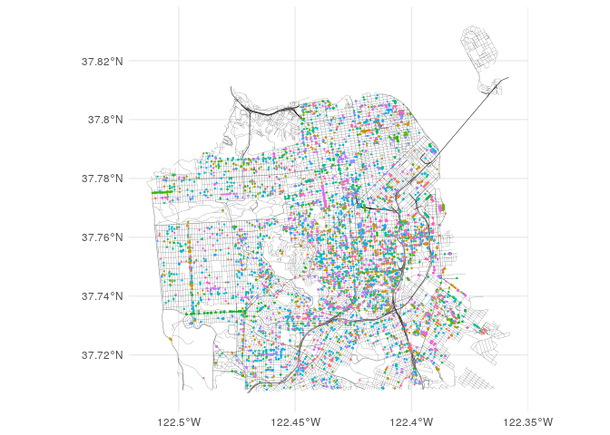
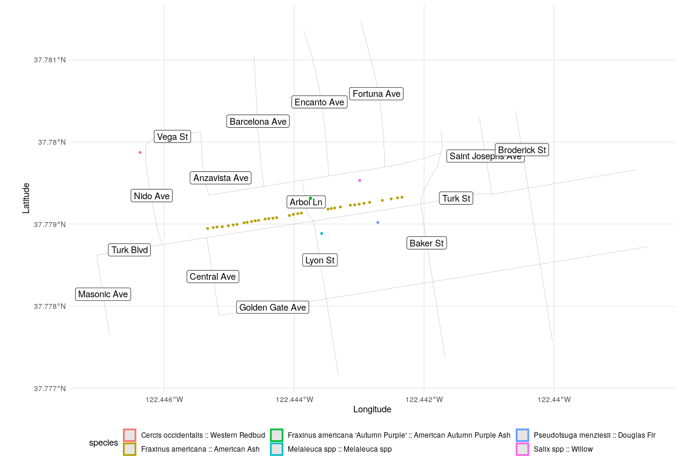

San Francisco Trees
================
Zach
2020-01-28

## Setup

<!-- ----------------------------------------------------------------------------- -->

``` r
library(tidyverse)
```

    ## ── Attaching packages ─────────────────────────────────── tidyverse 1.3.0 ──

    ## ✓ ggplot2 3.2.1     ✓ purrr   0.3.3
    ## ✓ tibble  2.1.3     ✓ dplyr   0.8.3
    ## ✓ tidyr   1.0.2     ✓ stringr 1.4.0
    ## ✓ readr   1.3.1     ✓ forcats 0.4.0

    ## ── Conflicts ────────────────────────────────────── tidyverse_conflicts() ──
    ## x dplyr::filter() masks stats::filter()
    ## x dplyr::lag()    masks stats::lag()

``` r
library(sf)
```

    ## Linking to GEOS 3.7.1, GDAL 2.4.0, PROJ 5.2.0

``` r
df_trees <- readr::read_csv('https://raw.githubusercontent.com/rfordatascience/tidytuesday/master/data/2020/2020-01-28/sf_trees.csv')
```

    ## Parsed with column specification:
    ## cols(
    ##   tree_id = col_double(),
    ##   legal_status = col_character(),
    ##   species = col_character(),
    ##   address = col_character(),
    ##   site_order = col_double(),
    ##   site_info = col_character(),
    ##   caretaker = col_character(),
    ##   date = col_date(format = ""),
    ##   dbh = col_double(),
    ##   plot_size = col_character(),
    ##   latitude = col_double(),
    ##   longitude = col_double()
    ## )

``` r
sf_trees <- 
  st_as_sf(
    df_trees %>% filter(!is.na(latitude), !is.na(longitude)),
    coords = c("longitude", "latitude"),
    crs = 4326,
    agr = "constant"
  )
sf_trees %>% glimpse
```

    ## Observations: 190,155
    ## Variables: 11
    ## $ tree_id      <dbl> 53719, 30313, 30312, 30314, 30315, 30316, 48435, 30319, …
    ## $ legal_status <chr> "Permitted Site", "Permitted Site", "Permitted Site", "D…
    ## $ species      <chr> "Tree(s) ::", "Tree(s) ::", "Tree(s) ::", "Pittosporum u…
    ## $ address      <chr> "2963 Webster St", "501 Arkansas St", "501 Arkansas St",…
    ## $ site_order   <dbl> 1, 3, 2, 1, 5, 6, 4, 2, 1, 3, 1, 3, 1, 2, 4, 1, 1, 1, 2,…
    ## $ site_info    <chr> "Sidewalk: Curb side : Cutout", "Sidewalk: Curb side : C…
    ## $ caretaker    <chr> "Private", "Private", "Private", "Private", "Private", "…
    ## $ date         <date> 1955-09-19, 1955-10-20, 1955-10-20, 1955-10-20, 1955-10…
    ## $ dbh          <dbl> NA, NA, NA, 16, NA, NA, NA, NA, NA, NA, 2, NA, NA, NA, N…
    ## $ plot_size    <chr> NA, NA, NA, NA, NA, NA, NA, NA, NA, NA, NA, NA, NA, NA, …
    ## $ geometry     <POINT [°]> POINT (-122.4341 37.79787), POINT (-122.3981 37.75…

``` r
species_many <- 
  sf_trees %>% 
  count(species) %>% 
  filter(n > 100) %>% 
  pull(species)

species_few <- 
  sf_trees %>% 
  count(species) %>% 
  filter(n < 100) %>% 
  pull(species)
```

### Download

``` r
url_parcels <- "https://data.sfgov.org/api/geospatial/us3s-fp9q?method=export&format=Shapefile"
curl::curl_download(url_parcels, destfile = "../data/parcels.zip")
unzip("../data/parcels.zip", exdir = "../data")
## Record filename
names_parcels <- unzip("../data/parcels.zip", list = TRUE)
main_parcels <- 
  names_parcels %>% 
  pull(Name) %>% 
  .[[1]] %>% 
  str_remove(., "\\.\\w+$")

sf_parcels <- read_sf(
  "../data", 
  main_parcels
)
```

``` r
url_streets <- "https://data.sfgov.org/api/geospatial/3psu-pn9h?method=export&format=Shapefile"
curl::curl_download(url_streets, destfile = "../data/streets.zip")
unzip("../data/streets.zip", exdir = "../data")
## Record filename
names_streets <- unzip("../data/streets.zip", list = TRUE)
main_streets <- 
  names_streets %>% 
  pull(Name) %>% 
  .[[1]] %>% 
  str_remove(., "\\.\\w+$")

sf_streets <- read_sf(
  "../data", 
  main_streets
)
```

``` r
sf_streets %>% glimpse
```

    ## Observations: 16,979
    ## Variables: 32
    ## $ accepted   <chr> "F", "T", "T", "T", "T", "F", "F", "F", "F", "F", "F", "F"…
    ## $ active     <chr> "T", "T", "T", "T", "F", "T", "T", "T", "T", "T", "T", "T"…
    ## $ classcode  <dbl> 0, 0, 5, 5, NA, 5, 5, 5, 5, 5, 5, 5, 5, 0, 5, 5, 5, 5, 5, …
    ## $ cnn        <dbl> 15145000, 11305001, 11305002, 13798000, 13576001, 5389001,…
    ## $ date_date_ <date> 2008-10-09, 2008-11-05, 2008-11-05, 2010-06-24, 2010-10-0…
    ## $ time_date_ <chr> "00:00:00.000", "00:00:00.000", "00:00:00.000", "00:00:00.…
    ## $ date_dat_2 <date> NA, NA, NA, 2014-03-12, 2013-07-08, 2018-06-12, 2018-06-1…
    ## $ time_dat_2 <chr> NA, NA, NA, "00:00:00.000", "00:00:00.000", "00:00:00.000"…
    ## $ date_dat_3 <date> NA, NA, NA, NA, 2016-04-18, NA, NA, NA, NA, NA, NA, NA, N…
    ## $ time_dat_3 <chr> NA, NA, NA, NA, "00:00:00.000", NA, NA, NA, NA, NA, NA, NA…
    ## $ f_node_cnn <dbl> 26132000, 26255000, 54224000, 35015000, NA, 35016000, 3501…
    ## $ f_st       <chr> "RACCOON DR", "TWIN PEAKS BLVD", "MID BLOCK", "CORONA ST",…
    ## $ gds_chg_id <chr> "2008-013", "2008-015", "2008-015", "2010-004", "2010-005"…
    ## $ gds_chg__2 <chr> NA, NA, NA, "2014-009", "2013-021", "2018-007", "2018-007"…
    ## $ gds_chg__3 <chr> NA, NA, NA, NA, "2016-005", NA, NA, NA, NA, NA, NA, NA, NA…
    ## $ jurisdicti <chr> NA, "DPW", "DPW", "DPW", "DPW", "DPW", "DPW", "DPW", "DPW"…
    ## $ layer      <chr> "PRIVATE", "UPROW", "STREETS", "STREETS", "STREETS", "STRE…
    ## $ lf_fadd    <dbl> 0, 1, 39, 221, NA, 1001, 1101, 300, 200, 100, 200, 100, 1,…
    ## $ lf_toadd   <dbl> 0, 37, 99, 299, NA, 1099, 1199, 398, 298, 198, 298, 198, 9…
    ## $ nhood      <chr> "Twin Peaks", "Clarendon Heights", "Clarendon Heights", "I…
    ## $ oneway     <chr> "B", "B", "B", "F", NA, "B", "B", "B", "B", "B", "B", "B",…
    ## $ rt_fadd    <dbl> 0, 2, 38, 222, NA, 1000, 1100, 301, 201, 101, 201, 101, 2,…
    ## $ rt_toadd   <dbl> 0, 36, 98, 298, NA, 1098, 1198, 399, 299, 199, 299, 199, 9…
    ## $ st_type    <chr> "CT", "AVE", "AVE", "ST", NA, "AVE", "AVE", "ST", "ST", "S…
    ## $ street     <chr> "CROWN", "SAINT GERMAIN", "SAINT GERMAIN", "CORONA", "WEST…
    ## $ street_gc  <chr> "CROWN", "SAINT GERMAIN", "SAINT GERMAIN", "CORONA", NA, "…
    ## $ streetname <chr> "CROWN CT", "SAINT GERMAIN AVE", "SAINT GERMAIN AVE", "COR…
    ## $ streetna_2 <chr> "CROWN CT", "SAINT GERMAIN AVE", "SAINT GERMAIN AVE", "COR…
    ## $ t_node_cnn <dbl> 54223000, 54224000, 26247000, 35015000, NA, 35017000, 2018…
    ## $ t_st       <chr> "END: EAST", "MID BLOCK", "GLENBROOK AVE", "CORONA ST", "M…
    ## $ zip_code   <dbl> 94114, 94114, 94114, 94127, 94124, 94124, 94124, 94124, 94…
    ## $ geometry   <LINESTRING [°]> LINESTRING (-122.4469 37.75..., LINESTRING (-12…

## Vis

<!-- ----------------------------------------------------------------------------- -->

Let’s go looking for *special* trees.

``` r
ggplot() +
  geom_sf(
      data = sf_streets %>% 
        mutate(
          layer = str_to_lower(layer),
          highway = str_detect(layer, "freeway")
        ),
      mapping = aes(size = highway)
    ) +
  geom_sf(
    data = sf_trees %>% filter(species %in% species_few),
    mapping = aes(color = species),
    size = 0.2
  ) +
  
  scale_size_manual(values = c(`TRUE` = 0.1, `FALSE` = 0.05)) +
  guides(size = FALSE, color = FALSE) +
  theme_minimal()
```

<!-- -->

Observations:

  - I see a few “lines” of special trees of the same species

Let’s zoom in to some of these special rows:

``` r
bound = st_polygon(
    list(rbind(
      c(-122.447, +37.778), 
      c(-122.447, +37.780), 
      c(-122.440, +37.780), 
      c(-122.440, +37.778), 
      c(-122.447, +37.778)
    ))
  )

sf_streets %>% 
  filter(
    st_within(., bound, sparse = FALSE) | 
    st_intersects(., bound, sparse = FALSE)
  ) %>% 
  mutate(
    layer = str_to_lower(layer),
    highway = str_detect(layer, "freeway"),
    center_lon = map_dbl(geometry, ~st_centroid(.)[[1]]),
    center_lat = map_dbl(geometry, ~st_centroid(.)[[2]])
  ) %>% 
ggplot() +
  geom_sf(aes(size = highway)) +
  geom_label(
    data = . %>% 
      group_by(streetname) %>% 
      filter(min_rank(center_lon) <= 1) %>% 
      ungroup(),
    aes(center_lon, center_lat, label = str_to_title(streetname))
  ) +
  geom_sf(
    data = sf_trees %>% 
      filter(
        st_within(., bound, sparse = FALSE),
        species %in% species_few
      ),
    mapping = aes(color = species),
    size = 1.0
  ) +
  
  scale_size_manual(values = c(`TRUE` = 0.1, `FALSE` = 0.05)) +
  guides(size = FALSE) +
  theme_minimal() +
  theme(legend.position = "bottom") +
  labs(
    x = "Longitude",
    y = "Latitude"
  )
```

    ## although coordinates are longitude/latitude, st_within assumes that they are planar

    ## although coordinates are longitude/latitude, st_intersects assumes that they are planar

    ## although coordinates are longitude/latitude, st_within assumes that they are planar

<!-- -->

There’s (apparently) a long row of `American Ash` trees on Turk Blvd.
near Arbol Lane. This is a strange place for American Ash, whose natural
range is the [Eastern
US](https://en.wikipedia.org/wiki/Fraxinus_americana).

Based on a [streetview](https://goo.gl/maps/iYQHZJ8zG61HqNoF8), it looks
like Arbol Lane is actually a staircase.
