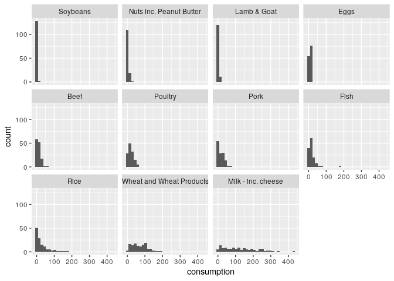
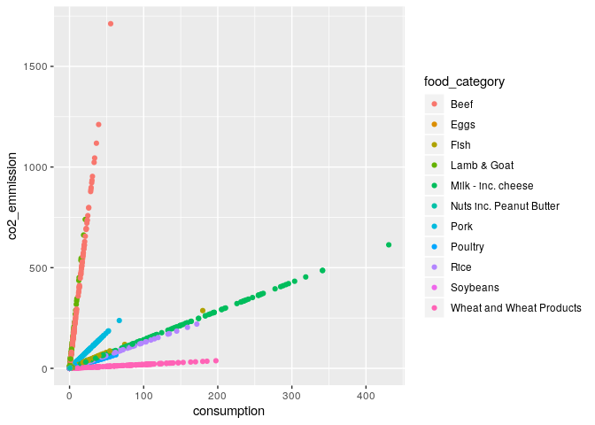
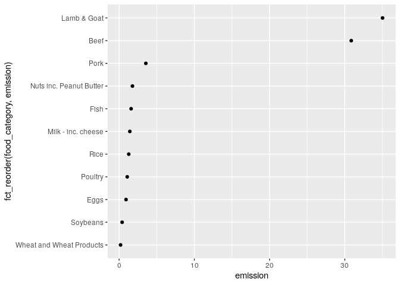
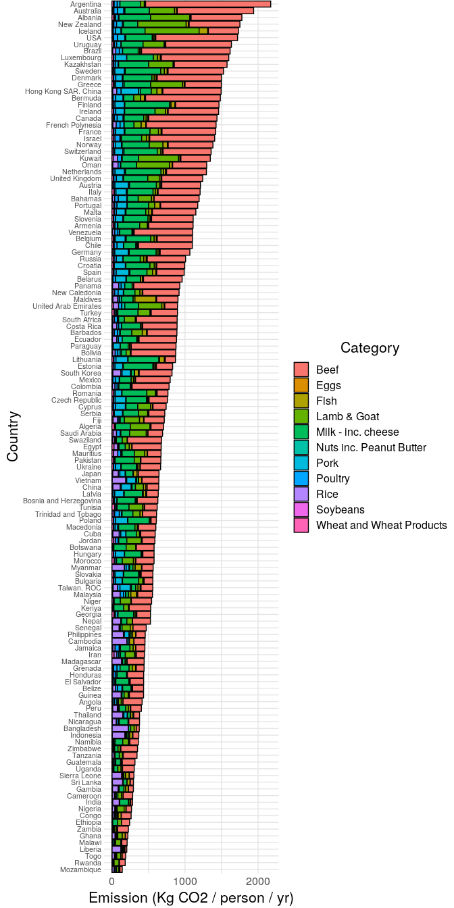

``` r
library(tidyverse)
```

    ## ── Attaching packages ─────────────────────────────────────── tidyverse 1.3.0 ──

    ## ✔ ggplot2 3.2.1     ✔ purrr   0.3.3
    ## ✔ tibble  2.1.3     ✔ dplyr   0.8.3
    ## ✔ tidyr   1.0.0     ✔ stringr 1.4.0
    ## ✔ readr   1.3.1     ✔ forcats 0.4.0

    ## ── Conflicts ────────────────────────────────────────── tidyverse_conflicts() ──
    ## ✖ dplyr::filter() masks stats::filter()
    ## ✖ dplyr::lag()    masks stats::lag()

``` r
df_food <- readr::read_csv('https://raw.githubusercontent.com/rfordatascience/tidytuesday/master/data/2020/2020-02-18/food_consumption.csv')
```

    ## Parsed with column specification:
    ## cols(
    ##   country = col_character(),
    ##   food_category = col_character(),
    ##   consumption = col_double(),
    ##   co2_emmission = col_double()
    ## )

``` r
theme_common <- function() {
  theme_minimal() %+replace%
  theme(
    axis.text.x = element_text(size = 12),
    axis.text.y = element_text(size = 12),
    axis.title.x = element_text(margin = margin(4, 4, 4, 4), size = 16),
    axis.title.y = element_text(margin = margin(4, 4, 4, 4), size = 16, angle = 90),

    legend.title = element_text(size = 16),
    legend.text = element_text(size = 12),

    strip.text.x = element_text(size = 12),
    strip.text.y = element_text(size = 12),

    panel.grid.major = element_line(color = "grey90"),
    panel.grid.minor = element_line(color = "grey90"),

    aspect.ratio = 4 / 4,

    plot.margin = unit(c(t = +0, b = +0, r = +0, l = +0), "cm"),
    plot.title = element_text(size = 18),
    plot.subtitle = element_text(size = 16),
    plot.caption = element_text(size = 12)
  )
}
```

``` r
df_food %>% summary
```

    ##    country          food_category       consumption      co2_emmission    
    ##  Length:1430        Length:1430        Min.   :  0.000   Min.   :   0.00  
    ##  Class :character   Class :character   1st Qu.:  2.365   1st Qu.:   5.21  
    ##  Mode  :character   Mode  :character   Median :  8.890   Median :  16.53  
    ##                                        Mean   : 28.110   Mean   :  74.38  
    ##                                        3rd Qu.: 28.133   3rd Qu.:  62.60  
    ##                                        Max.   :430.760   Max.   :1712.00

``` r
df_food %>%
  pull(country) %>%
  unique
```

    ##   [1] "Argentina"              "Australia"              "Albania"               
    ##   [4] "Iceland"                "New Zealand"            "USA"                   
    ##   [7] "Uruguay"                "Luxembourg"             "Brazil"                
    ##  [10] "Kazakhstan"             "Sweden"                 "Bermuda"               
    ##  [13] "Denmark"                "Finland"                "Ireland"               
    ##  [16] "Greece"                 "France"                 "Canada"                
    ##  [19] "Norway"                 "Hong Kong SAR. China"   "French Polynesia"      
    ##  [22] "Israel"                 "Switzerland"            "Netherlands"           
    ##  [25] "Kuwait"                 "United Kingdom"         "Austria"               
    ##  [28] "Oman"                   "Italy"                  "Bahamas"               
    ##  [31] "Portugal"               "Malta"                  "Armenia"               
    ##  [34] "Slovenia"               "Chile"                  "Venezuela"             
    ##  [37] "Belgium"                "Germany"                "Russia"                
    ##  [40] "Croatia"                "Belarus"                "Spain"                 
    ##  [43] "Paraguay"               "New Caledonia"          "South Africa"          
    ##  [46] "Barbados"               "Lithuania"              "Turkey"                
    ##  [49] "Estonia"                "Mexico"                 "Costa Rica"            
    ##  [52] "Bolivia"                "Ecuador"                "Panama"                
    ##  [55] "Czech Republic"         "Romania"                "Colombia"              
    ##  [58] "Maldives"               "Cyprus"                 "Serbia"                
    ##  [61] "United Arab Emirates"   "Algeria"                "Ukraine"               
    ##  [64] "Pakistan"               "Swaziland"              "Latvia"                
    ##  [67] "Bosnia and Herzegovina" "Fiji"                   "South Korea"           
    ##  [70] "Poland"                 "Saudi Arabia"           "Botswana"              
    ##  [73] "Macedonia"              "Hungary"                "Trinidad and Tobago"   
    ##  [76] "Tunisia"                "Egypt"                  "Mauritius"             
    ##  [79] "Bulgaria"               "Morocco"                "Slovakia"              
    ##  [82] "Niger"                  "Kenya"                  "Jordan"                
    ##  [85] "Japan"                  "Georgia"                "Grenada"               
    ##  [88] "El Salvador"            "Cuba"                   "China"                 
    ##  [91] "Honduras"               "Taiwan. ROC"            "Angola"                
    ##  [94] "Jamaica"                "Namibia"                "Belize"                
    ##  [97] "Malaysia"               "Zimbabwe"               "Guatemala"             
    ## [100] "Uganda"                 "Nepal"                  "Iran"                  
    ## [103] "Tanzania"               "Senegal"                "Peru"                  
    ## [106] "Nicaragua"              "Vietnam"                "Ethiopia"              
    ## [109] "Myanmar"                "Congo"                  "Zambia"                
    ## [112] "Cameroon"               "Madagascar"             "Malawi"                
    ## [115] "Guinea"                 "Nigeria"                "Rwanda"                
    ## [118] "Philippines"            "Ghana"                  "Togo"                  
    ## [121] "Gambia"                 "India"                  "Thailand"              
    ## [124] "Mozambique"             "Cambodia"               "Sierra Leone"          
    ## [127] "Sri Lanka"              "Indonesia"              "Liberia"               
    ## [130] "Bangladesh"

``` r
df_food %>%
  pull(food_category) %>%
  unique
```

    ##  [1] "Pork"                     "Poultry"                 
    ##  [3] "Beef"                     "Lamb & Goat"             
    ##  [5] "Fish"                     "Eggs"                    
    ##  [7] "Milk - inc. cheese"       "Wheat and Wheat Products"
    ##  [9] "Rice"                     "Soybeans"                
    ## [11] "Nuts inc. Peanut Butter"

``` r
df_food %>%
  group_by(food_category) %>%
  mutate(spread = sd(consumption)) %>%
  ungroup() %>%
  mutate(food_category = fct_reorder(food_category, spread)) %>%

  ggplot(aes(consumption)) +
  geom_histogram() +
  facet_wrap(~food_category)
```

    ## `stat_bin()` using `bins = 30`. Pick better value with `binwidth`.

<!-- -->

Observations:

  - Consumption of milk and cheese varies widely across countries
  - Consumption of rice and wheat varies a fair bit

<!-- end list -->

``` r
df_food %>%
  ggplot(aes(consumption, co2_emmission)) +
  geom_point(aes(color = food_category))
```

<!-- -->

Observations:

  - CO2 emission is linear in consumption; this tells us either that 1.
    no country is significantly more efficient in their CO2 generation
    (the values are real), or 2. The emission data are calculated from
    consumption values (the values are estimated / synthetic)

<!-- end list -->

``` r
df_food %>%
  mutate(emission = co2_emmission / consumption) %>%
  group_by(food_category) %>%
  summarize(emission = mean(emission, na.rm = TRUE)) %>%

  ggplot(aes(fct_reorder(food_category, emission), emission)) +
  geom_point() +
  coord_flip()
```

<!-- -->

Observations:

  - Lamb, goat, and beef are by far the largest producers of CO2
    emissions

<!-- end list -->

``` r
df_food %>%
  group_by(country) %>%
  mutate(co2_total = sum(co2_emmission, na.rm = TRUE)) %>%
  ungroup() %>%

  ggplot(aes(fct_reorder(country, co2_total), co2_emmission)) +
  geom_bar(
    aes(fill = food_category),
    color = "black",
    stat = "identity"
  ) +

  scale_fill_discrete(name = "Category") +
  scale_y_continuous(breaks = c(0, 1000, 2000)) +
  coord_flip() +
  theme_common() +
  theme(
    axis.text.y = element_text(size = 8, hjust = 1),
    aspect.ratio = 5 / 1
  ) +
  labs(
    x = "Country",
    y = "Emission (Kg CO2 / person / yr)"
  )
```

<!-- -->

Observations:

  - The top producers of CO2 are Argentina, Australia, Albania, New
    Zealand, and Iceland.
      - There’s variety in how these countries produce CO2; Argentina
        produces emissions through beef production, while Iceland
        produces primarily through lamb and goat
