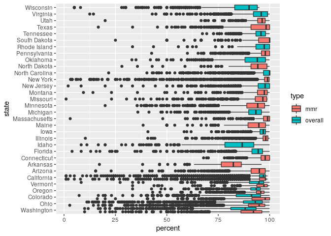
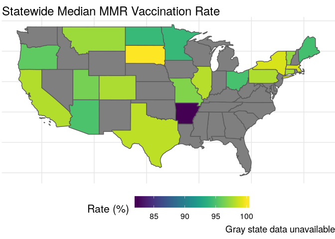
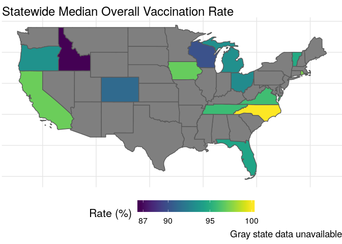

Measles Vaccines
================
Zach
2020-02-25

Today’s TidyTuesday is on vaccination
    rates.

``` r
library(tidyverse)
```

    ## ── Attaching packages ────────────────────────────────────────────────────────────────────────── tidyverse 1.3.0 ──

    ## ✓ ggplot2 3.2.1     ✓ purrr   0.3.3
    ## ✓ tibble  2.1.3     ✓ dplyr   0.8.3
    ## ✓ tidyr   1.0.2     ✓ stringr 1.4.0
    ## ✓ readr   1.3.1     ✓ forcats 0.4.0

    ## ── Conflicts ───────────────────────────────────────────────────────────────────────────── tidyverse_conflicts() ──
    ## x dplyr::filter() masks stats::filter()
    ## x dplyr::lag()    masks stats::lag()

``` r
library(sf)
```

    ## Linking to GEOS 3.7.1, GDAL 2.4.0, PROJ 5.2.0

``` r
measles <- readr::read_csv('https://raw.githubusercontent.com/rfordatascience/tidytuesday/master/data/2020/2020-02-25/measles.csv')
```

    ## Parsed with column specification:
    ## cols(
    ##   index = col_double(),
    ##   state = col_character(),
    ##   year = col_character(),
    ##   name = col_character(),
    ##   type = col_character(),
    ##   city = col_character(),
    ##   county = col_character(),
    ##   district = col_logical(),
    ##   enroll = col_double(),
    ##   mmr = col_double(),
    ##   overall = col_double(),
    ##   xrel = col_logical(),
    ##   xmed = col_double(),
    ##   xper = col_double(),
    ##   lat = col_double(),
    ##   lng = col_double()
    ## )

``` r
theme_common <- function() {
  theme_minimal() %+replace%
  theme(
    axis.text.x = element_text(size = 12),
    axis.text.y = element_text(size = 12),
    axis.title.x = element_text(margin = margin(4, 4, 4, 4), size = 16),
    axis.title.y = element_text(margin = margin(4, 4, 4, 4), size = 16, angle = 90),

    legend.title = element_text(size = 16),
    legend.text = element_text(size = 12),

    strip.text.x = element_text(size = 12),
    strip.text.y = element_text(size = 12),

    panel.grid.major = element_line(color = "grey90"),
    panel.grid.minor = element_line(color = "grey90"),

    aspect.ratio = 4 / 4,

    plot.margin   = unit(c(t = +0, b = +0, r = +0, l = +0), "cm"),
    plot.title    = element_text(size = 18, hjust = 0),
    plot.subtitle = element_text(size = 16),
    plot.caption  = element_text(size = 14, hjust = 1)
  )
}
```

``` r
url_boundaries <- "https://www2.census.gov/geo/tiger/GENZ2018/shp/cb_2018_us_state_20m.zip"
file_boundaries = "../data/usa_states.zip"

curl::curl_download(url_boundaries, destfile = file_boundaries)
unzip(file_boundaries, exdir = "../data")

sf_boundaries <- sf::read_sf("../data", "cb_2018_us_state_20m")
```

### Data dictionary

| variable | class     | description                                                            |
| :------- | :-------- | :--------------------------------------------------------------------- |
| index    | double    | Index ID                                                               |
| state    | character | School’s state                                                         |
| year     | character | School’s district                                                      |
| name     | character | School name                                                            |
| type     | character | Whether a school is public, private, charter                           |
| city     | character | City                                                                   |
| county   | character | County                                                                 |
| district | logical   | School district                                                        |
| enroll   | double    | Enrollment                                                             |
| mmr      | double    | School’s Measles, Mumps, and Rubella (MMR) vaccination rate            |
| overall  | double    | School’s overall vaccination rate                                      |
| xrel     | logical   | Percentage of students exempted from vaccination for religious reasons |
| xmed     | double    | Percentage of students exempted from vaccination for medical reasons   |
| xper     | double    | Percentage of students exempted from vaccination for personal reasons  |

``` r
measles %>% summary
```

    ##      index         state               year               name          
    ##  Min.   :   1   Length:66113       Length:66113       Length:66113      
    ##  1st Qu.: 429   Class :character   Class :character   Class :character  
    ##  Median : 997   Mode  :character   Mode  :character   Mode  :character  
    ##  Mean   :1608                                                           
    ##  3rd Qu.:2133                                                           
    ##  Max.   :8066                                                           
    ##                                                                         
    ##      type               city              county          district      
    ##  Length:66113       Length:66113       Length:66113       Mode:logical  
    ##  Class :character   Class :character   Class :character   NA's:66113    
    ##  Mode  :character   Mode  :character   Mode  :character                 
    ##                                                                         
    ##                                                                         
    ##                                                                         
    ##                                                                         
    ##      enroll            mmr            overall         xrel        
    ##  Min.   :   0.0   Min.   : -1.00   Min.   : -1.00   Mode:logical  
    ##  1st Qu.:  46.0   1st Qu.: -1.00   1st Qu.: -1.00   TRUE:109      
    ##  Median :  80.0   Median : 95.00   Median : 87.00   NA's:66004    
    ##  Mean   : 131.9   Mean   : 63.17   Mean   : 54.09                 
    ##  3rd Qu.: 129.0   3rd Qu.: 98.00   3rd Qu.: 96.10                 
    ##  Max.   :6222.0   Max.   :100.00   Max.   :100.00                 
    ##  NA's   :16260                                                    
    ##       xmed             xper             lat             lng         
    ##  Min.   :  0.04   Min.   :  0.17   Min.   :24.55   Min.   :-124.50  
    ##  1st Qu.:  1.00   1st Qu.:  2.84   1st Qu.:35.69   1st Qu.:-117.63  
    ##  Median :  2.00   Median :  5.00   Median :40.21   Median : -89.97  
    ##  Mean   :  2.91   Mean   :  6.78   Mean   :39.15   Mean   : -96.28  
    ##  3rd Qu.:  3.53   3rd Qu.:  7.55   3rd Qu.:42.18   3rd Qu.: -81.75  
    ##  Max.   :100.00   Max.   :169.23   Max.   :49.00   Max.   :  80.21  
    ##  NA's   :45122    NA's   :57560    NA's   :1549    NA's   :1549

Oddly, only a subset of the states are
    listed:

``` r
measles %>% pull(state) %>% unique
```

    ##  [1] "Arizona"        "Arkansas"       "California"     "Colorado"      
    ##  [5] "Connecticut"    "Florida"        "Idaho"          "Illinois"      
    ##  [9] "Iowa"           "Maine"          "Massachusetts"  "Michigan"      
    ## [13] "Minnesota"      "Missouri"       "Montana"        "New Jersey"    
    ## [17] "New York"       "North Carolina" "North Dakota"   "Oklahoma"      
    ## [21] "Ohio"           "Oregon"         "Pennsylvania"   "Rhode Island"  
    ## [25] "South Dakota"   "Tennessee"      "Texas"          "Utah"          
    ## [29] "Vermont"        "Virginia"       "Washington"     "Wisconsin"

``` r
measles %>% pull(state) %>% unique %>% length
```

    ## [1] 32

We only have `32` of the states in the dataset.

## Post-processing

<!-- -------------------------------------------------- -->

There’s a bunch of odd stuff in these data; below I document some
observations and wrap up with some post-processing before analysis.

### Variable `year`

Year is a character, and the data dictionary calls it the “school’s
district”. That seems odd…

``` r
measles %>% pull(year) %>% unique
```

    ## [1] "2018-19" "2017-18" "null"    "2017"

Assume that the `2017` level is the beginning of the academic year; then
we can pull the first four digits to get the year.

### Missing data coding

It appears that `mmr` and `overall` use the value `-1` to encode missing
values. However, this will mess with any aggregation we do later. Let’s
replace out-of-bounds values with `NA`.

### Post-processing

Run post-processing to fix the issues found above.

``` r
df_measles <-
  measles %>%
  mutate(
    ## Variable `year`
    year = str_extract(year, "^\\d{4}") %>%
      as.integer,
    ## Missing data coding
    mmr = if_else(mmr < 0, NA_real_, mmr),
    overall = if_else(overall < 0, NA_real_, overall)
  )
```

## EDA

<!-- -------------------------------------------------- -->

``` r
df_measles %>%
  select(state, mmr, overall) %>%
  pivot_longer(
    mmr:overall,
    values_to = "percent",
    names_to = "type"
  ) %>%
  group_by(state, type) %>%
  mutate(
    percent_mu = median(percent, na.rm = TRUE),
    percent_sd = sd(percent, na.rm = TRUE),
  ) %>%
  ungroup() %>%
  mutate(state = fct_reorder(state, percent_mu)) %>%

  ggplot(aes(state, percent, fill = type)) +
  geom_boxplot(
    position = position_dodge(width = 1)
  ) +
  coord_flip()
```

    ## Warning: Removed 49180 rows containing non-finite values (stat_boxplot).

<!-- -->

Observations: - There is extremely large variation in vaccination rates
among schools within the same state\!

``` r
df_measles %>% 
  group_by(type) %>% 
  summarize_at(
    vars(mmr, overall),
    list(
      ~median(., na.rm = TRUE), 
      "lo"=~quantile(., probs = c(0.05), na.rm = TRUE)
    )
  ) %>% 
  arrange(desc(mmr_median)) %>% 
  knitr::kable()
```

| type         | mmr\_median | overall\_median |  mmr\_lo | overall\_lo |
| :----------- | ----------: | --------------: | -------: | ----------: |
| BOCES        |       99.40 |              NA | 96.02000 |          NA |
| Public       |       98.00 |          97.000 | 88.52100 |     83.0075 |
| Kindergarten |       97.80 |          91.255 | 77.27000 |     62.3470 |
| NA           |       97.30 |          94.600 | 78.40297 |     73.2420 |
| Nonpublic    |       97.26 |              NA | 78.39950 |          NA |
| Private      |       96.00 |          95.000 | 73.98000 |     70.8300 |
| Charter      |       91.00 |              NA | 66.39800 |          NA |

Observations:

  - I had to look up
    [BOCES](https://en.wikipedia.org/wiki/Boards_of_Cooperative_Educational_Services);
    it’s an organization of school districts in New York state
  - Charter schools seem to do the worst at vaccination, both in median
    and in low-quantile

## Geospatial vis

<!-- -------------------------------------------------- -->

``` r
sf_measles <-
  st_as_sf(
    df_measles %>% filter(!is.na(lng), !is.na(lat)),
    coords = c("lng", "lat"),
    crs = 4326,
    agr = "constant"
  )
sf_measles %>% glimpse
```

    ## Observations: 64,564
    ## Variables: 15
    ## $ index    <dbl> 1, 2, 3, 4, 5, 6, 7, 8, 9, 10, 10, 11, 12, 13, 14, 15, 15, 1…
    ## $ state    <chr> "Arizona", "Arizona", "Arizona", "Arizona", "Arizona", "Ariz…
    ## $ year     <int> 2018, 2018, 2018, 2018, 2018, 2018, 2018, 2018, 2018, 2018, …
    ## $ name     <chr> "A J Mitchell Elementary", "Academy Del Sol", "Academy Del S…
    ## $ type     <chr> "Public", "Charter", "Charter", "Charter", "Charter", "Publi…
    ## $ city     <chr> "Nogales", "Tucson", "Tucson", "Phoenix", "Phoenix", "Phoeni…
    ## $ county   <chr> "Santa Cruz", "Pima", "Pima", "Maricopa", "Maricopa", "Maric…
    ## $ district <lgl> NA, NA, NA, NA, NA, NA, NA, NA, NA, NA, NA, NA, NA, NA, NA, …
    ## $ enroll   <dbl> 51, 22, 85, 60, 43, 36, 24, 22, 26, 78, 78, 35, 54, 54, 34, …
    ## $ mmr      <dbl> 100, 100, 100, 100, 100, 100, 100, 100, 100, 100, 100, 100, …
    ## $ overall  <dbl> NA, NA, NA, NA, NA, NA, NA, NA, NA, NA, NA, NA, NA, NA, NA, …
    ## $ xrel     <lgl> NA, NA, NA, NA, NA, NA, NA, NA, NA, NA, NA, NA, NA, NA, NA, …
    ## $ xmed     <dbl> NA, NA, NA, NA, 2.33, NA, NA, NA, NA, NA, NA, 2.86, NA, 7.41…
    ## $ xper     <dbl> NA, NA, NA, NA, 2.33, NA, 4.17, NA, NA, NA, NA, NA, NA, NA, …
    ## $ geometry <POINT [°]> POINT (-110.938 31.34782), POINT (-110.8961 32.22192),…

``` r
left_join(
  sf_boundaries,
  df_measles %>%
    group_by(state) %>%
    filter(min_rank(-year) == 1) %>% 
    summarize(mmr = median(mmr, na.rm = TRUE)),
  by = c("NAME" = "state")
) %>%
  filter(!(NAME %in% c("Alaska", "Hawaii", "Puerto Rico"))) %>%

  ggplot() +
  geom_sf(aes(fill = mmr)) +

  viridis::scale_fill_viridis(name = "Rate (%)") +
  guides(
    fill = guide_colorbar(barwidth = 12)
  ) +
  theme_common() +
  theme(
    axis.text.x = element_blank(),
    axis.text.y = element_blank(),
    aspect.ratio = 1 / 2,
    legend.position = "bottom"
  ) +
  labs(
    title = "Statewide Median MMR Vaccination Rate",
    caption = "Gray state data unavailable"
  )
```

<!-- -->

``` r
ggsave("./state-mmr-vaccination.png")
```

    ## Saving 7 x 5 in image

Observations:

  - Among states with available data, Arkansas seems to have done the
    worst at encouraging MMR vaccination
  - There’s a lot of missing data in this set

<!-- end list -->

``` r
left_join(
  sf_boundaries,
  df_measles %>%
    group_by(state) %>%
    filter(min_rank(-year) == 1) %>% 
    summarize(overall = median(overall, na.rm = TRUE)),
  by = c("NAME" = "state")
) %>%
  filter(!(NAME %in% c("Alaska", "Hawaii", "Puerto Rico"))) %>%

  ggplot() +
  geom_sf(aes(fill = overall)) +

  viridis::scale_fill_viridis(name = "Rate (%)", breaks = c(87, 90, 95, 100)) +
  guides(
    fill = guide_colorbar(barwidth = 12)
  ) +
  theme_common() +
  theme(
    axis.text.x = element_blank(),
    axis.text.y = element_blank(),
    aspect.ratio = 1 / 2,
    legend.position = "bottom"
  ) +
  labs(
    title = "Statewide Median Overall Vaccination Rate",
    caption = "Gray state data unavailable"
  )
```

<!-- -->

``` r
ggsave("./state-overall-vaccination.png")
```

    ## Saving 7 x 5 in image

Observations:

  - Among states with overall vaccination rate data, Idahoe does the
    worst
  - There is more missing data for `overall`, as compared with `mmr`
    rates
      - Furthermore the pattern of missing data is different; maybe
        we’re seeing differences in state reporting standards?
