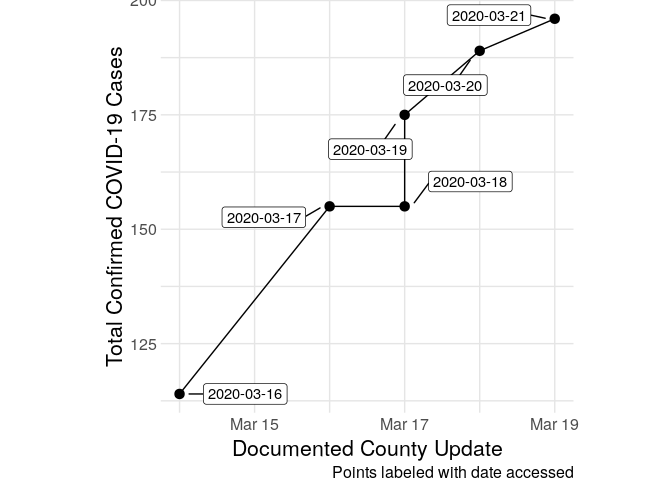

Santa Clara COVID-19 Cases
================
Zach
2020-03-21

Process the scraped data. This is a developing situation, so I expect to
have to return to this script many
    times.

``` r
library(tidyverse)
```

    ## ── Attaching packages ─────────────────────────────────────── tidyverse 1.3.0 ──

    ## ✔ ggplot2 3.3.0     ✔ purrr   0.3.3
    ## ✔ tibble  2.1.3     ✔ dplyr   0.8.5
    ## ✔ tidyr   1.0.2     ✔ stringr 1.4.0
    ## ✔ readr   1.3.1     ✔ forcats 0.5.0

    ## ── Conflicts ────────────────────────────────────────── tidyverse_conflicts() ──
    ## ✖ dplyr::filter() masks stats::filter()
    ## ✖ dplyr::lag()    masks stats::lag()

``` r
library(lubridate)
```

    ## 
    ## Attaching package: 'lubridate'

    ## The following object is masked from 'package:base':
    ## 
    ##     date

``` r
library(ggrepel)

# Data directory
dir_data <- "./data"
# Find all the data files
df_files_all <-
  tibble(file = list.files(dir_data, full.names = TRUE)) %>%
  mutate(name = str_sub(str_extract(file, "[^/]+\\."), 1, -2))

df_files_all %>% head
```

    ## # A tibble: 6 x 2
    ##   file                                        name                              
    ##   <chr>                                       <chr>                             
    ## 1 ./data/covid19_santa_clara_t2020-03-16_u20… covid19_santa_clara_t2020-03-16_u…
    ## 2 ./data/covid19_santa_clara_t2020-03-17_u20… covid19_santa_clara_t2020-03-17_u…
    ## 3 ./data/covid19_santa_clara_t2020-03-18_u20… covid19_santa_clara_t2020-03-18_u…
    ## 4 ./data/covid19_santa_clara_t2020-03-19_u20… covid19_santa_clara_t2020-03-19_u…
    ## 5 ./data/covid19_santa_clara_t2020-03-20_u20… covid19_santa_clara_t2020-03-20_u…
    ## 6 ./data/covid19_santa_clara_t2020-03-21_u20… covid19_santa_clara_t2020-03-21_u…

``` r
theme_common <- function() {
  theme_minimal() %+replace%
  theme(
    axis.text.x = element_text(size = 12),
    axis.text.y = element_text(size = 12),
    axis.title.x = element_text(margin = margin(4, 4, 4, 4), size = 16),
    axis.title.y = element_text(margin = margin(4, 4, 4, 4), size = 16, angle = 90),

    legend.title = element_text(size = 16),
    legend.text = element_text(size = 12),

    strip.text.x = element_text(size = 12),
    strip.text.y = element_text(size = 12),

    panel.grid.major = element_line(color = "grey90"),
    panel.grid.minor = element_line(color = "grey90"),

    aspect.ratio = 4 / 4,

    plot.margin = unit(c(t = +0, b = +0, r = +0, l = +0), "cm"),
    plot.title = element_text(size = 18),
    plot.title.position = "plot",
    plot.subtitle = element_text(size = 16),
    plot.caption = element_text(size = 12, hjust = 1)
  )
}
```

Load and wrangle all data

``` r
df_all <-
  ## Load all files
  pmap_dfr(
    df_files_all,
    function(file, name) {
      accessed <-
        str_extract(name, "_t[\\d-]*_u") %>%
        str_sub(., 3, -2) %>%
        ymd()
      updated <-
        str_extract(name, "_u[\\d-]*") %>%
        str_sub(., 3) %>%
        ymd

      read_csv(file) %>%
        mutate(
          accessed = accessed,
          updated = updated
        )
    }
  ) %>%
  ## Tidy
  pivot_wider(names_from = var, values_from = val)
```

    ## Parsed with column specification:
    ## cols(
    ##   var = col_character(),
    ##   val = col_double()
    ## )
    ## Parsed with column specification:
    ## cols(
    ##   var = col_character(),
    ##   val = col_double()
    ## )
    ## Parsed with column specification:
    ## cols(
    ##   var = col_character(),
    ##   val = col_double()
    ## )
    ## Parsed with column specification:
    ## cols(
    ##   var = col_character(),
    ##   val = col_double()
    ## )
    ## Parsed with column specification:
    ## cols(
    ##   var = col_character(),
    ##   val = col_double()
    ## )
    ## Parsed with column specification:
    ## cols(
    ##   var = col_character(),
    ##   val = col_double()
    ## )

Plot the data.

``` r
df_all %>%

  ggplot(aes(updated, Total_Confirmed_Cases)) +
  geom_line() +
  geom_point(size = 3) +
  geom_label_repel(
    aes(label = str_c(accessed)),
    point.padding = 1
  ) +

  theme_common() +
  labs(
    x = "Documented County Update",
    y = "Total Confirmed COVID-19 Cases",
    caption = "Points labeled with date accessed"
  )
```

<!-- -->

Observations:

  - I didn’t think to collect the *time of day* of each update, so some
    of the points may lie on top of each other.
  - Is the first entry on March 17th a data error?
