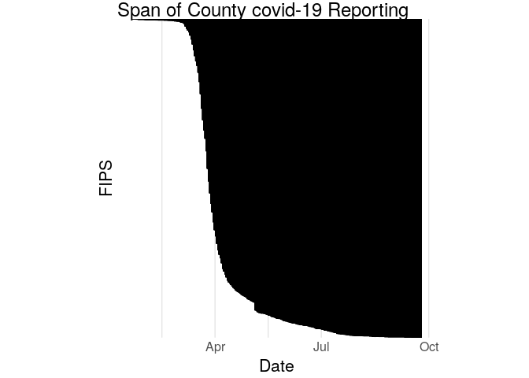
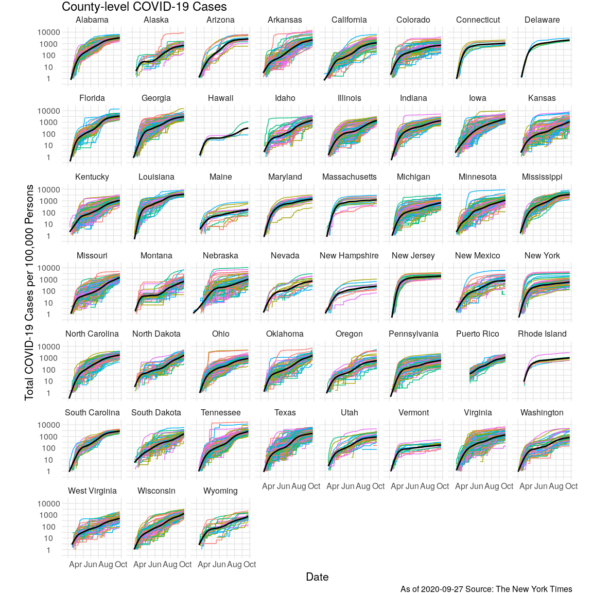
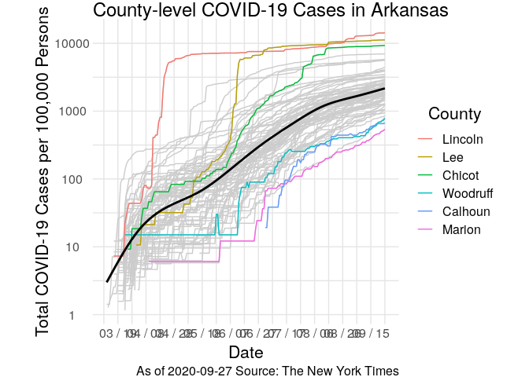
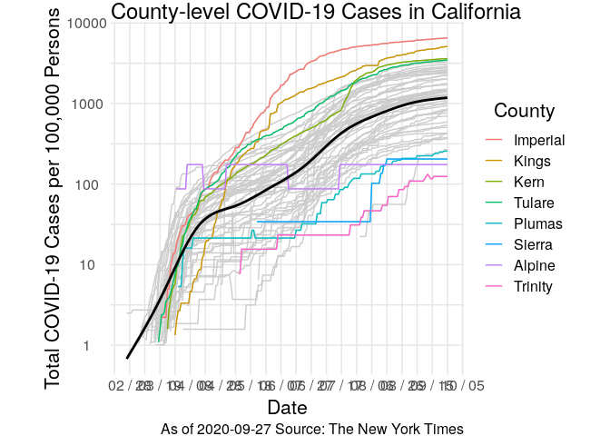
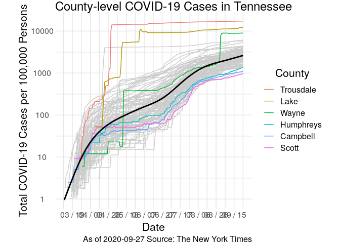
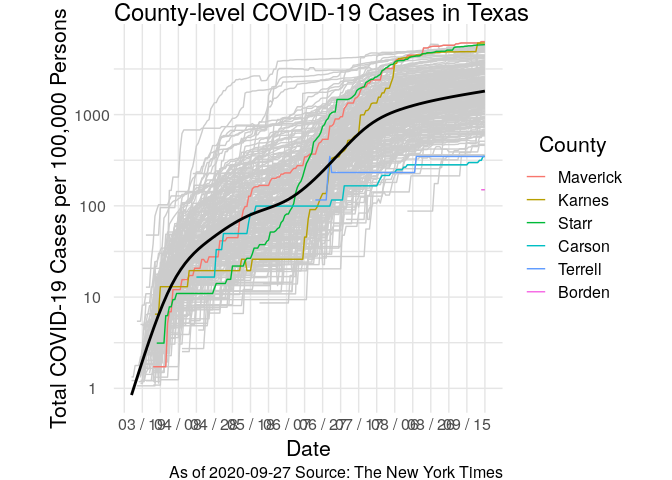

NYT County-level covid-19 Data
================
Zach del Rosario
2020-05-30

This is an analysis of the New York Times [county-level covid-19
data](https://github.com/nytimes/covid-19-data). Additionally, I use US
Census Data to normalize counts by 2018 population
    estimates.

# Setup

<!-- -------------------------------------------------- -->

``` r
library(tidyverse)
```

    ## ── Attaching packages ─────────────────────────────────────── tidyverse 1.3.0 ──

    ## ✔ ggplot2 3.3.1     ✔ purrr   0.3.4
    ## ✔ tibble  3.0.1     ✔ dplyr   1.0.0
    ## ✔ tidyr   1.1.0     ✔ stringr 1.4.0
    ## ✔ readr   1.3.1     ✔ forcats 0.5.0

    ## ── Conflicts ────────────────────────────────────────── tidyverse_conflicts() ──
    ## ✖ dplyr::filter() masks stats::filter()
    ## ✖ dplyr::lag()    masks stats::lag()

``` r
library(lubridate)
```

    ## 
    ## Attaching package: 'lubridate'

    ## The following objects are masked from 'package:base':
    ## 
    ##     date, intersect, setdiff, union

``` r
url_counties <- "https://raw.githubusercontent.com/nytimes/covid-19-data/master/us-counties.csv"
filename_counties <- "./data/counties.csv"

filename_pop <- "./data/ACSDT5Y2018.B01003_data_with_overlays_2020-05-30T133451.csv"

theme_common <- function() {
  theme_minimal() %+replace%
  theme(
    axis.text.x = element_text(size = 12),
    axis.text.y = element_text(size = 12),
    axis.title.x = element_text(margin = margin(4, 4, 4, 4), size = 16),
    axis.title.y = element_text(margin = margin(4, 4, 4, 4), size = 16, angle = 90),

    legend.title = element_text(size = 16),
    legend.text = element_text(size = 12),

    strip.text.x = element_text(size = 12),
    strip.text.y = element_text(size = 12),

    panel.grid.major = element_line(color = "grey90"),
    panel.grid.minor = element_line(color = "grey90"),

    aspect.ratio = 4 / 4,

    plot.margin = unit(c(t = +0, b = +0, r = +0, l = +0), "cm"),
    plot.title = element_text(size = 18, hjust = 0),
    ## plot.title.position = "plot",
    plot.subtitle = element_text(size = 16),
    plot.caption = element_text(size = 12, hjust = 1)
  )
}
```

``` r
curl::curl_download(
        url_counties,
        destfile = filename_counties
      )
```

``` r
df_counties <- read_csv(filename_counties)
```

    ## Parsed with column specification:
    ## cols(
    ##   date = col_date(format = ""),
    ##   county = col_character(),
    ##   state = col_character(),
    ##   fips = col_character(),
    ##   cases = col_double(),
    ##   deaths = col_double()
    ## )

Additionally, I use the `2018: ACS 5-Year Estimates Detailed Tables`
[Total
Population](https://data.census.gov/cedsci/table?q=county%20population&g=0100000US.050000&hidePreview=false&tid=ACSDT5Y2018.B01003&t=Populations%20and%20People&vintage=2010)
for county-level population estimates. Load those locally:

``` r
df_pop <- read_csv(
  filename_pop,
  skip = 2,
  col_names = c(
    "id",
    "name",
    "population",
    "margin_of_error"
  )
) %>%
  mutate(
    fips = str_sub(id, -5, -1)
  )
```

    ## Parsed with column specification:
    ## cols(
    ##   id = col_character(),
    ##   name = col_character(),
    ##   population = col_double(),
    ##   margin_of_error = col_character()
    ## )

# EDA

<!-- -------------------------------------------------- -->

## First look

<!-- ------------------------- -->

``` r
df_counties %>% summary
```

    ##       date               county             state               fips          
    ##  Min.   :2020-01-21   Length:264120      Length:264120      Length:264120     
    ##  1st Qu.:2020-04-17   Class :character   Class :character   Class :character  
    ##  Median :2020-05-10   Mode  :character   Mode  :character   Mode  :character  
    ##  Mean   :2020-05-09                                                           
    ##  3rd Qu.:2020-06-02                                                           
    ##  Max.   :2020-06-23                                                           
    ##      cases              deaths        
    ##  Min.   :     0.0   Min.   :    0.00  
    ##  1st Qu.:     5.0   1st Qu.:    0.00  
    ##  Median :    24.0   Median :    0.00  
    ##  Mean   :   430.6   Mean   :   23.95  
    ##  3rd Qu.:   117.0   3rd Qu.:    4.00  
    ##  Max.   :217803.0   Max.   :21817.00

**Observations**

  - The data start on January 21, and run until May 28
  - The largest values are `cases ~ 200,000` and `deaths ~ 21,000`;
    these are probably in NYC

Note that the NYT Readme states “If a county is not listed for a date,
then there were zero reported confirmed cases and deaths.” For instance:

``` r
df_counties %>% filter(cases == 0, deaths == 0)
```

    ## # A tibble: 0 x 6
    ## # … with 6 variables: date <date>, county <chr>, state <chr>, fips <chr>,
    ## #   cases <dbl>, deaths <dbl>

## Variables

<!-- ------------------------- -->

``` r
df_counties %>% glimpse
```

    ## Rows: 264,120
    ## Columns: 6
    ## $ date   <date> 2020-01-21, 2020-01-22, 2020-01-23, 2020-01-24, 2020-01-24, 2…
    ## $ county <chr> "Snohomish", "Snohomish", "Snohomish", "Cook", "Snohomish", "O…
    ## $ state  <chr> "Washington", "Washington", "Washington", "Illinois", "Washing…
    ## $ fips   <chr> "53061", "53061", "53061", "17031", "53061", "06059", "17031",…
    ## $ cases  <dbl> 1, 1, 1, 1, 1, 1, 1, 1, 1, 1, 1, 1, 1, 1, 1, 1, 1, 1, 1, 1, 1,…
    ## $ deaths <dbl> 0, 0, 0, 0, 0, 0, 0, 0, 0, 0, 0, 0, 0, 0, 0, 0, 0, 0, 0, 0, 0,…

| Variable | Description                                                                                                                  |
| -------- | ---------------------------------------------------------------------------------------------------------------------------- |
| `date`   | Date of data update                                                                                                          |
| `county` | Name of reporting county                                                                                                     |
| `state`  | Name of state                                                                                                                |
| `fips`   | Federal Information Processing System code (UID)                                                                             |
| `cases`  | Cumulative cases, both [confirmed and probable](https://github.com/nytimes/covid-19-data/blob/master/PROBABLE-CASES-NOTE.md) |
| `deaths` | Cumulative deaths due to covid-19; NYT non-specific as to confirmed vs probable                                              |

As of writing, there are [`3143`
counties](https://en.wikipedia.org/wiki/County_\(United_States\)) in the
50 US states. How many counties do we have data for?

``` r
df_counties %>%
  filter(!is.na(fips)) %>%
  pull(fips) %>%
  unique %>%
  length
```

    ## [1] 3023

This is over 90% of the counties in the US; not quite complete, but the
vast majority.

## Exceptions

<!-- ------------------------- -->

There are some oddities in these data: From poking around I found some
entries with `NA` fips:

``` r
df_counties %>%
  filter(is.na(fips)) %>%
  count(county, state) %>%
  arrange(desc(n))
```

    ## # A tibble: 48 x 3
    ##    county        state              n
    ##    <chr>         <chr>          <int>
    ##  1 New York City New York         115
    ##  2 Unknown       Rhode Island     115
    ##  3 Unknown       New Jersey       104
    ##  4 Unknown       Puerto Rico      103
    ##  5 Unknown       Virgin Islands   102
    ##  6 Unknown       Guam             101
    ##  7 Unknown       Massachusetts    100
    ##  8 Unknown       Louisiana         98
    ##  9 Kansas City   Missouri          96
    ## 10 Unknown       Arkansas          96
    ## # … with 38 more rows

**Observations**

  - NYC is given its own category
  - Some territories are reported in the `state` column; these do not
    have county-level fips codes
  - Kansas City has a community fips code, but it is part of Jackson
    County
  - From the NYT documentation, “Many state health departments choose to
    report cases separately when the patient’s county of residence is
    unknown or pending determination. In these instances, we record the
    county name as”Unknown.""

## Source dates

<!-- ------------------------- -->

Undoubtedly, the data reporting from each county have different
temporality. Let’s inspect:

``` r
df_duration <-
  df_counties %>%
  group_by(fips) %>%
  summarize(
    date_min = min(date),
    date_max = max(date)
  ) %>%
  mutate(
    span = date_max - date_min,
    fips = fct_reorder(fips, span)
  )
```

    ## `summarise()` ungrouping output (override with `.groups` argument)

``` r
df_duration %>%
  ggplot() +
  geom_segment(aes(x = date_min, xend = date_max, y = fips, yend = fips)) +

  scale_y_discrete(breaks = c()) +
  theme_common() +
  labs(
    x = "Date",
    y = "FIPS",
    title = "Span of County covid-19 Reporting"
  )
```

<!-- -->

**Observations**

  - The earliest county-level reports are in early 2020; the NYT
    documentation puts the first case at Washington State on Jan. 21,
    2020
  - The latest county reports appear to be just a few days ago

We can get a better sense of the start dates via a histogram.

``` r
n_top <- 650 # Where to place labels

df_duration_stat <-
  df_duration %>%
  summarize(
    Min = min(date_min),
    Median = median(date_min),
    Max = max(date_min)
  ) %>%
  pivot_longer(
    names_to = "stat",
    values_to = "date_min",
    everything()
  )

df_duration %>%
  ggplot() +
  geom_histogram(aes(date_min), bins = 40) +
  geom_segment(
    data = df_duration_stat,
    mapping = aes(x = date_min, xend = date_min, y = 0, yend = n_top, color = stat)
  ) +
  geom_label(
    data = df_duration_stat,
    mapping = aes(x = date_min, y = n_top + 50, label = date_min)
  ) +

  scale_x_date(limits = c(ymd("2020-01-01", "2020-06-10"))) +
  scale_color_discrete(name = "") +
  theme_common() +
  theme(legend.position = "bottom") +
  labs(
    x = "Date",
    y = "Counties Reporting",
    title = "Earliest Date of County Data"
  )
```

    ## Warning: Removed 28 rows containing non-finite values (stat_bin).

    ## Warning: Removed 2 rows containing missing values (geom_bar).

    ## Warning: Removed 1 rows containing missing values (geom_segment).

    ## Warning: Removed 1 rows containing missing values (geom_label).

<!-- -->

**Obserations**

  - As reported above, the earliest case of covid-19 reported was on
    January 21, 2020
  - There was a gap between early reports in Jan/Feb and the start of
    the bulk of reports in March
  - The bulk of reports started on March 25, 2020
  - The data were last updated May 28, 2020
      - Note that this tail is dependent on when we pull the data and
        when the NYT updates\!

## Population

<!-- ------------------------- -->

``` r
n_count <- 310
pop_median <-
  df_pop %>%
  summarize(across(population, median)) %>%
  pull(population) %>%
  round()

df_pop %>%

  ggplot(aes(population)) +
  geom_histogram(bins = 40) +
  annotate(
    "segment",
    x = pop_median, xend = pop_median, y = 0, yend = n_count
  ) +
  annotate(
    "label",
    x = pop_median, y = n_count + 10, label = pop_median
  ) +

  scale_x_log10(labels = scales::label_number_si()) +
  theme_common() +
  labs(
    x = "County Population",
    y = "Density"
  )
```

<!-- -->

**Observations**

  - The distribution of county populations is approximately lognormal
  - Small counties are around `1000` persons
  - The median county size is `25950` persons
  - The largest county is about `10` million persons

# Trends

<!-- -------------------------------------------------- -->

To study trends in the number of cases, I first turn the implicit
zero-counts into explicit zeros.

``` r
df_cases_filled <-
  df_counties %>%
  select(date, county, state, fips, cases) %>%
  pivot_wider(
    names_from = date,
    names_sep = "_",
    values_from = cases,
    values_fill = 0
  ) %>%
  pivot_longer(
    names_to = "date",
    values_to = "cases",
    -c(county, state, fips)
  ) %>%
  left_join(
    .,
    df_pop %>% select(fips, population),
    by = "fips"
  ) %>%
  mutate(
    date = ymd(date),
    cases_per_100k = cases / population * 100000
  )
```

Visualize all the county data

``` r
n_roll <- 5
cpk_min <-
  df_cases_filled %>%
  filter(cases_per_100k > 0) %>%
  pull(cases_per_100k) %>%
  min

df_cases_filled %>%
  filter(
    !is.na(fips),
    state != "District of Columbia"
  ) %>%
  group_by(state) %>%
  mutate(id = as.factor((dense_rank(as.integer(fips))) %% n_roll)) %>%
  filter(cases_per_100k >= 1) %>%
  ungroup() %>%

  ggplot(aes(date, cases_per_100k, group = fips, color = id)) +
  geom_line(size = 0.5) +
  geom_smooth(aes(group = state), se = FALSE, color = "black", size = 1) +

  scale_x_date(breaks = "2 months", date_labels = "%b") +
  scale_y_log10() +
  facet_wrap(~state) +
  guides(color = "none") +
  theme_common() +
  labs(
    x = "Date",
    y = "Total COVID-19 Cases per 100,000 Persons",
    title = "County-level COVID-19 Cases",
    caption = str_c("As of ", today(), " Source: The New York Times")
  )
```

    ## `geom_smooth()` using method = 'gam' and formula 'y ~ s(x, bs = "cs")'

<!-- -->

**Observations**

  - Some states seem to have slowed or stalled their rate of cases; for
    instance AL, HI, KS, ME, MA, MI, MT, NV, NJ, NY, VT, WA
  - The other states have varying degrees of upward trend
  - Some counties are alarming outliers; for instance counties in AK,
    ID, MN, OH, and TN

### State-level data

<!-- ------------------------- -->

``` r
plot_cpk <- function(state_name, n_max = 3) {
  top_counties <-
    df_cases_filled %>%
    filter(state == state_name, date == max(date)) %>%
    group_by(county) %>%
    summarize(cpk = median(cases_per_100k)) %>%
    filter(dense_rank(-cpk) <= n_max) %>%
    pull(county)

  bot_counties <-
    df_cases_filled %>%
    filter(state == state_name, date == max(date)) %>%
    group_by(county) %>%
    summarize(cpk = median(cases_per_100k)) %>%
    filter(dense_rank(cpk) <= n_max) %>%
    pull(county)

  df_cases_filled %>%
    filter(
      state == state_name,
      cases_per_100k >= 1
    ) %>%
    mutate(county = fct_reorder2(county, date, cases_per_100k)) %>%

    ggplot(aes(date, cases_per_100k)) +
    geom_line(
      aes(group = county),
      size = 0.5,
      color = "grey80"
    ) +
    geom_line(
      data = . %>% filter(county %in% c(top_counties, bot_counties)),
      mapping = aes(color = county),
      size = 0.5
    ) +
    geom_smooth(aes(group = state), se = FALSE, color = "black", size = 1) +

    scale_x_date(labels = scales::label_date("%m / %d"), date_breaks = "20 days") +
    scale_y_log10() +
    scale_color_discrete(name = "County") +
    theme_common() +
    labs(
      x = "Date",
      y = "Total COVID-19 Cases per 100,000 Persons",
      title = str_c("County-level COVID-19 Cases in ", state_name),
      caption = str_c("As of ", today(), " Source: The New York Times")
    )
}
```

### Arkansas

<!-- ------------------------- -->

``` r
plot_cpk("Arkansas")
```

    ## `summarise()` ungrouping output (override with `.groups` argument)
    ## `summarise()` ungrouping output (override with `.groups` argument)

    ## `geom_smooth()` using method = 'gam' and formula 'y ~ s(x, bs = "cs")'

<!-- -->

**Observations**

  - Lincoln County
      - With population 13695, this is a small county
      - Apparently April testing in
        [prisons](https://www.themarshallproject.org/2020/04/24/these-prisons-are-doing-mass-testing-for-covid-19-and-finding-mass-infections)
        uncovered many cases, which accounts for the
    increase

### California

<!-- ------------------------- -->

``` r
plot_cpk("California", n_max = 4)
```

    ## `summarise()` ungrouping output (override with `.groups` argument)
    ## `summarise()` ungrouping output (override with `.groups` argument)

    ## `geom_smooth()` using method = 'gam' and formula 'y ~ s(x, bs = "cs")'

<!-- -->

**Observations**

  - Imperial County has a per-capita rate of infection so high, that
    some residents are being transported to [San
    Francisco](https://www.sandiegouniontribune.com/news/story/2020-06-14/imperial-county-has-highest-rate-of-covid-19-cases-in-the-state-it-wants-to-reopen-anyway)
  - There was an outbreak in [Avenal
    Prison](https://www.fresnobee.com/news/coronavirus/article242975596.html)
    back in late May, but that probably doesn’t account for the
    continued increase in
    cases

### Idaho

<!-- ------------------------- -->

``` r
plot_cpk("Idaho")
```

    ## `summarise()` ungrouping output (override with `.groups` argument)
    ## `summarise()` ungrouping output (override with `.groups` argument)

    ## `geom_smooth()` using method = 'gam' and formula 'y ~ s(x, bs = "cs")'

<!-- -->

  - Blaine County
      - With population 21994, this is a medium county
      - This [Buzzfeed
        article](https://www.buzzfeednews.com/article/annehelenpetersen/coronavirus-covid-19-idaho-blaine-county-sun-valley)
        notes that Blaine is not so different from other counties, but
        was hit earlier than many other counties
  - Washington County
      - With population 10025, this is a small county
      - Apparently there was a cluster of covid-19 cases in Washington
        county due to a [family
        gathering](https://localnews8.com/health/coronavirus/2020/05/13/official-idaho-virus-outbreak-linked-to-family-gathering/)

### Massachusetts

<!-- ------------------------- -->

``` r
plot_cpk("Massachusetts")
```

    ## `summarise()` ungrouping output (override with `.groups` argument)
    ## `summarise()` ungrouping output (override with `.groups` argument)

    ## `geom_smooth()` using method = 'gam' and formula 'y ~ s(x, bs = "cs")'

<!-- -->

**Observations**

  - Massachusetts seems to have flattened the
    curve\!

### Minnesota

<!-- ------------------------- -->

``` r
plot_cpk("Minnesota")
```

    ## `summarise()` ungrouping output (override with `.groups` argument)
    ## `summarise()` ungrouping output (override with `.groups` argument)

    ## `geom_smooth()` using method = 'gam' and formula 'y ~ s(x, bs = "cs")'

<!-- -->

  - Nobles County
      - With population 21839, this is a small county
      - Apparently there was a cluster of covid-19 cases in Washington
        county due to a [family
        gathering](https://localnews8.com/health/coronavirus/2020/05/13/official-idaho-virus-outbreak-linked-to-family-gathering/)

### Ohio

<!-- ------------------------- -->

``` r
plot_cpk("Ohio")
```

    ## `summarise()` ungrouping output (override with `.groups` argument)
    ## `summarise()` ungrouping output (override with `.groups` argument)

    ## `geom_smooth()` using method = 'gam' and formula 'y ~ s(x, bs = "cs")'

<!-- -->

  - Marion County
      - With population 65344, this is a medium county
      - About [75% of
        inmates](https://www.cleveland.com/open/2020/04/marion-county-not-cuyahoga-county-now-leads-ohio-in-reported-coronavirus-cases-heres-why.html)
        in Marion Correctional Center tested positive for covid-19
  - Pickaway County
      - With population 57420, this is a medium county
      - [Pickaway Correctional
        Institution](https://www.dispatch.com/news/20200422/coronavirus-surges-at-pickaway-prison-now-no-2-hot-spot-in-nation---behind-marion-prison)
        also has a large number of
    cases

### Tennessee

<!-- ------------------------- -->

``` r
plot_cpk("Tennessee")
```

    ## `summarise()` ungrouping output (override with `.groups` argument)
    ## `summarise()` ungrouping output (override with `.groups` argument)

    ## `geom_smooth()` using method = 'gam' and formula 'y ~ s(x, bs = "cs")'

<!-- -->

  - Trousdale County
      - With population 9573, this is a tiny county
      - The early-May spike can be attributed to cases in [Trousdale
        Turner Correctional
        Center](https://communityimpact.com/nashville/southwest-nashville/coronavirus/2020/05/01/large-spike-in-coronavirus-cases-traced-to-prison-in-trousdale-county/)
  - Lake County
      - With population 7526, this is a tiny county
      - There are multiple jumps in case count, first in April, then
        again in May
      - Reports go back as far as April about cases in the [Northwest
        Correctional
        Complex](https://www.kfvs12.com/2020/04/23/lake-county-covid-cases-double-one-day/)
      - A majority of cases by May were in the [Northwest Correctional
        Complex](https://www.kfvs12.com/2020/05/14/covid-cases-lake-county-tenn-linked-northwest-correctional-complex/)
  - Bledsoe County
      - With population 14602, this is a medium county
      - Cases jumped in
        [April](https://wdef.com/2020/04/24/bledsoe-prison-warping-covid-19-case-stats-county/)
        due to cases in Bledsoe County Regional
    Facility

### Texas

<!-- ------------------------- -->

``` r
plot_cpk("Texas")
```

    ## `summarise()` ungrouping output (override with `.groups` argument)
    ## `summarise()` ungrouping output (override with `.groups` argument)

    ## `geom_smooth()` using method = 'gam' and formula 'y ~ s(x, bs = "cs")'

<!-- -->
