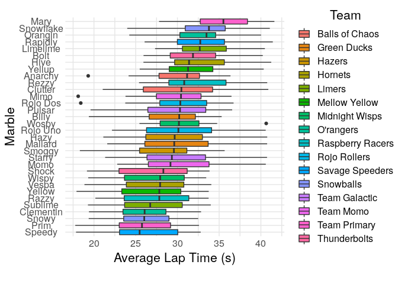
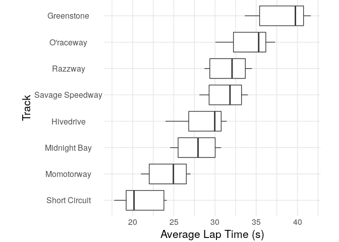

Marbles
================
Zach del Rosario
2020-06-02

Today’s TidyTuesday is on [“Jelle’s Marble
Runs”](https://github.com/rfordatascience/tidytuesday/tree/master/data/2020/2020-06-02).

``` r
library(tidyverse)
library(rzdr)

df_marbles <- readr::read_csv('https://raw.githubusercontent.com/rfordatascience/tidytuesday/master/data/2020/2020-06-02/marbles.csv')
```

    ## Parsed with column specification:
    ## cols(
    ##   date = col_character(),
    ##   race = col_character(),
    ##   site = col_character(),
    ##   source = col_character(),
    ##   marble_name = col_character(),
    ##   team_name = col_character(),
    ##   time_s = col_double(),
    ##   pole = col_character(),
    ##   points = col_double(),
    ##   track_length_m = col_double(),
    ##   number_laps = col_double(),
    ##   avg_time_lap = col_double(),
    ##   host = col_character(),
    ##   notes = col_character()
    ## )

# First Look

<!-- -------------------------------------------------- -->

``` r
df_marbles %>% glimpse()
```

    ## Rows: 256
    ## Columns: 14
    ## $ date           <chr> "15-Feb-20", "15-Feb-20", "15-Feb-20", "15-Feb-20", "1…
    ## $ race           <chr> "S1Q1", "S1Q1", "S1Q1", "S1Q1", "S1Q1", "S1Q1", "S1Q1"…
    ## $ site           <chr> "Savage Speedway", "Savage Speedway", "Savage Speedway…
    ## $ source         <chr> "https://youtu.be/JtsQ_UydjEI?t=356", "https://youtu.b…
    ## $ marble_name    <chr> "Clementin", "Starry", "Momo", "Yellow", "Snowy", "Raz…
    ## $ team_name      <chr> "O'rangers", "Team Galactic", "Team Momo", "Mellow Yel…
    ## $ time_s         <dbl> 28.11, 28.37, 28.40, 28.70, 28.71, 28.72, 28.96, 29.11…
    ## $ pole           <chr> "P1", "P2", "P3", "P4", "P5", "P6", "P7", "P8", "P9", …
    ## $ points         <dbl> NA, NA, NA, NA, NA, NA, NA, NA, NA, NA, NA, NA, NA, NA…
    ## $ track_length_m <dbl> 12.81, 12.81, 12.81, 12.81, 12.81, 12.81, 12.81, 12.81…
    ## $ number_laps    <dbl> 1, 1, 1, 1, 1, 1, 1, 1, 1, 1, 1, 1, 1, 1, 1, 1, 10, 10…
    ## $ avg_time_lap   <dbl> 28.11, 28.37, 28.40, 28.70, 28.71, 28.72, 28.96, 29.11…
    ## $ host           <chr> "No", "No", "No", "No", "No", "No", "No", "No", "No", …
    ## $ notes          <chr> NA, NA, NA, NA, NA, NA, NA, NA, NA, NA, NA, NA, NA, NA…

``` r
df_marbles %>% summary()
```

    ##      date               race               site              source         
    ##  Length:256         Length:256         Length:256         Length:256        
    ##  Class :character   Class :character   Class :character   Class :character  
    ##  Mode  :character   Mode  :character   Mode  :character   Mode  :character  
    ##                                                                             
    ##                                                                             
    ##                                                                             
    ##                                                                             
    ##  marble_name         team_name             time_s           pole          
    ##  Length:256         Length:256         Min.   : 17.76   Length:256        
    ##  Class :character   Class :character   1st Qu.: 28.40   Class :character  
    ##  Mode  :character   Mode  :character   Median : 36.28   Mode  :character  
    ##                                        Mean   :190.84                     
    ##                                        3rd Qu.:338.16                     
    ##                                        Max.   :492.01                     
    ##                                        NA's   :3                          
    ##      points       track_length_m   number_laps     avg_time_lap  
    ##  Min.   : 0.000   Min.   :11.90   Min.   : 1.00   Min.   :17.76  
    ##  1st Qu.: 0.000   1st Qu.:12.62   1st Qu.: 1.00   1st Qu.:25.94  
    ##  Median : 3.000   Median :13.02   Median : 5.00   Median :30.05  
    ##  Mean   : 6.453   Mean   :13.22   Mean   : 6.25   Mean   :29.70  
    ##  3rd Qu.:11.250   3rd Qu.:14.13   3rd Qu.:10.25   3rd Qu.:33.65  
    ##  Max.   :26.000   Max.   :14.55   Max.   :16.00   Max.   :41.62  
    ##  NA's   :128                                      NA's   :3      
    ##      host              notes          
    ##  Length:256         Length:256        
    ##  Class :character   Class :character  
    ##  Mode  :character   Mode  :character  
    ##                                       
    ##                                       
    ##                                       
    ## 

It’s unclear to me how `avg_time_lap` is computed; what is the average
over?

``` r
df_marbles %>%
  mutate(
    time_comp = avg_time_lap * number_laps,
    time_diff = time_s - time_comp
  ) %>%
  summary
```

    ##      date               race               site              source         
    ##  Length:256         Length:256         Length:256         Length:256        
    ##  Class :character   Class :character   Class :character   Class :character  
    ##  Mode  :character   Mode  :character   Mode  :character   Mode  :character  
    ##                                                                             
    ##                                                                             
    ##                                                                             
    ##                                                                             
    ##  marble_name         team_name             time_s           pole          
    ##  Length:256         Length:256         Min.   : 17.76   Length:256        
    ##  Class :character   Class :character   1st Qu.: 28.40   Class :character  
    ##  Mode  :character   Mode  :character   Median : 36.28   Mode  :character  
    ##                                        Mean   :190.84                     
    ##                                        3rd Qu.:338.16                     
    ##                                        Max.   :492.01                     
    ##                                        NA's   :3                          
    ##      points       track_length_m   number_laps     avg_time_lap  
    ##  Min.   : 0.000   Min.   :11.90   Min.   : 1.00   Min.   :17.76  
    ##  1st Qu.: 0.000   1st Qu.:12.62   1st Qu.: 1.00   1st Qu.:25.94  
    ##  Median : 3.000   Median :13.02   Median : 5.00   Median :30.05  
    ##  Mean   : 6.453   Mean   :13.22   Mean   : 6.25   Mean   :29.70  
    ##  3rd Qu.:11.250   3rd Qu.:14.13   3rd Qu.:10.25   3rd Qu.:33.65  
    ##  Max.   :26.000   Max.   :14.55   Max.   :16.00   Max.   :41.62  
    ##  NA's   :128                                      NA's   :3      
    ##      host              notes             time_comp        time_diff         
    ##  Length:256         Length:256         Min.   : 17.76   Min.   :-0.0800000  
    ##  Class :character   Class :character   1st Qu.: 28.40   1st Qu.: 0.0000000  
    ##  Mode  :character   Mode  :character   Median : 36.28   Median : 0.0000000  
    ##                                        Mean   :190.84   Mean   :-0.0002767  
    ##                                        3rd Qu.:338.10   3rd Qu.: 0.0000000  
    ##                                        Max.   :492.00   Max.   : 0.0600000  
    ##                                        NA's   :3        NA's   :3

`time_comp` is approximately equal to `time_s`; it appears that
`avg_time_lap` is the average over all laps.

# 1D EDA

<!-- -------------------------------------------------- -->

``` r
df_marbles %>%

  ggplot(
    aes(fct_reorder(marble_name, avg_time_lap, na.rm = TRUE), avg_time_lap, fill = team_name)
  ) +
  geom_boxplot() +

  scale_fill_discrete(name = "Team") +
  coord_flip() +
  theme_common() +
  labs(
    x = "Marble",
    y = "Average Lap Time (s)"
  )
```

    ## Warning: Removed 3 rows containing non-finite values (stat_boxplot).

<!-- -->

**Observations**:

  - There’s certainly variation in the lap times, but it could easily be
    due to noise alone

<!-- end list -->

``` r
df_marbles %>%

  ggplot(aes(fct_reorder(site, avg_time_lap, na.rm = TRUE), avg_time_lap)) +
  geom_boxplot() +

  coord_flip() +
  theme_common() +
  labs(
    x = "Track",
    y = "Average Lap Time (s)"
  )
```

    ## Warning: Removed 3 rows containing non-finite values (stat_boxplot).

<!-- -->

**Observations**:

  - There is definitive variation in lap time with track

# Modeling

<!-- -------------------------------------------------- -->

### ANOVA

<!-- ------------------------- -->

Is there a significant difference in speeed among the marbles?

``` r
df_marbles %>%
  mutate(speed = avg_time_lap / track_length_m) %>%
  lm(speed ~ marble_name, data = .) %>%
  anova() %>%
  broom::tidy()
```

    ## # A tibble: 2 x 6
    ##   term           df sumsq meansq statistic p.value
    ##   <chr>       <int> <dbl>  <dbl>     <dbl>   <dbl>
    ## 1 marble_name    31  2.92 0.0943      1.02   0.448
    ## 2 Residuals     221 20.5  0.0927     NA     NA

There’s no strong effect of individual marble. For comparison, let’s do
the same with sites.

``` r
df_marbles %>%
  lm(avg_time_lap ~ site, data = .) %>%
  anova() %>%
  broom::tidy()
```

    ## # A tibble: 2 x 6
    ##   term         df sumsq meansq statistic   p.value
    ##   <chr>     <int> <dbl>  <dbl>     <dbl>     <dbl>
    ## 1 site          7 6362. 909.        160.  1.31e-87
    ## 2 Residuals   245 1392.   5.68       NA  NA

There’s a huge effect of track site on lap time.

### Linear Models

<!-- ------------------------- -->

Can we predict `avg_time_lap` well based on `site`?

``` r
df_marbles %>%
  lm(
    formula = avg_time_lap ~ site,
    data = .
  ) %>%
  summary()
```

    ## 
    ## Call:
    ## lm(formula = avg_time_lap ~ site, data = .)
    ## 
    ## Residuals:
    ##    Min     1Q Median     3Q    Max 
    ## -4.811 -2.298  1.124  2.230  3.558 
    ## 
    ## Coefficients:
    ##                     Estimate Std. Error t value Pr(>|t|)    
    ## (Intercept)          38.0625     0.4213  90.345  < 2e-16 ***
    ## siteHivedrive        -9.2619     0.6006 -15.421  < 2e-16 ***
    ## siteMidnight Bay    -10.2641     0.5958 -17.227  < 2e-16 ***
    ## siteMomotorway      -13.7531     0.5958 -23.083  < 2e-16 ***
    ## siteO'raceway        -3.8135     0.6006  -6.349 1.04e-09 ***
    ## siteRazzway          -6.4322     0.5958 -10.796  < 2e-16 ***
    ## siteSavage Speedway  -6.7469     0.5958 -11.324  < 2e-16 ***
    ## siteShort Circuit   -16.8044     0.6006 -27.979  < 2e-16 ***
    ## ---
    ## Signif. codes:  0 '***' 0.001 '**' 0.01 '*' 0.05 '.' 0.1 ' ' 1
    ## 
    ## Residual standard error: 2.383 on 245 degrees of freedom
    ##   (3 observations deleted due to missingness)
    ## Multiple R-squared:  0.8205, Adjusted R-squared:  0.8154 
    ## F-statistic:   160 on 7 and 245 DF,  p-value: < 2.2e-16

The `site` variable carries a lot of information; how much can we
recapture with a coarser description of the track using just the
features`number_laps` and `track_length_m`.

``` r
df_marbles %>%
  lm(
    formula = avg_time_lap ~ number_laps + track_length_m,
    data = .
  ) %>%
  summary()
```

    ## 
    ## Call:
    ## lm(formula = avg_time_lap ~ number_laps + track_length_m, data = .)
    ## 
    ## Residuals:
    ##     Min      1Q  Median      3Q     Max 
    ## -4.9787 -1.6597 -0.1704  1.5361  5.5229 
    ## 
    ## Coefficients:
    ##                 Estimate Std. Error t value Pr(>|t|)    
    ## (Intercept)    -40.13951    2.21423  -18.13   <2e-16 ***
    ## number_laps      0.36640    0.02835   12.92   <2e-16 ***
    ## track_length_m   5.10931    0.16447   31.07   <2e-16 ***
    ## ---
    ## Signif. codes:  0 '***' 0.001 '**' 0.01 '*' 0.05 '.' 0.1 ' ' 1
    ## 
    ## Residual standard error: 2.458 on 250 degrees of freedom
    ##   (3 observations deleted due to missingness)
    ## Multiple R-squared:  0.8051, Adjusted R-squared:  0.8036 
    ## F-statistic: 516.5 on 2 and 250 DF,  p-value: < 2.2e-16

We get nearly the same COD using these features. This is nice because we
use fewer DOF for the fit, which will help with the model below:

Now let’s fit on track features along with marble names; this will model
the variation in marble lap times, controlling for the track.

``` r
df_marbles %>%
  lm(
    formula = avg_time_lap ~ number_laps + track_length_m + marble_name,
    data = .
  ) %>%
  anova() %>%
  broom::tidy()
```

    ## # A tibble: 4 x 6
    ##   term              df sumsq  meansq statistic   p.value
    ##   <chr>          <int> <dbl>   <dbl>     <dbl>     <dbl>
    ## 1 number_laps        1  410.  410.       69.5   8.36e-15
    ## 2 track_length_m     1 5832. 5832.      988.    3.87e-83
    ## 3 marble_name       31  219.    7.05      1.20  2.30e- 1
    ## 4 Residuals        219 1292.    5.90     NA    NA

Once again, we see that marble identity does not have a significant
effect on lap time.
