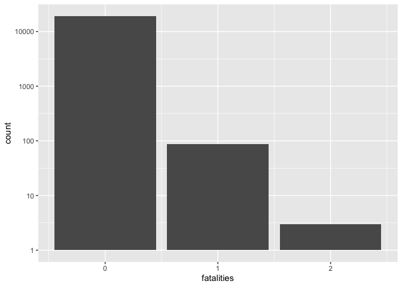
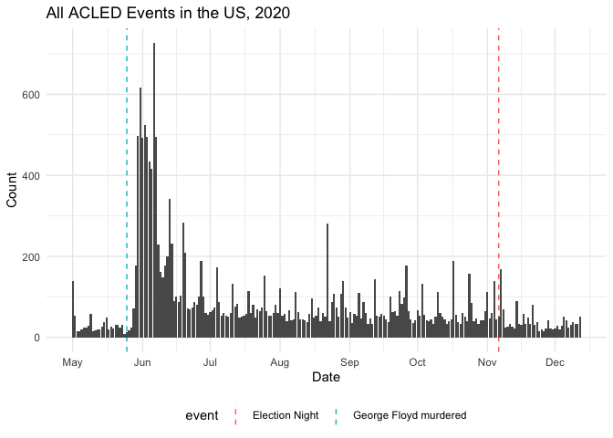
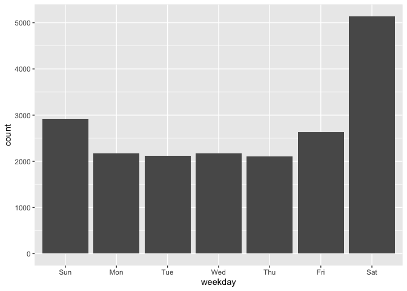
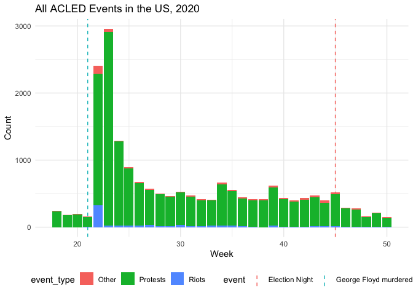
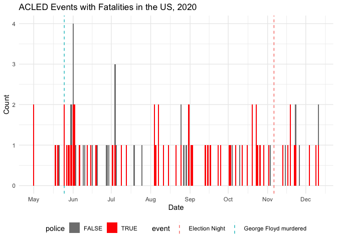
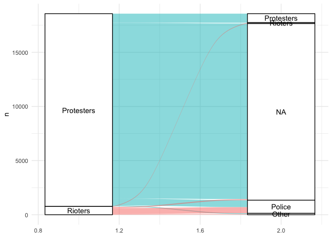
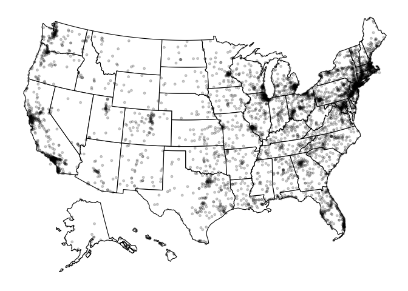

ACLED Data
================

This is a coarse look at the [ACLED
Data](https://acleddata.com/special-projects/us-crisis-monitor/#1594231506765-4fb4695e-85a0)
for the
    US.

``` r
library(tidyverse)
```

    ## ── Attaching packages ─────────────────────────────────────── tidyverse 1.3.0 ──

    ## ✔ ggplot2 3.3.2     ✔ purrr   0.3.4
    ## ✔ tibble  3.0.3     ✔ dplyr   1.0.2
    ## ✔ tidyr   1.1.2     ✔ stringr 1.4.0
    ## ✔ readr   1.4.0     ✔ forcats 0.5.0

    ## ── Conflicts ────────────────────────────────────────── tidyverse_conflicts() ──
    ## ✖ dplyr::filter() masks stats::filter()
    ## ✖ dplyr::lag()    masks stats::lag()

``` r
library(readxl)
library(lubridate)
```

    ## 
    ## Attaching package: 'lubridate'

    ## The following objects are masked from 'package:base':
    ## 
    ##     date, intersect, setdiff, union

``` r
library(ggalluvial)
library(ggrepel)
library(usmap)

filename <- "~/Documents/Data/ACLED/USA_2020_Dec12.xlsx"
```

## Read and process the data

<!-- -------------------------- -->

``` r
df_raw <- 
  read_excel(filename)
```

``` r
df <- 
  df_raw %>% 
  janitor::clean_names() %>% 
  mutate(event_date = ymd(event_date))

df
```

    ## # A tibble: 19,248 x 28
    ##      iso event_id_cnty event_id_no_cnty event_date  year time_precision
    ##    <dbl> <chr>                    <dbl> <date>     <dbl>          <dbl>
    ##  1   840 USA18080                 18080 2020-05-01  2020              1
    ##  2   840 USA18081                 18081 2020-05-01  2020              1
    ##  3   840 USA18082                 18082 2020-05-01  2020              1
    ##  4   840 USA18083                 18083 2020-05-01  2020              1
    ##  5   840 USA18084                 18084 2020-05-01  2020              1
    ##  6   840 USA18085                 18085 2020-05-01  2020              1
    ##  7   840 USA18086                 18086 2020-05-01  2020              1
    ##  8   840 USA18087                 18087 2020-05-01  2020              1
    ##  9   840 USA18088                 18088 2020-05-01  2020              1
    ## 10   840 USA18089                 18089 2020-05-01  2020              1
    ## # … with 19,238 more rows, and 22 more variables: event_type <chr>,
    ## #   sub_event_type <chr>, actor1 <chr>, assoc_actor_1 <chr>, inter1 <dbl>,
    ## #   actor2 <chr>, assoc_actor_2 <chr>, inter2 <dbl>, interaction <dbl>,
    ## #   region <chr>, country <chr>, admin1 <chr>, admin2 <chr>, admin3 <lgl>,
    ## #   location <chr>, latitude <dbl>, longitude <dbl>, geo_precision <dbl>,
    ## #   source <chr>, source_scale <chr>, notes <chr>, fatalities <dbl>

## Basic Facts

<!-- ----------------------------------------------------------------------- -->

What columns do we
    have?

``` r
df %>% names()
```

    ##  [1] "iso"              "event_id_cnty"    "event_id_no_cnty" "event_date"      
    ##  [5] "year"             "time_precision"   "event_type"       "sub_event_type"  
    ##  [9] "actor1"           "assoc_actor_1"    "inter1"           "actor2"          
    ## [13] "assoc_actor_2"    "inter2"           "interaction"      "region"          
    ## [17] "country"          "admin1"           "admin2"           "admin3"          
    ## [21] "location"         "latitude"         "longitude"        "geo_precision"   
    ## [25] "source"           "source_scale"     "notes"            "fatalities"

*Observations*:

  - `actor1`, `actor2` contain a description of the parties involved in
    an event
  - `inter1`, `inter2`, and `interaction` contain codes for the type of
    interaction between actors
  - There’s no quantification for the number of persons involved in each
    event; it doesn’t appear we can determine the number of persons
    involved in any given event
      - However, there is a count of `fatalities`

What years are represented?

``` r
df %>% count(year)
```

    ## # A tibble: 1 x 2
    ##    year     n
    ##   <dbl> <int>
    ## 1  2020 19248

*Observations*:

  - This dataset is only for `2020`.

What are the event types?

``` r
df %>% 
  count(event_type) %>% 
  arrange(desc(n))
```

    ## # A tibble: 5 x 2
    ##   event_type                     n
    ##   <chr>                      <int>
    ## 1 Protests                   17807
    ## 2 Riots                        776
    ## 3 Strategic developments       606
    ## 4 Violence against civilians    53
    ## 5 Battles                        6

The majority of events are `Protests`, with a few `Riots` and `Strategic
developments`. The [ACLED
codebook](https://acleddata.com/acleddatanew/wp-content/uploads/dlm_uploads/2019/04/ACLED_Codebook_2019FINAL_pbl.pdf)
disambiguates the
`event_types`:

| Type      | Description                                                                      |
| --------- | -------------------------------------------------------------------------------- |
| Protests  | “a public demonstration in which the participants do not engage in violence”     |
| Riots     | “violent events where demonstrators or mobs engage in disruptive acts”           |
| St. dev.  | “important information regarding the activities of violent groups”               |
| Violence… | Includes sexual violence, attacks, abduction/forced disappearance                |
| Battles   | Includes armed clashes, gov’t regains territory, non-state actor takes territory |

What the heck were the 6 battles in the US in 2020?

``` r
df %>% 
  filter(event_type == "Battles") %>% 
  select(event_date, actor1, actor2, notes) %>% 
  knitr::kable()
```

| event\_date | actor1                                        | actor2                                     | notes                                                                                                                                                                                                                                                                                                                                                                                                                                                                                                                                                                                                                                                |
| :---------- | :-------------------------------------------- | :----------------------------------------- | :--------------------------------------------------------------------------------------------------------------------------------------------------------------------------------------------------------------------------------------------------------------------------------------------------------------------------------------------------------------------------------------------------------------------------------------------------------------------------------------------------------------------------------------------------------------------------------------------------------------------------------------------------- |
| 2020-05-21  | Military Forces of the United States (2017-)  | Sole Perpetrator (United States)           | On 21 May 2020, an armed attacker tried to speed through the security gate at the Naval Air Station in Corpus Christi (Texas). While the FBI asserted the incident might be ‘terrorism-related,’ the motives of the attacker are unknown. A member of base security was wounded by the attacker while the attacker himself was shot and killed by other security personnel. One fatality.                                                                                                                                                                                                                                                            |
| 2020-05-29  | Boogaloo Bois                                 | Police Forces of the United States (2017-) | On 29 May 2020, during a demonstration in Oakland, California over the killing of George Floyd by police, two alleged members of the Boogaloo movement fired from a vehicle on federal officers who were working security at the protest, killing 1 and injuring a second. One of the assailants was reported to be an Air Force Sgt.                                                                                                                                                                                                                                                                                                                |
| 2020-06-03  | Sole Perpetrator (United States)              | Police Forces of the United States (2017-) | On 3 June 2020, a 20-year old man stabbed one police officer and shot two others at the intersection of Church and Flatbush avenues in New York-Brooklyn (New York). The attack, captured on film, was targeted against the police officers, who were on anti-looting duty. The exact motivations for the attack are unknown, however the attacker shouted “Allahu Akbar” three times during the attack, and the attack also occured during the ongoing anti-police demonstrations. The FBI is investigating whether the attack may be related to domestic terrorism. The man was injured by police and was subsequently treated for gunshot wounds. |
| 2020-06-06  | Boogaloo Bois                                 | Police Forces of the United States (2017-) | On 6 June 2020, an armed clash ensued between police and a Boogaloo Bois member, who was also an active-duty sergeant stationed at Travis Air Force Base, in Santa Cruz (California). During the clash a police officer was shot dead, and another deputy was injured. The perpetrator was also shot and injured, and eventually arrested. 1 fatality, 2 injuries and arrest.                                                                                                                                                                                                                                                                        |
| 2020-06-29  | Unidentified Communal Militia (United States) | Unidentified Armed Group (United States)   | On 29 June 2020, in the ‘’Capitol Hill Organized Protest’’ or ‘’CHOP’‘, a self-declared’‘autonomous zone’’ in Seattle (Washington), a teen was killed and another injured after they drove a Jeep into the area after having stolen it a knife point. The two believed they would be safe inside CHOP, but were fired upon when they entered. According to a friend who was on the phone with the teens as they drove, a car with ‘’security’’ marked on the side followed them. It’s not clear who exactly shot at them. 1 fatality.                                                                                                                |
| 2020-06-29  | KKK: Ku Klux Klan                             | Private Security Forces (United States)    | On 29 June 2020, a man, allegedly linked to Ku Klux Klan, drove into a group of African-American people at a parking lot in Torrance (California). The suspect had verbally attacked the group before speeding towards them, leading one of the victims, an off-duty security guard, to shoot in self-defense. Police forces intervened, although the suspect managed to escape. Neither injuries nor fatalities were reported. The perpetrator was later arrested with hate crime and assault charges.                                                                                                                                              |

There’s very “thick” data on every event\! One could spend *a lot* of
time looking deeper into these data.

What’s in the `actor\\d` columns?

``` r
df %>% 
  count(actor1) %>% 
  arrange(desc(n))
```

    ## # A tibble: 86 x 2
    ##    actor1                                                          n
    ##    <chr>                                                       <int>
    ##  1 Protesters (United States)                                  17792
    ##  2 Rioters (United States)                                       777
    ##  3 Police Forces of the United States (2017-)                     98
    ##  4 Government of the United States (2017-)                        77
    ##  5 Military Forces of the United States (2017-) National Guard    69
    ##  6 Sole Perpetrator (United States)                               68
    ##  7 Unidentified Communal Militia (United States)                  56
    ##  8 American Contingency                                           45
    ##  9 Unidentified Armed Group (United States)                       42
    ## 10 Civilians (United States)                                      21
    ## # … with 76 more rows

``` r
df %>% 
  count(actor2) %>% 
  arrange(desc(n))
```

    ## # A tibble: 25 x 2
    ##    actor2                                                                      n
    ##    <chr>                                                                   <int>
    ##  1 <NA>                                                                    16806
    ##  2 Police Forces of the United States (2017-)                               1183
    ##  3 Protesters (United States)                                                817
    ##  4 Civilians (United States)                                                 198
    ##  5 Sole Perpetrator (United States)                                           93
    ##  6 Rioters (United States)                                                    91
    ##  7 Police Forces of the United States (2017-) Protecting American Communi…    17
    ##  8 Private Security Forces (United States)                                     7
    ##  9 Police Forces of the United States (2017-) Immigration and Customs Enf…     6
    ## 10 Unidentified Armed Group (United States)                                    6
    ## # … with 15 more rows

Note from the ACLED documentation “The order of actors has no meaning in
the ACLED system, barring cases of ‘Violence against civilians’, in
which the victim is always coded as Actor2.”

Create a manual recoding of actors; in particular make use of common
acronyms.

``` r
recode_actor <- function(actor) {
  case_when(
    str_detect(actor, "Protecting American Communities Task Force") ~ "PACT",
    str_detect(actor, "Immigration and Customs Enforcement") ~ "ICE",
    str_detect(actor, "Prison Guards") ~ "Prison Guards",
    str_detect(actor, "Department of Homeland Security") ~ "DHS",
    str_detect(actor, "National Guard") ~ "National Guard",
    str_detect(actor, "Border Patrol") ~ "Border Patrol",
    str_detect(actor, "Federal Bureau of Investigation") ~ "FBI",
    str_detect(actor, "Police Forces") ~ "Police",
    TRUE ~ actor
  )
}

## Low-res recoding to combine police forces
recode_police <- function(actor) {
  case_when(
    str_detect(actor, "Police Forces") ~ "Police",
    TRUE ~ actor
  )
}
```

What’s the distribution of fatalities?

``` r
df %>% 
  ggplot(aes(fatalities)) +
  geom_bar() +
  scale_y_log10()
```

<!-- -->

*Observations*:

  - The vast majority of recorded events had no reported fatalities
  - A little less than `100` events had a single fatality
  - A small number (less than `10`) had two fatalities

Among the cases with nonzero fatalities, which actors tend to be
involved?

``` r
df_tmp <- 
  df %>% 
  filter(fatalities > 0) %>% 
  mutate(
    actor1 = recode_police(actor1),
    actor2 = recode_police(actor2)
  ) %>% 
  count(actor1, actor2) %>% 
  arrange(desc(n))

df_tmp %>% 
  head() %>% 
  knitr::kable()
```

| actor1                           | actor2                           |  n |
| :------------------------------- | :------------------------------- | -: |
| Police                           | Civilians (United States)        | 52 |
| Rioters (United States)          | Police                           |  7 |
| Civilians (United States)        | NA                               |  6 |
| Sole Perpetrator (United States) | Civilians (United States)        |  4 |
| Protesters (United States)       | Sole Perpetrator (United States) |  3 |
| Rioters (United States)          | Rioters (United States)          |  3 |

*Observations*:

  - By far, the events that tend to most frequently result in a fatality
    occur between Police and
Civilians

## Timeline

<!-- ----------------------------------------------------------------------- -->

What dates are represented?

``` r
df %>% 
  
  ggplot(aes(event_date)) +
  geom_vline(
    data = tribble(
      ~date, ~event,
      ymd("2020-05-25"), "George Floyd murdered",
      ymd("2020-11-06"), "Election Night",
    ),
    mapping = aes(xintercept = date, color = event),
    linetype = "dashed"
  ) +
  geom_bar() +
  
  scale_x_date(date_breaks = "1 month", date_labels = "%b") +
  theme_minimal() +
  theme(legend.position = "bottom") +
  labs(
    title = "All ACLED Events in the US, 2020",
    x = "Date",
    y = "Count"
  )
```

<!-- -->

*Observations*:

  - The data are for 2020 only, and furthermore only for May through
    December
  - It’s likely the data were selected for the period just before George
    Floyd was murdered (May 25th)
  - It appears that events are relatively few in number before May 25th,
    spike and decay, but then jump down to a low level again after the
    November election.
  - There appears to be a seasonal trend on the timescale of a week;
    let’s check that out below:

On what day of the week do events occur?

``` r
df %>% 
  mutate(weekday = wday(event_date, label = TRUE)) %>% 
  
  ggplot(aes(weekday)) +
  geom_bar()
```

<!-- -->

*Observations*:

  - Sensibly, the most events tend to occur on Sat, followed by Sun,
    then Fri

How do event types vary over the year? (Aggregate over individual weeks
to smooth weekly variation.)

``` r
df %>% 
  mutate(
    week = week(event_date),
    event_type = case_when(
      !str_detect(event_type, "Protests|Riots") ~ "Other",
      TRUE ~ event_type
    )
  ) %>% 
  
  ggplot(aes(week)) +
  geom_vline(
    data = tribble(
      ~week, ~event,
      week(ymd("2020-05-25")), "George Floyd murdered",
      week(ymd("2020-11-06")), "Election Night",
    ),
    mapping = aes(xintercept = week, color = event),
    linetype = "dashed"
  ) +
  geom_bar(aes(fill = event_type)) +
  
  theme_minimal() +
  theme(legend.position = "bottom") +
  labs(
    title = "All ACLED Events in the US, 2020",
    x = "Week",
    y = "Count"
  )
```

<!-- -->

*Observations*:

  - There was a massive spike in protests and riots after George Floyd
    was murdered, which continued at an elevated rate, only starting to
    decay after Election Night and into the holiday season.
  - There were more riots just after George Floyd was murdered, and the
    rate seemed slightly higher through the summer

When did fatalities occur?

``` r
df %>% 
  mutate(
    police = case_when(
      str_detect(actor1, "Police") ~ TRUE,
      str_detect(actor2, "Police") ~ TRUE,
      TRUE ~ FALSE
    )
  ) %>% 
  
  filter(fatalities > 0) %>% 
  
  ggplot(aes(event_date)) +
  geom_vline(
    data = tribble(
      ~date, ~event,
      ymd("2020-05-25"), "George Floyd murdered",
      ymd("2020-11-06"), "Election Night",
    ),
    mapping = aes(xintercept = date, color = event),
    linetype = "dashed"
  ) +
  geom_bar(aes(fill = police)) +
  
  scale_x_date(date_breaks = "1 month", date_labels = "%b") +
  scale_fill_manual(
    values = c(
      `TRUE` = "red",
      `FALSE` = "grey50"
    )
  ) +
  theme_minimal() +
  theme(legend.position = "bottom") +
  labs(
    title = "ACLED Events with Fatalities in the US, 2020",
    x = "Date",
    y = "Count"
  )
```

<!-- -->

*Observations*:

  - There appears to be an increase in the rate of fatal events just
    following George Floyd’s murder.
      - There’s a general increase in the count of events (Protests,
        etc.), which may account for this
increase.

## Interactions

<!-- ----------------------------------------------------------------------- -->

What’s the typical pairing between actors?

``` r
df %>% 
  mutate(
    actor1 = recode_police(actor1),
    actor2 = recode_police(actor2)
  ) %>% 
  count(actor1, actor2) %>% 
  filter(
    str_detect(actor1, "Protesters \\(Un") | str_detect(actor1, "Rioters")
  ) %>%
  replace_na(list(actor2 = "NA")) %>% 
  mutate(
    actor1 = str_remove(actor1, " \\(United States\\)"),
    actor2 = str_remove(actor2, " \\(United States\\)"),
    actor2 = case_when(
      !str_detect(actor2, "Protesters|Rioters|Police|NA") ~ "Other",
      TRUE ~ actor2
    ),
    actor2 = fct_reorder(actor2, -n),
  ) %>% 
  
  ggplot(aes(axis1 = actor1, axis2 = actor2, y = n)) +
  geom_alluvium(aes(fill = actor1)) +
  geom_stratum() +
  geom_text(
    stat = "stratum", 
    aes(label = after_stat(stratum))
  ) +

  scale_fill_manual(
    values = c(
      "Protesters" = "#00BFC4",
      "Rioters" = "#F8766D"
    )
  ) +
  guides(fill = "none") +
  theme_minimal()
```

    ## Warning in to_lodes_form(data = data, axes = axis_ind, discern =
    ## params$discern): Some strata appear at multiple axes.
    
    ## Warning in to_lodes_form(data = data, axes = axis_ind, discern =
    ## params$discern): Some strata appear at multiple axes.
    
    ## Warning in to_lodes_form(data = data, axes = axis_ind, discern =
    ## params$discern): Some strata appear at multiple axes.

<!-- -->

*Observations*:

  - Protesters most frequently interact with no one (`NA`)
      - Hypothesis: These might be small protests, where no
        counter-group feels it necessary to oppose
  - Rioters most frequently interact with
Police

## Maps

<!-- ----------------------------------------------------------------------- -->

Just a simple map; I didn’t take this analysis any further:

``` r
plot_usmap(regions = "states") +
  geom_point(
    data = df %>%
      select(longitude, latitude) %>%
      usmap_transform(),
    mapping = aes(longitude.1, latitude.1),
    size = 1,
    alpha = 1 / 5
  )
```

    ## Warning in showSRID(uprojargs, format = "PROJ", multiline = "NO", prefer_proj =
    ## prefer_proj): Discarded datum unknown in CRS definition

    ## Warning in sp::proj4string(transformed): CRS object has comment, which is lost
    ## in output

    ## Warning in showSRID(uprojargs, format = "PROJ", multiline = "NO", prefer_proj
    ## = prefer_proj): Discarded datum Unknown based on Normal Sphere (r=6370997)
    ## ellipsoid in CRS definition

    ## Warning in sp::proj4string(transformed): CRS object has comment, which is lost
    ## in output

    ## Warning in showSRID(uprojargs, format = "PROJ", multiline = "NO", prefer_proj
    ## = prefer_proj): Discarded datum Unknown based on Normal Sphere (r=6370997)
    ## ellipsoid in CRS definition

<!-- -->
